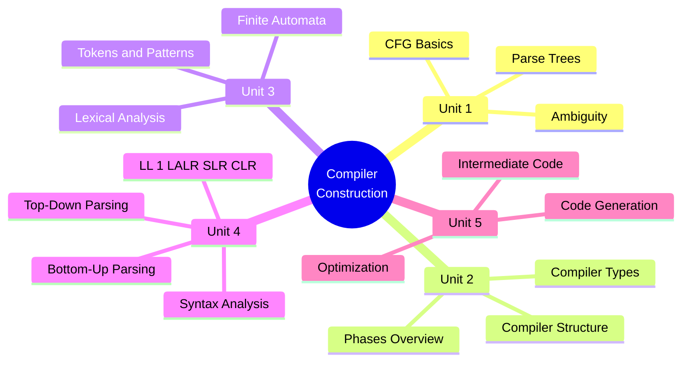
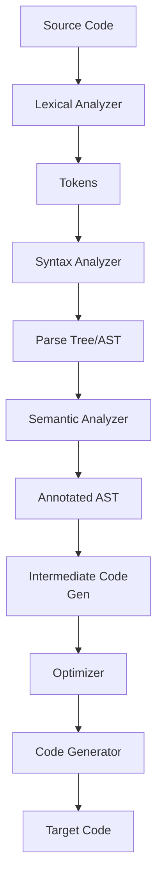

[[00-Dashboard/Home|Home]] | [[02-Semester-VI/Semester-VI-Dashboard|Semester VI]] | [[Overview]] | [[Syllabus]] | [[Unit-1]] | [[Unit-2]] | [[Unit-3]] | [[Unit-4]] | [[Unit-5]] | [[Important-Questions|Imp. Qs]] | [[Revision]] | [[Interview-Prep]]

# CS-354-MJ-T - Compiler Construction

> [!important] Subject at a Glance
> Compiler Construction dives deep into how programming languages are translated to machine code. From Context-Free Grammars to lexical analysis, parsing techniques, and code optimization - this subject builds the foundation of language design and systems programming.

## Learning Objectives

After completing this subject, students will be able to:

- [ ] Construct and analyze Context-Free Grammars (CFG)
- [ ] Identify and resolve ambiguous grammars
- [ ] Describe all phases of a compiler with clear data flow
- [ ] Build a lexical analyzer using finite automata
- [ ] Compute FIRST and FOLLOW sets for grammars
- [ ] Construct LL(1), SLR, CLR, and LALR parsing tables
- [ ] Generate and optimize intermediate code representations

## Subject Map

## Units Summary

| Unit | Topic | Hours | Weight |
|------|-------|-------|--------|
| [[Unit-1|Unit 1: CFG and Languages]] | CFG, Parse Trees, Ambiguity | 6H | |
| [[Unit-2|Unit 2: Introduction to Compiler]] | Compiler Structure and Phases | 4H | |
| [[Unit-3|Unit 3: Lexical Analysis]] | Lexer, Tokens, FA | 5H | |
| [[Unit-4|Unit 4: Syntax Analysis]] | All Parsers (LL, LR, SLR, LALR) | **12H** | |
| [[Unit-5|Unit 5: Code Generation and Optimization]] | Code Gen, Intermediate Code, Optimization | 3H | |

**Total: 30 Hours**

> [!warning] Heaviest Unit
> Unit 4 (Syntax Analysis) is **12 hours** - the largest unit. It covers all parser types and is the most exam-heavy chapter. Plan extra study time for this unit.

## Reference Books

1. **Alfred V. Aho, Monica S. Lam, Ravi Sethi, Jeffrey D. Ullman** - *Compilers: Principles, Techniques, and Tools* (Dragon Book) - **Primary**
2. **Andrew Appel** - *Modern Compiler Implementation in Java/C/ML*
3. **Steven Muchnick** - *Advanced Compiler Design and Implementation*

## Quick Navigation

- [[Syllabus]] - Detailed syllabus breakdown
- [[Unit-1|Unit 1: CFG and Languages]] - CFG, LMD, RMD, Ambiguity
- [[Unit-2|Unit 2: Introduction to Compiler]] - Phases and structure
- [[Unit-3|Unit 3: Lexical Analysis]] - Tokens and FA
- [[Unit-4|Unit 4: Syntax Analysis]] - All parsing techniques (LARGEST)
- [[Unit-5|Unit 5: Code Generation and Optimization]] - Backend
- [[Important-Questions]] - Exam-focused questions
- [[Revision]] - Quick revision notes
- [[Interview-Prep]] - Interview Q&A

## Why This Subject Matters

> [!tip] Foundational Knowledge
> Understanding compilers gives you deep insight into how programming languages work - essential for systems programming, language design, virtual machines (JVM/V8), and even interview questions at top companies about interpreters, ASTs, and optimizations.

## Compiler Pipeline Flow

## Related Subjects

- [[02-Semester-VI/CS-351-MJ-T-Advanced-Java/Overview|Advanced Java]] - Language being compiled
- Theory of Computation - Automata foundation for Unit 3

---
*Last updated: 2026-06-16 | Semester VI | CS-354-MJ-T*
