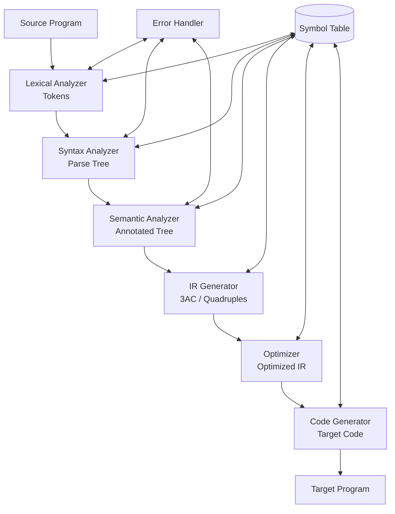

[[Overview]] | [[Syllabus]] | [[Unit-1]] | [[Unit-2]] | [[Unit-3]] | [[Unit-4]] | [[Unit-5]]

---

# CS-354 Compiler Construction - Quick Revision

> [!important] Exam Strategy
> - Unit 4 (Parsing) carries maximum marks. FIRST/FOLLOW computation and LL(1) table construction appear every year.
> - Always show full working steps for FIRST/FOLLOW and parsing trace questions.
> - Unit 5 (3AC, quadruples, DAG, optimization) is the second most important unit.
> - For Unit 2, be able to trace all six phases on the expression `position = initial + rate * 60`.

---

## Unit 1 - CFG and Formal Languages

### Chomsky Hierarchy (Must Know)

| Type | Grammar | Automaton | Language |
|------|---------|-----------|---------|
| Type 0 | Unrestricted | Turing Machine | Recursively Enumerable |
| Type 1 | Context-Sensitive | Linear Bounded Automaton | Context-Sensitive |
| ==Type 2== | ==Context-Free (CFG)== | ==Pushdown Automaton== | ==Context-Free== |
| Type 3 | Regular | Finite Automaton | Regular |

### Key CFG Definitions

- **CFG:** G = (V, T, P, S) where V = non-terminals, T = terminals, P = productions, S = start symbol.
- **Derivation:** Replacing a non-terminal using a production rule. `A ⇒ α` means A derives α in one step.
- **LMD (Leftmost Derivation):** Always replace the leftmost non-terminal.
- **RMD (Rightmost Derivation):** Always replace the rightmost non-terminal.
- **Parse Tree:** Tree representation of a derivation. Root = start symbol, leaves = terminals.
- **Ambiguous Grammar:** A grammar where at least one string has more than one parse tree (or more than one LMD, or more than one RMD).

### Classic Expression Grammar

```
E → E + T | T
T → T * F | F
F → ( E ) | id
```

This grammar is ==unambiguous== - multiplication has higher precedence than addition (lower in the hierarchy means higher precedence), and both are left-associative.

### CNF and GNF

| Normal Form | Rule Format | Purpose |
|------------|-------------|---------|
| ==CNF (Chomsky Normal Form)== | A → BC or A → a | Simplifies parsing proofs; CYK algorithm |
| ==GNF (Greibach Normal Form)== | A → a α (terminal first) | Every derivation adds exactly one terminal per step |

**CNF Conversion Steps:**
1. Eliminate start symbol from right-hand side (add S0 → S)
2. Eliminate ε-productions (except for start symbol if ε is in L)
3. Eliminate unit productions (A → B)
4. Convert remaining long productions: A → B1 B2 ... Bk → introduce new variables

---

## Unit 2 - Phases of a Compiler

### Complete Phase-by-Phase Trace

**Source:** `position = initial + rate * 60`

| Phase | Output |
|-------|--------|
| ==Lexical Analysis== | Tokens: `id(position)`, `=`, `id(initial)`, `+`, `id(rate)`, `*`, `num(60)` |
| ==Syntax Analysis== | Parse tree / AST of the assignment expression |
| ==Semantic Analysis== | Type checks: all ids are float, 60 is int → implicit coercion to float |
| ==IR Generation== | `t1 = inttofloat(60)`, `t2 = rate * t1`, `t3 = initial + t2`, `position = t3` |
| ==Optimization== | `t1 = 60.0`, `t2 = rate * 60.0`, `t3 = initial + t2`, `position = t3` |
| ==Code Generation== | Assembly: `LDF R2, rate`, `MULF R2, R2, #60.0`, etc. |

### Compiler Structure Diagram



### Compiler vs Interpreter

| Feature | Compiler | Interpreter |
|---------|----------|-------------|
| Translation | Entire program at once | Line by line |
| Output | Object/machine code | Executes directly |
| Execution speed | Faster (pre-compiled) | Slower (translates at runtime) |
| Error detection | Before execution | At runtime (when line is reached) |
| Examples | GCC (C), javac (Java) | Python, Ruby, PHP |

---

## Unit 3 - Lexical Analysis

### Token, Lexeme, Pattern

| Concept | Definition | Example |
|---------|-----------|---------|
| ==Token== | Category/type of a lexical unit | `identifier`, `keyword`, `operator` |
| ==Lexeme== | Actual character sequence matched | `position`, `if`, `+` |
| ==Pattern== | Rule describing valid lexemes | `letter (letter | digit)*` |

### Regular Expression for Identifiers

```
letter → [a-zA-Z_]
digit  → [0-9]
id     → letter (letter | digit)*
```

### NFA to DFA Subset Construction (Key Algorithm)

1. ε-closure(start state of NFA) = initial state of DFA
2. For each DFA state S and each input symbol a:
   - Compute move(S, a) = all NFA states reachable from any state in S on input a
   - Compute ε-closure(move(S, a)) = new DFA state
3. Repeat until no new states are created
4. DFA accepts if any NFA accepting state is in the set

### LEX/Flex Tool Structure

```lex
%{
/* C declarations / includes */
#include "y.tab.h"
%}

/* Definitions */
letter  [a-zA-Z_]
digit   [0-9]
id      {letter}({letter}|{digit})*
number  {digit}+

%%
/* Rules */
if      { return IF; }
else    { return ELSE; }
{id}    { yylval.str = strdup(yytext); return IDENTIFIER; }
{number} { yylval.num = atoi(yytext); return NUMBER; }
[ \t\n]+ { /* skip whitespace */ }
.       { return yytext[0]; }  /* any other character */

%%

int yywrap() { return 1; }
```

---

## Unit 4 - Syntax Analysis (Parsing)

### Top-Down vs Bottom-Up

| Feature | Top-Down (LL) | Bottom-Up (LR) |
|---------|-------------|---------------|
| Direction | Root to leaves | Leaves to root |
| Derivation | Leftmost | Rightmost (in reverse) |
| Stack contains | Expected input | Partially built parse tree |
| Grammar class | LL(1) ⊂ LR(1) | Larger class |
| Backtracking | Eliminated by LL(1) | Never needed |
| Conflict types | First-First, First-Follow | Shift-Reduce, Reduce-Reduce |

### Left Recursion Elimination

For `A → Aα | β` (direct left recursion), transform to:

```
A  → β A'
A' → α A' | ε
```

**Example:** Eliminate left recursion from `E → E + T | T`

```
E  → T E'
E' → + T E' | ε
```

### Left Factoring

For `A → αβ | αγ`, factor out common prefix `α`:

```
A  → α A'
A' → β | γ
```

**Example:** `S → if E then S else S | if E then S`

```
S  → if E then S S'
S' → else S | ε
```

### FIRST Set Rules

For non-terminal A with production `A → X1 X2 ... Xk`:

1. If `a` is a terminal, FIRST(a) = {a}
2. If `A → ε`, add ε to FIRST(A)
3. If `A → X1 X2 ... Xk`:
   - Add FIRST(X1) - {ε} to FIRST(A)
   - If ε ∈ FIRST(X1), add FIRST(X2) - {ε} to FIRST(A)
   - Continue until either Xi cannot derive ε, or all Xi can derive ε (then add ε to FIRST(A))

### FOLLOW Set Rules

1. Place `$` in FOLLOW(S) (S = start symbol)
2. For production `A → αBβ`:
   - Add FIRST(β) - {ε} to FOLLOW(B)
   - If ε ∈ FIRST(β), add FOLLOW(A) to FOLLOW(B)
3. For production `A → αB` (B is at the end):
   - Add FOLLOW(A) to FOLLOW(B)

### FIRST and FOLLOW Worked Example

**Grammar (standard expression grammar):**
```
E  → T E'
E' → + T E' | ε
T  → F T'
T' → * F T' | ε
F  → ( E ) | id
```

**FIRST sets:**

| Non-terminal | Computation | FIRST |
|------------|-------------|-------|
| F | F → (E)|id | { (, id } |
| T' | T' → \*FT'|ε | { \*, ε } |
| T | T → FT'; FIRST(F) = {(, id} | { (, id } |
| E' | E' → +TE'|ε | { +, ε } |
| E | E → TE'; FIRST(T) = {(, id} | { (, id } |

**FOLLOW sets:**

| Non-terminal | Computation | FOLLOW |
|------------|-------------|--------|
| E | Start symbol → add $; E appears in F → (E) → add FIRST(')') = {)} | { $, ) } |
| E' | E → TE'; E' is at end → add FOLLOW(E) | { $, ) } |
| T | E' → +TE'; FIRST(E') - {ε} = {+}; ε ∈ FIRST(E') so add FOLLOW(E') | { +, $, ) } |
| T' | T → FT'; T' at end → add FOLLOW(T) | { +, $, ) } |
| F | T' → \*FT'; FIRST(T') - {ε} = {\*}; ε ∈ FIRST(T') so add FOLLOW(T') | { \*, +, $, ) } |

### LL(1) Parsing Table Construction

**Rule:** For production `A → α`:
- For each terminal `a` in FIRST(α): add `A → α` to M[A, a]
- If ε ∈ FIRST(α): for each terminal `b` in FOLLOW(A): add `A → α` to M[A, b]

**LL(1) Parsing Table for expression grammar:**

| Non-terminal | id | + | * | ( | ) | $ |
|-------------|----|----|---|---|---|---|
| E | E→TE' | | | E→TE' | | |
| E' | | E'→+TE' | | | E'→ε | E'→ε |
| T | T→FT' | | | T→FT' | | |
| T' | | T'→ε | T'→\*FT' | | T'→ε | T'→ε |
| F | F→id | | | F→(E) | | |

### LL(1) Parsing Trace: `id + id * id`

| Stack | Input | Action |
|-------|-------|--------|
| $E | id+id\*id$ | M[E,id] = E→TE' |
| $E'T | id+id\*id$ | M[T,id] = T→FT' |
| $E'T'F | id+id\*id$ | M[F,id] = F→id |
| $E'T'id | id+id\*id$ | Match id |
| $E'T' | +id\*id$ | M[T',+] = T'→ε |
| $E' | +id\*id$ | M[E',+] = E'→+TE' |
| $E'T+ | +id\*id$ | Match + |
| $E'T | id\*id$ | M[T,id] = T→FT' |
| $E'T'F | id\*id$ | M[F,id] = F→id |
| $E'T'id | id\*id$ | Match id |
| $E'T' | \*id$ | M[T',\*] = T'→\*FT' |
| $E'T'F\* | \*id$ | Match * |
| $E'T'F | id$ | M[F,id] = F→id |
| $E'T'id | id$ | Match id |
| $E'T' | $ | M[T',$] = T'→ε |
| $E' | $ | M[E',$] = E'→ε |
| $ | $ | ==Accept== |

### LR Parser Types Comparison

| Parser | States | Power | Used In |
|--------|--------|-------|---------|
| SLR (Simple LR) | LR(0) items + FOLLOW | Weakest | Teaching |
| LALR (Look-Ahead LR) | LR(0) items + computed lookaheads | Moderate | YACC, Bison |
| CLR (Canonical LR) | LR(1) items (with lookaheads) | Most powerful | Academic |

> [!note] LALR vs CLR
> LALR merges states that have the same LR(0) core (ignoring lookaheads). This reduces the number of states to match SLR, while retaining more power than SLR. LALR may introduce reduce-reduce conflicts that CLR does not have, but in practice it handles almost all programming language grammars.

---

## Unit 5 - Code Generation and Optimization

### Three-Address Code Quick Reference

| Instruction Type | Example |
|-----------------|---------|
| Binary op | `t1 = a + b` |
| Unary op | `t1 = -a` |
| Copy | `a = b` |
| Jump | `goto L` |
| Conditional jump | `if a < b goto L` |
| Parameter | `param x` |
| Call | `call f, 2` |
| Indexed | `a = b[i]` / `a[i] = b` |
| Address | `a = &b` / `a = *b` / `*a = b` |

### 3AC Generation Examples

**Example 1:** `a = -b * (c + d)`
```
t1 = -b
t2 = c + d
t3 = t1 * t2
a  = t3
```

**Example 2:** `(a + b) * (a + b) - c * d`
```
t1 = a + b
t2 = a + b      (CSE would optimize t2 = t1)
t3 = t1 * t2
t4 = c * d
t5 = t3 - t4
```

**Example 3:** `a + b * c - d / e` to postfix
```
a b c * + d e / -
```

### Quadruples for `a = -b * (c + d)`

| # | Op | Arg1 | Arg2 | Result |
|---|----|----|------|--------|
| 0 | uminus | b | | t1 |
| 1 | + | c | d | t2 |
| 2 | * | t1 | t2 | t3 |
| 3 | = | t3 | | a |

### Code Optimization Summary

| Technique | Type | Description |
|-----------|------|-------------|
| ==Constant Folding== | Local | `2 * 3` → `6` at compile time |
| ==Constant Propagation== | Local | Replace var with its constant value |
| ==CSE== | Local/Global | Reuse previously computed expression |
| ==Dead Code Elimination== | Local/Global | Remove code with unused results |
| ==Loop Invariant Motion== | Loop | Move constant expressions outside loop |
| ==Strength Reduction== | Loop | `i*4` → `val+=4` (add replaces multiply) |
| ==Induction Variable Elimination== | Loop | Remove derived induction variables |
| ==Peephole Optimization== | Machine | Sliding window on target code |

### DAG Quick Method

For each instruction `t = a op b`:
1. Find or create leaf nodes for `a` and `b`
2. Check if an `op` node with children `a` and `b` already exists
3. If yes: label that existing node with `t` (CSE found)
4. If no: create new `op` node, label with `t`

---

## Most Critical Exam Problems

> [!important] These appear in every SPPU exam
> 1. Compute FIRST and FOLLOW for a given grammar (show step-by-step)
> 2. Construct the LL(1) parsing table
> 3. Trace LL(1) parsing on an input string (show stack, input, action)
> 4. Generate 3AC / quadruples for an expression
> 5. Build the DAG for a basic block and identify CSEs
> 6. Eliminate left recursion and apply left factoring

---

## Quick Formula Reference

**Ambiguity test:** Find two different parse trees for the same string.

**Left recursion direct:** `A → Aα | β` → eliminate to `A → βA'`, `A' → αA' | ε`

**Left factoring:** `A → αβ | αγ` → `A → αA'`, `A' → β | γ`

**LL(1) conflict:** A grammar is NOT LL(1) if:
- Any cell in the parsing table has more than one production
- FIRST(α) ∩ FIRST(β) ≠ ∅ for two productions `A → α | β`
- If ε ∈ FIRST(α) and FIRST(β) ∩ FOLLOW(A) ≠ ∅

---

[[Overview]] | [[Important-Questions]] | [[Interview-Prep]]
