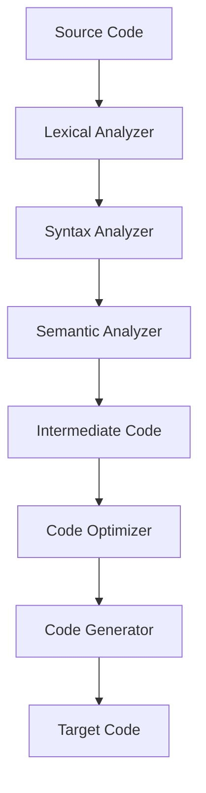

[[00-Dashboard/Home|Home]] | [[02-Semester-VI/Semester-VI-Dashboard|Semester VI]] | [[Overview]] | [[Syllabus]] | [[Unit-1]] | [[Unit-2]] | [[Unit-3]] | [[Unit-4]] | [[Unit-5]] | [[Important-Questions|Imp. Qs]] | [[Revision]] | [[Interview-Prep]]

# CS-354 Compiler Construction - Complete Syllabus

> [!info] Course Information
> **Semester:** VI | **Credits:** 2 | **IE:** 15 | **EE:** 35
> **Teaching:** 2 Hours/Week | **Total:** ~30 Hours

## Prerequisites
- Familiarity with **Finite Automata (FA)**, **Regular Expressions (RE)**, and **Context-Free Grammars (CFG)** (from CS-304 TCS)
- Knowledge of stacks, trees, graphs, symbol tables, and basic complexity
- Basic understanding of machine coding and instruction sets

## Course Objectives
- Understand lexical analysis, syntax analysis, and semantic analysis
- Describe the basic ideas and stages involved in compiler design
- Examine the runtime environment and intermediary code creation
- Recognize symbol table management and error handling
- Learn to build and implement compiler components

## Course Outcomes (COs)

| CO | Description |
|----|-------------|
| CO1 | Describe compiler phases and structure |
| CO2 | Build lexical analyzers using FA and RE |
| CO3 | Build parsers with CFG and parsing methods (LL, LR) |
| CO4 | Evaluate and design target code generators, understand runtime environments |
| CO5 | Utilize code optimization strategies |
| CO6 | Use CFGs to parse programming languages |

## Chapter-wise Syllabus

### Chapter 1: Context-Free Grammars and Languages *(6 Hours)*
→ [[Unit-1|Unit 1 Notes]]

| Section | Topics |
|---------|--------|
| 1.1 | Context-Free Grammar (CFG) basics, Parse Tree, LMD, RMD, Examples |
| 1.2 | Ambiguous Grammar: Definition, Examples, Effect on Parsing, Resolving Ambiguity (precedence & associativity) |

> [!note] Connection to CS-304
> This chapter directly builds on [[01-Semester-V/CS-304-MJ-T-Theory-of-Computer-Science/Unit-3|CS-304 Unit 3 (CFG)]] learned in Semester V

### Chapter 2: Introduction to Compiler *(4 Hours)*
→ [[Unit-2|Unit 2 Notes]]

| Section | Topics |
|---------|--------|
| 2.1 | Definition of Compiler |
| 2.2 | Structure: Front End & Back End |
| 2.3 | **Phases of Compiler**: Lexical Analysis → Syntax Analysis → Semantic Analysis → Intermediate Code Gen → Optimization → Code Gen |
| 2.4 | **Types**: One-pass, Multi-pass, Cross Compiler (definition, advantages, examples) |

### Chapter 3: Lexical Analysis *(5 Hours)*
→ [[Unit-3|Unit 3 Notes]]

| Section | Topics |
|---------|--------|
| 3.1 | Role of Lexical Analyzer |
| 3.2 | Tokens, Lexemes & Patterns: Definitions + Examples |
| 3.3 | Finite Automata as Lexical Analyzer |
| 3.3.1 | Role of FA in token recognition |
| 3.3.2 | FA Structure and Working |
| 3.3.3 | Identifier and Number Recognition using FA |
| 3.3.4 | Lexical Error Detection |
| 3.3.5 | Advantages of FA in Lexical Analysis |

### Chapter 4: Syntax Analysis (Parser) *(12 Hours)*  MOST IMPORTANT
→ [[Unit-4|Unit 4 Notes]]

> [!warning] Heavy Weightage
> Chapter 4 carries **12 hours** - the LARGEST chapter. Expect multiple exam questions.

#### 4.1 Introduction to Parser
- Definition, Types (Top-Down, Bottom-Up)

#### 4.2 Top-Down Parsers
- Backtracking: Method & Problems
- Drawbacks of Top-Down Parsing
- **Left Recursion**: Direct & Indirect, Examples
- **Left Factoring**: Need, Examples

#### 4.3 Recursive Descent Parsing
- Definition, Implementation via recursive procedures, Examples

#### 4.4 FIRST & FOLLOW 
- Definition of FIRST Set, Rules, Examples
- Definition of FOLLOW Set, Rules, Examples

#### 4.5 Predictive Parser - LL(1) Parser
- Definition, Model, Implementation, Examples

#### 4.6 Bottom-Up Parsers
- Definition, Examples of implementation
- Types: Shift-Reduce, LR, Operator Precedence

#### 4.7 Shift-Reduce Parsing
- Stack implementation
- Operations: Shift, Reduce, Accept, Error
- Examples

#### 4.8 LR Parsers
- Components: Stack, Input Buffer, ACTION Table, GOTO Table
- Types: **SLR(1)**, **Canonical LR (CLR)**, **LALR**
- Differentiation & Examples

#### 4.9 Operator Precedence Parser
- Definition, Operator precedence & associativity

### Chapter 5: Code Generation and Optimization *(3 Hours)*
→ [[Unit-5|Unit 5 Notes]]

| Section | Topics |
|---------|--------|
| 5.1 | Compilation of expressions |
| 5.2 | Operand and Register descriptors |
| 5.3 | Intermediate code: **Postfix**, **Triples**, **Quadruples**, **Expression trees** |
| 5.4 | Code Optimization techniques: compile-time eval, common sub-expression elimination, dead code elimination, frequency reduction, strength reduction |

## Reference Books

| # | Book | Author |
|---|------|--------|
| R1 | Compilers: Principles, Techniques, and Tools (**Dragon Book**) | Aho, Sethi, Ullman |
| R2 | Modern Compiler Implementation | Andrew Appel, Jens Palsberg |
| R3 | Advanced Compiler Design and Implementation | Steven S. Muchnick |
| R4 | Principles of Compiler Design | Aho, Ullman (Narosa) |

## Most Important Topics for Exam

> [!warning] Definitely Coming in Exam
> 1. **FIRST & FOLLOW** set computation (always numerical)
> 2. **LL(1) parsing table** construction
> 3. **Left recursion elimination** examples
> 4. **Left factoring** examples
> 5. **SLR vs CLR vs LALR** differences
> 6. **Shift-Reduce** parsing trace
> 7. **Intermediate code** (Triples/Quadruples from expression)
> 8. **Compiler phases** diagram and description

## Quick Navigation

| File | Purpose |
|------|---------|
| [[Overview|Overview.md]] | Subject overview |
| [[Unit-1|Unit 1: CFG & Languages]] | Parse trees, LMD, RMD, Ambiguity |
| [[Unit-2|Unit 2: Introduction to Compiler]] | Phases, structure, types |
| [[Unit-3|Unit 3: Lexical Analysis]] | Tokens, lexemes, FA-based lexer |
| [[Unit-4|Unit 4: Syntax Analysis]] | Parsers - MOST IMPORTANT UNIT |
| [[Unit-5|Unit 5: Code Generation & Optimization]] | Intermediate code, optimization |
| [[Important-Questions|Important Questions]] | Exam Q&A |
| [[Revision|Revision Notes]] | Quick revision |
| [[Interview-Prep|Interview Prep]] | Compiler interview questions |
| [[Home| Dashboard]] | Main vault dashboard |

---
*← [[02-Semester-VI/CS-353-MJ-T-Web-Technology-II/Syllabus|CS-353 Web II]] | [[Home| Dashboard]] | [[02-Semester-VI/CS-357-MJ-T-Android-Programming/Syllabus|CS-357 Android →]]*
