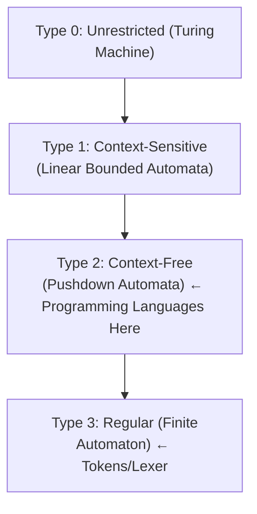

[[00-Dashboard/Home|Home]] | [[02-Semester-VI/Semester-VI-Dashboard|Semester VI]] | [[Overview]] | [[Syllabus]] | [[Unit-1]] | [[Unit-2]] | [[Unit-3]] | [[Unit-4]] | [[Unit-5]] | [[Important-Questions|Imp. Qs]] | [[Revision]] | [[Interview-Prep]]


# Unit 1 - CFG and Languages

> [!note] Unit Overview
> Context-Free Grammars form the mathematical foundation of programming language syntax. This unit covers CFG notation, parse tree construction, derivation types, and how to detect and resolve ambiguous grammars.

## Learning Objectives

- [ ] Define a Context-Free Grammar (CFG) formally
- [ ] Construct parse trees from grammars and strings
- [ ] Perform Leftmost and Rightmost derivations
- [ ] Identify ambiguous grammars with multiple parse trees
- [ ] Resolve ambiguity using operator precedence and associativity rules

---

## 1.1 Context-Free Grammar (CFG) - Basics

A ==Context-Free Grammar (CFG)== is a formal system for specifying the syntax of programming languages.

### Formal Definition

A CFG is a 4-tuple: **G = (V, T, P, S)** where:

| Component | Symbol | Description |
|-----------|--------|-------------|
| **Non-terminals** | V | Variables/syntactic categories - e.g., `E`, `S`, `A` |
| **Terminals** | T | Actual symbols (tokens) - e.g., `id`, `+`, `*`, `(` |
| **Productions** | P | Rules: Non-terminal → string of (V ∪ T)* |
| **Start symbol** | S | The root non-terminal (usually S or E) |

### Example CFG for Arithmetic Expressions

```
G = ({E, T, F}, {id, +, *, (, )}, P, E)

Productions P:
  E → E + T   | T
  T → T * F   | F
  F → ( E )   | id
```

### Notation Conventions

- **Uppercase** letters → Non-terminals (V): A, B, E, S, T, F
- **Lowercase** letters → Terminals (T): a, b, id, +, *
- **Greek letters** → Strings of grammar symbols: α, β, γ
- **ε** (epsilon) → Empty string (lambda)
- **→** → "produces" or "derives"
- **|** → "or" (alternative productions)

---

## 1.2 Parse Tree (Derivation Tree)

A ==Parse Tree== (also called a Derivation Tree or Concrete Syntax Tree) is a graphical representation of a derivation.

### Properties of a Parse Tree

1. **Root** → Start symbol (S)
2. **Interior nodes** → Non-terminals
3. **Leaf nodes** → Terminals (or ε)
4. **Children** of a node correspond to the right-hand side of a production applied to that node

### Example - Parse Tree for `id + id * id`

Using the grammar:
```
E → E + T | T
T → T * F | F
F → ( E ) | id
```

**Parse Tree:**
```
           E
         / | \
        E  +   T
        |     / | \
        T    T  *   F
        |    |      |
        F    F      id
        |    |
        id   id
```

The yield (leaves left to right) = `id + id * id` 

---

## 1.3 Leftmost Derivation (LMD)

In a ==Leftmost Derivation (LMD)==, at each step the **leftmost non-terminal** is replaced.

### LMD of `id + id * id`

```
E
⇒ E + T              [E → E + T, replacing leftmost E]
⇒ T + T              [E → T, replacing leftmost E]
⇒ F + T              [T → F, replacing leftmost T]
⇒ id + T             [F → id, replacing leftmost F]
⇒ id + T * F         [T → T * F, replacing leftmost T]
⇒ id + F * F         [T → F, replacing leftmost T]
⇒ id + id * F        [F → id, replacing leftmost F]
⇒ id + id * id       [F → id, replacing last F]
```

**Notation:** Uses ⇒ for a single step, ⇒\* for multiple steps

---

## 1.4 Rightmost Derivation (RMD)

In a ==Rightmost Derivation (RMD)==, at each step the **rightmost non-terminal** is replaced.

### RMD of `id + id * id`

```
E
⇒ E + T              [E → E + T]
⇒ E + T * F          [T → T * F, rightmost T]
⇒ E + T * id         [F → id, rightmost F]
⇒ E + F * id         [T → F, rightmost T]
⇒ E + id * id        [F → id]
⇒ T + id * id        [E → T]
⇒ F + id * id        [T → F]
⇒ id + id * id       [F → id]
```

> [!tip] LMD vs RMD
> - The **same parse tree** can be read in LMD or RMD order
> - LMD corresponds to **top-down (LL) parsers**
> - RMD (in reverse) corresponds to **bottom-up (LR) parsers**

---

## 1.5 Ambiguous Grammar

### Definition

A grammar G is ==ambiguous== if there exists some string w in L(G) that has:
- **More than one parse tree**, OR
- **More than one leftmost derivation**, OR
- **More than one rightmost derivation**

These three are equivalent conditions.

### Classic Example - Dangling Else

```
Grammar:
  S → if E then S
    | if E then S else S
    | other

String: if E1 then if E2 then S1 else S2
```

This has TWO parse trees:

**Interpretation 1** (else matches inner if - standard):
```
if E1 then
    [if E2 then S1 else S2]  ← else goes with inner if
```

**Interpretation 2** (else matches outer if):
```
if E1 then
    [if E2 then S1]
else S2                       ← else goes with outer if
```

### Classic Example - Expression Grammar

```
Ambiguous grammar: E → E + E | E * E | id

String: id + id * id
```

**Parse Tree 1** (+ has higher precedence - WRONG):
```
      E
    / | \
   E  +   E
   |      | \ \
   id     E  *  E
          |     |
          id    id
```

**Parse Tree 2** (* has higher precedence - CORRECT):
```
      E
    / | \
   E  +   E
   |     / | \
   id   E  *   E
        |       |
        id      id
```

> [!warning] Ambiguity Problem
> Ambiguous grammars are problematic for parsers - they don't know which interpretation to use. Compilers need **unambiguous grammars**.

---

## 1.6 Resolving Ambiguity

### Method 1: Operator Precedence

Introduce separate non-terminals for each precedence level. **Lower in the grammar = higher precedence.**

```
Ambiguous:   E → E + E | E * E | id

Unambiguous (multiplication binds tighter):
  E → E + T | T        ← E handles +
  T → T * F | F        ← T handles * (higher precedence)
  F → ( E ) | id       ← F handles atoms

Now id + id * id has ONLY ONE parse tree:
E → E + T → T + T → F + T → id + T → id + T * F → id + F * F → id + id * id
```

**Precedence levels (lowest to highest):**
```
Addition/Subtraction    (+, -)    → handled at E level
Multiplication/Division (*, /)    → handled at T level
Unary, Atoms           (id, ())   → handled at F level
```

### Method 2: Operator Associativity

**Left-associative** (most operators): `a - b - c` = `(a - b) - c`

```
Left-recursive (left-associative):
  E → E + T | T    ← Left-recursive → left-associative
```

**Right-associative** (exponentiation, assignment): `a = b = c` = `a = (b = c)`

```
Right-recursive (right-associative):
  E → T + E | T    ← Right-recursive → right-associative
```

### Method 3: Dangling Else Resolution

Standard rule: **else matches the nearest unmatched if**

```
Unambiguous grammar:
  S  → matched_S | unmatched_S

  matched_S   → if E then matched_S else matched_S
              | other

  unmatched_S → if E then S
              | if E then matched_S else unmatched_S
```

### Summary - Resolving Ambiguity

| Technique | When to Use | How |
|-----------|-------------|-----|
| **Precedence levels** | Multiple operators | Separate non-terminals per precedence |
| **Associativity** | Same-precedence operators | Left/right recursion in grammar |
| **Grammar rewriting** | Dangling else | Introduce matched/unmatched categories |
| **Disambiguation rules** | When grammar rewriting is complex | External rules (as in yacc/bison `%left`, `%right`) |

^ambiguity-resolution

---

## 1.7 Formal Language Chomsky Hierarchy

> [!note] Context - Where CFGs Fit



| Type | Grammar | Automaton | Example |
|------|---------|-----------|---------|
| 0 | Unrestricted | Turing Machine | Any computable language |
| 1 | Context-Sensitive | LBA | `aⁿbⁿcⁿ` |
| 2 | **Context-Free** | **PDA** | **Programming languages (syntax)** |
| 3 | Regular | DFA/NFA | Tokens, identifiers, numbers |

---

## Key Terms Summary

| Term | Definition |
|------|------------|
| ==CFG== | Context-Free Grammar - 4-tuple (V, T, P, S) for language syntax |
| ==Non-terminal== | Variable in grammar (e.g., E, S, T) |
| ==Terminal== | Actual token/symbol (e.g., id, +, if) |
| ==Production== | Rule: Non-terminal → string |
| ==Parse Tree== | Tree showing derivation structure |
| ==LMD== | Leftmost Derivation - replace leftmost NT first |
| ==RMD== | Rightmost Derivation - replace rightmost NT first |
| ==Ambiguous Grammar== | Grammar with multiple parse trees for same string |
| ==Precedence== | Operator binding strength (*, / before +, -) |
| ==Associativity== | Grouping direction (left or right) for same-precedence ops |

---

## Practice Questions

1. Define a Context-Free Grammar formally with all four components.
2. What is the difference between a terminal and a non-terminal in a CFG?
3. Construct a CFG for the language of all palindromes over {a, b}.
4. Show the leftmost and rightmost derivations for `id * id + id` using the standard expression grammar.
5. What is an ambiguous grammar? Give an example.
6. How do you resolve ambiguity using operator precedence? Rewrite `E → E + E | E * E | id` to be unambiguous.
7. What is the dangling else problem? How is it resolved?
8. What is the difference between left-recursive and right-recursive grammars?
9. Draw the parse tree for `a + b * c` using the unambiguous expression grammar.
10. Where do CFGs fit in the Chomsky hierarchy?

---

## Navigation

- [[Overview]] | [[Syllabus]]
- ← Previous: (Start)
- → Next: [[Unit-2|Unit-2 - Introduction to Compiler]]
- [[Important-Questions]] | [[Revision]] | [[Interview-Prep]]

---
*CS-354-MJ-T Compiler Construction | Unit 1 | Semester VI*
