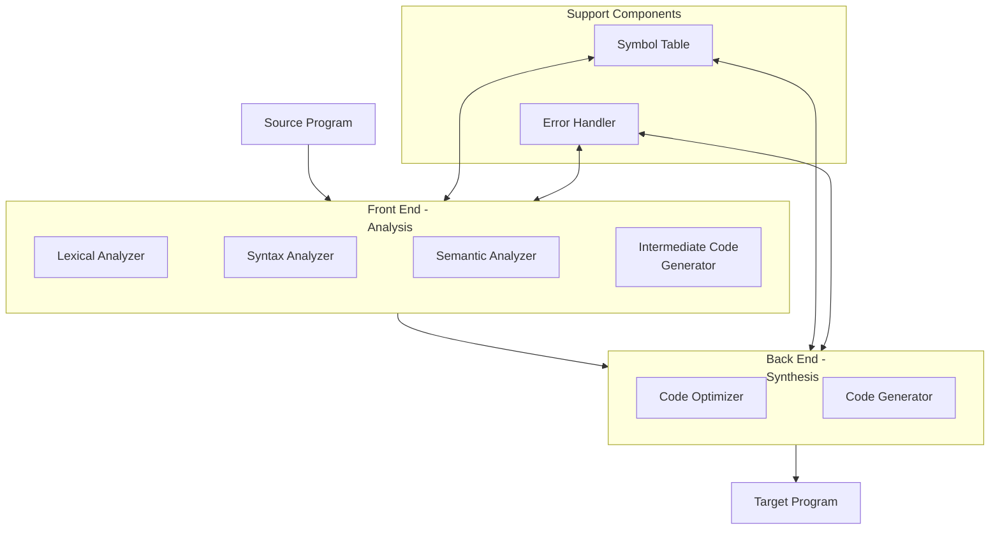
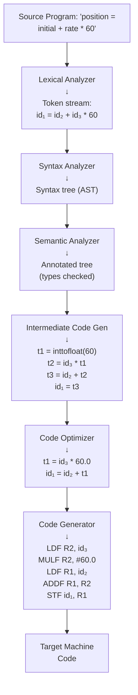

[[00-Dashboard/Home|Home]] | [[02-Semester-VI/Semester-VI-Dashboard|Semester VI]] | [[Overview]] | [[Syllabus]] | [[Unit-1]] | [[Unit-2]] | [[Unit-3]] | [[Unit-4]] | [[Unit-5]] | [[Important-Questions|Imp. Qs]] | [[Revision]] | [[Interview-Prep]]


# Unit 2 - Introduction to Compiler

> [!note] Unit Overview
> This unit provides a holistic understanding of what compilers do, how they are structured into phases, and the different types of compilers. This is the conceptual foundation for the detailed analysis in later units.

## Learning Objectives

- [ ] Define a compiler and distinguish it from an interpreter
- [ ] Explain all six phases of a compiler with data flow
- [ ] Distinguish front-end (analysis) from back-end (synthesis)
- [ ] Identify the role of the Symbol Table and Error Handler
- [ ] Classify compilers by type (one-pass, multi-pass, cross)

---

## 2.1 What is a Compiler?

A ==compiler== is a **translator program** that converts source code written in a **high-level language** (HLL) into **target code** (usually machine code or assembly language) without changing the meaning of the program.

### Compiler vs Interpreter

| Feature | Compiler | Interpreter |
|---------|----------|-------------|
| Translation | Entire program at once | Statement by statement |
| Execution | After compilation | During translation |
| Speed | Faster execution (pre-compiled) | Slower (translate per statement) |
| Error reporting | After entire analysis | Stops at first error |
| Output | Object/machine code file | Direct execution |
| Examples | GCC (C), javac (Java) | Python, Ruby, early BASIC |
| Portability | Object code is platform-specific | Source runs with interpreter |

> [!note] Java is Hybrid
> Java uses **javac** (compiler to bytecode) + **JVM** (interpreter/JIT of bytecode) - a hybrid approach.

---

## 2.2 Compiler Structure - Front End vs Back End



### Front End (Analysis Phase)
- **Language-dependent** - specific to source language
- Analyzes source code and checks for correctness
- Produces an **Intermediate Representation (IR)**

### Back End (Synthesis Phase)
- **Machine-dependent** - specific to target hardware
- Generates target code from IR
- Performs optimizations

---

## 2.3 Phases of a Compiler

A compiler works in **six major phases**, each transforming the source program:



### Phase 1: Lexical Analysis (Scanning)

- **Input:** Character stream
- **Output:** Token stream
- **Tasks:** Group characters into tokens, remove whitespace/comments

```
Source: position = initial + rate * 60
Tokens: [id:"position"] [=] [id:"initial"] [+] [id:"rate"] [*] [num:60]
```

### Phase 2: Syntax Analysis (Parsing)

- **Input:** Token stream
- **Output:** Abstract Syntax Tree (AST) / Parse Tree
- **Tasks:** Check grammatical structure, build tree

```
AST for: position = initial + rate * 60

        =
       / \
  position  +
           / \
       initial  *
               / \
            rate   60
```

### Phase 3: Semantic Analysis

- **Input:** Parse tree / AST
- **Output:** Annotated AST
- **Tasks:** Type checking, type coercion, scope resolution, semantic errors

```
Checks:
- position, initial, rate must be declared (scope)
- 60 is int, but expression context is float → insert inttofloat()
- Types of + and * operands must be compatible
```

### Phase 4: Intermediate Code Generation

- **Input:** Annotated AST
- **Output:** Three-address code (or other IR)
- **Tasks:** Generate machine-independent intermediate code

```
Three-address code:
  t1 = inttofloat(60)     ← Integer 60 → float
  t2 = id3 * t1
  t3 = id2 + t2
  id1 = t3
```

### Phase 5: Code Optimization

- **Input:** Intermediate code
- **Output:** Optimized intermediate code
- **Tasks:** Improve efficiency - reduce operations, eliminate redundancy

```
Optimized:
  t1 = id3 * 60.0         ← Constant folding (int 60 → 60.0 at compile time)
  id1 = id2 + t1          ← Fewer temporaries needed
```

### Phase 6: Code Generation

- **Input:** Optimized intermediate code
- **Output:** Target machine code
- **Tasks:** Map to CPU instructions, register allocation

```
Target Assembly (RISC):
  LDF  R2, id3        // Load rate into register R2
  MULF R2, #60.0      // Multiply by 60.0
  LDF  R1, id2        // Load initial into R1
  ADDF R1, R2         // R1 = initial + rate*60.0
  STF  id1, R1        // Store result in position
```

### Phases Summary Table

| Phase | Input | Output | Key Tools |
|-------|-------|--------|-----------|
| Lexical Analysis | Characters | Tokens | Regular expressions, DFA |
| Syntax Analysis | Tokens | Parse Tree | CFG, LL/LR parsers |
| Semantic Analysis | Parse Tree | Annotated Tree | Type system, symbol table |
| Intermediate Code Gen | Annotated Tree | IR (3-addr code) | IR design |
| Code Optimization | IR | Optimized IR | Data flow analysis |
| Code Generation | Optimized IR | Machine code | Register allocation |

^compiler-phases

---

## 2.4 Symbol Table

The ==Symbol Table== is a data structure maintained throughout compilation that stores information about identifiers.

```
Symbol Table Example:
┌────────────┬────────┬──────────┬───────────┬─────────┐
│ Name       │ Type   │ Scope    │ Address   │ Value   │
├────────────┼────────┼──────────┼───────────┼─────────┤
│ position   │ float  │ global   │ 0x1000    │ -       │
│ initial    │ float  │ global   │ 0x1004    │ 0.0     │
│ rate       │ float  │ global   │ 0x1008    │ -       │
│ count      │ int    │ main()   │ 0x100C    │ 0       │
└────────────┴────────┴──────────┴───────────┴─────────┘
```

### Symbol Table Operations
- **Insert** - add new identifier entry
- **Lookup** - find identifier info (used in semantic analysis)
- **Update** - add type/address info as compilation progresses
- **Delete** - remove identifiers going out of scope

### Implementation Approaches

| Structure | Lookup | Insert | Use Case |
|-----------|--------|--------|----------|
| Linear list | O(n) | O(1) | Small programs |
| Hash table | O(1) avg | O(1) avg | **Most common**  |
| Binary tree | O(log n) | O(log n) | Ordered access |

---

## 2.5 Error Handler

The ==Error Handler== detects and reports errors encountered during compilation phases.

### Types of Errors

| Phase | Error Type | Example |
|-------|------------|---------|
| Lexical | **Lexical error** | Illegal character `@price`, unterminated string `"abc` |
| Syntax | **Syntax error** | Missing `;`, unmatched `}`, invalid expression |
| Semantic | **Semantic error** | Type mismatch (`int = "hello"`), undeclared variable |
| Code Gen | **Logical error** | Division by zero (sometimes) |

### Error Recovery Strategies

1. **Panic Mode** - skip tokens until synchronizing token (`;`, `}`)
2. **Phrase-level** - locally replace/insert/delete tokens
3. **Error productions** - grammar rules for common errors
4. **Global correction** - find minimum edits (expensive)

---

## 2.6 Types of Compilers

| Type | Description | Example |
|------|-------------|---------|
| **One-pass compiler** | Processes source once, generates code immediately | Early Fortran compilers |
| **Two-pass (Multi-pass)** | Multiple passes for analysis and synthesis | GCC, most modern compilers |
| **Cross compiler** | Runs on Platform A, generates code for Platform B | Android NDK (compiles on PC for ARM) |
| **Incremental compiler** | Recompiles only changed parts | IDE background compilation |
| **Bootstrapping** | Compiler written in its own language | First GCC compiled by C compiler, then GCC compiles itself |
| **Just-In-Time (JIT)** | Compiles at runtime | Java JVM, V8 (JavaScript) |
| **Ahead-Of-Time (AOT)** | Compiles before deployment | Angular AOT compilation |
| **Decompiler** | Machine code → High-level code | Reverse engineering tools |

---

## Key Terms Summary

| Term | Definition |
|------|------------|
| ==Compiler== | Translates entire source program to target code |
| ==Interpreter== | Translates and executes source line by line |
| ==Front End== | Analysis phases - language-dependent |
| ==Back End== | Synthesis phases - machine-dependent |
| ==Lexeme== | Actual string in source (`count`, `42`) |
| ==Token== | Category of lexeme (IDENTIFIER, NUMBER) |
| ==AST== | Abstract Syntax Tree - hierarchical program structure |
| ==IR== | Intermediate Representation - machine-independent code |
| ==Symbol Table== | Stores information about program identifiers |
| ==Cross Compiler== | Compiles for a different target architecture |

---

## Practice Questions

1. Define a compiler. How does it differ from an interpreter?
2. Draw and explain the structure of a compiler showing front-end and back-end phases.
3. What are the six phases of a compiler? Explain the input and output of each phase.
4. Trace the compilation of `x = a + b * 2` through all six phases.
5. What is the role of the Symbol Table in a compiler?
6. What is the role of the Error Handler? Name four types of errors in compilation.
7. What is a cross compiler? Give a real-world example.
8. What is bootstrapping in the context of compilers?
9. What is the difference between a one-pass and a multi-pass compiler?
10. What is a JIT compiler? How does Java use it?

---

## Navigation

- [[Overview]] | [[Syllabus]]
- ← Previous: [[Unit-1|Unit-1 - CFG and Languages]]
- → Next: [[Unit-3|Unit-3 - Lexical Analysis]]
- [[Important-Questions]] | [[Revision]] | [[Interview-Prep]]

---
*CS-354-MJ-T Compiler Construction | Unit 2 | Semester VI*
