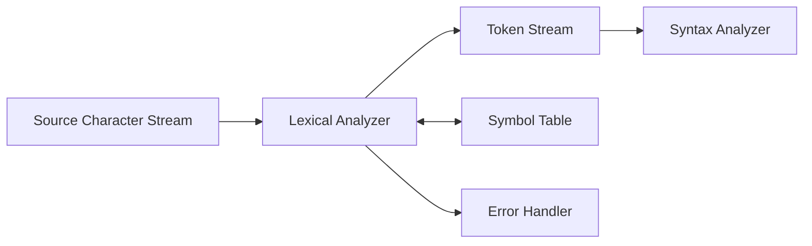

[[00-Dashboard/Home|Home]] | [[02-Semester-VI/Semester-VI-Dashboard|Semester VI]] | [[Overview]] | [[Syllabus]] | [[Unit-1]] | [[Unit-2]] | [[Unit-3]] | [[Unit-4]] | [[Unit-5]] | [[Important-Questions|Imp. Qs]] | [[Revision]] | [[Interview-Prep]]


# Unit 3 - Lexical Analysis

> [!note] Unit Overview
> Lexical Analysis (scanning) is the **first phase** of a compiler. It reads the source program character by character and groups them into meaningful tokens using patterns defined by regular expressions and recognized by finite automata.

## Learning Objectives

- [ ] Distinguish between tokens, lexemes, and patterns
- [ ] Draw transition diagrams for token recognition
- [ ] Explain how a DFA functions as a lexical analyzer
- [ ] Describe identifier and number recognition algorithms
- [ ] Identify types of lexical errors

---

## 3.1 Role of Lexical Analyzer (Lexer/Scanner)

The ==Lexical Analyzer== (also called lexer or scanner) is the first phase of compilation:



### Tasks of the Lexical Analyzer

1. **Read** source program characters
2. **Group** characters into lexemes
3. **Classify** lexemes into token categories
4. **Remove** whitespace and comments
5. **Report** lexical errors
6. **Interface** with the symbol table (insert identifiers)

### Why Separate Lexical Analysis?

| Reason | Explanation |
|--------|-------------|
| Simplicity | Parser operates on tokens, not individual characters |
| Efficiency | Buffering and scanning techniques improve speed |
| Portability | Lexer handles machine-specific I/O, parser is portable |
| Modularity | Cleaner separation of concerns |

---

## 3.2 Tokens, Lexemes, and Patterns

These three concepts are closely related but distinct:

### Definitions

| Concept | Definition | Example |
|---------|------------|---------|
| ==Token== | Category/type of a terminal symbol | `IDENTIFIER`, `NUMBER`, `KEYWORD`, `OPERATOR` |
| ==Lexeme== | Actual character sequence from source | `count`, `42`, `if`, `+` |
| ==Pattern== | Rule describing what lexemes belong to a token | Regex `[a-zA-Z_][a-zA-Z0-9_]*` for IDENTIFIER |

### Comprehensive Token Table

| Token | Pattern (Informal) | Sample Lexemes |
|-------|--------------------|----------------|
| `KEYWORD` | Reserved words | `if`, `while`, `for`, `int`, `class` |
| `IDENTIFIER` | Letter (letter|digit|_)* | `count`, `myVar`, `_name` |
| `INTEGER_LITERAL` | Digit+ | `42`, `100`, `0` |
| `FLOAT_LITERAL` | Digit+ . Digit* (Digit+) | `3.14`, `2.5`, `100.0` |
| `STRING_LITERAL` | " any-chars " | `"hello"`, `"world"` |
| `OPERATOR` | Arithmetic/relational/logical ops | `+`, `-`, `*`, `/`, `==`, `&&` |
| `DELIMITER` | Punctuation | `;`, `,`, `{`, `}`, `(`, `)` |
| `ASSIGN` | Assignment operator | `=` |
| `EOF` | End of file | - |

### Example Token Stream

```
Source code:  if (count > 10) total = total + count;

Token stream:
(KEYWORD, "if")
(DELIMITER, "(")
(IDENTIFIER, "count")
(RELOP, ">")
(INTEGER, "10")
(DELIMITER, ")")
(IDENTIFIER, "total")
(ASSIGN, "=")
(IDENTIFIER, "total")
(OPERATOR, "+")
(IDENTIFIER, "count")
(DELIMITER, ";")
```

---

## 3.3 Finite Automaton as Lexical Analyzer

A ==Finite Automaton (FA)== is the mathematical model used to recognize tokens.

### Types of FA

| Type | States | Transitions | Deterministic |
|------|--------|-------------|---------------|
| **NFA** (Non-deterministic) | One state per regex operation | ε-transitions allowed, multiple on same input | No |
| **DFA** (Deterministic) | Subset of NFA states | Exactly one transition per (state, input) | Yes |

### DFA for Identifier Recognition

A valid identifier: starts with letter or underscore, followed by letters, digits, or underscore.

**Pattern (Regex):** `[a-zA-Z_][a-zA-Z0-9_]*`

```
Transition Diagram:

     letter|_          letter|digit|_
  [0] ────────────► [1] ──────────────► [1]   (Accept State)
                       ◄──────────────
                       (self-loop)
  
  From state 0: If see letter or _, go to state 1
  State 1 (accept): On letter/digit/_, stay in state 1
                    On anything else → output IDENTIFIER token, retract
```

**DFA Transition Table:**

| State | Letter/_ | Digit | Other | Token Emitted |
|-------|-----------|-------|-------|---------------|
| **0 (Start)** | → 1 | Error | Error | - |
| **1 (Accept)** | → 1 | → 1 | Retract | IDENTIFIER |

### DFA for Integer Recognition

**Pattern:** `[0-9]+`

```
Transition Diagram:

      digit              digit
  [0] ──────────► [1] ──────────► [1]
                    (accept state)
  
  State 0: digit → State 1
  State 1: digit → State 1 (self-loop), else retract → emit INTEGER
```

### DFA for Floating-Point Number

**Pattern:** `[0-9]+\.[0-9]*`

```
Transition Diagram:

      digit       .        digit
  [0] ──────► [1] ──────► [2] ──────► [2]
                               ↑_______↑
                              (self-loop)
  
  Accept state: 2 (and 1 for integer)
```

### Transition Diagram for Relational Operators

```
Operators: < <= <> > >= = ==

From start:
  '<' → State A
       State A: '=' → State B (accept: <=)
               '>' → State C (accept: <>)
               other → retract, accept: <
  
  '>' → State D
       State D: '=' → State E (accept: >=)
               other → retract, accept: >
  
  '=' → State F
       State F: '=' → State G (accept: ==)
               other → retract, accept: =
```

---

## 3.4 Identifier Recognition Algorithm

```
Algorithm: scanIdentifier()
Input: Current character ch
Output: Token (IDENTIFIER or KEYWORD)

1. If ch is letter or '_':
   a. buffer = ""
   b. While ch is letter, digit, or '_':
      i. buffer += ch
      ii. ch = nextChar()
   c. retract()  // Put back last non-identifier char
   d. If buffer is in keywords table:
      Return (KEYWORD, buffer)
   e. Else:
      Insert buffer in symbol table (if not present)
      Return (IDENTIFIER, buffer)
2. Else: Error - not an identifier start
```

### Implementation (Pseudocode)

```java
String[] keywords = {"if", "else", "while", "for", "int", "float", "return"};

Token scanIdentifier(char startChar) {
    StringBuilder buffer = new StringBuilder();
    char ch = startChar;
    
    while (Character.isLetterOrDigit(ch) || ch == '_') {
        buffer.append(ch);
        ch = nextChar();
    }
    retract();  // Put back non-identifier character
    
    String lexeme = buffer.toString();
    
    // Check if it's a keyword
    for (String kw : keywords) {
        if (lexeme.equals(kw)) {
            return new Token(TokenType.KEYWORD, lexeme);
        }
    }
    
    // It's an identifier - add to symbol table
    symbolTable.insert(lexeme);
    return new Token(TokenType.IDENTIFIER, lexeme);
}
```

---

## 3.5 Number Recognition

### Integer Recognition

```
Algorithm: scanInteger()
buffer = ""
While ch is digit:
    buffer += ch
    ch = nextChar()
retract()
Return (INTEGER_LITERAL, buffer)
```

### Floating-Point Recognition

```
Algorithm: scanNumber()
buffer = ""
While ch is digit:       // Integer part
    buffer += ch
    ch = nextChar()

If ch == '.':            // Decimal point
    buffer += '.'
    ch = nextChar()
    While ch is digit:   // Fractional part
        buffer += ch
        ch = nextChar()
    retract()
    Return (FLOAT_LITERAL, buffer)
Else:
    retract()
    Return (INTEGER_LITERAL, buffer)
```

---

## 3.6 Lexical Errors and Recovery

### Types of Lexical Errors

| Error Type | Example | Description |
|------------|---------|-------------|
| Illegal character | `@`, `` ` ``, `#` (in most languages) | Character not part of alphabet |
| Unterminated string | `"hello` (no closing `"`) | EOF before string ends |
| Invalid number | `3.14.15`, `0xGG` | Malformed numeric literal |
| Illegal identifier | `2name` (starts with digit) | Wrong start character |

### Error Recovery Strategies

1. **Delete** the illegal character and continue scanning
2. **Replace** illegal character with valid one
3. **Insert** missing character (e.g., closing quote)
4. **Panic mode**: skip characters until a valid start is found
5. **Report error** with line/column number and continue

```
Example error messages:
  Error: Line 5, Col 12: Illegal character '@'
  Error: Line 8, Col 1: Unterminated string literal
  Error: Line 12, Col 5: Invalid float literal '3.14.15'
```

---

## 3.7 Buffering for Efficiency

Reading one character at a time is slow. Lexers use **two-buffer scheme**:

```
Buffer Pair Scheme:
┌─────────────────────┬─────────────────────┐
│    Buffer 1 (4KB)   │    Buffer 2 (4KB)   │
│ E = M + C * 2 \n   │  if (x > 0) ...     │
└─────────────────────┴─────────────────────┘
   ↑ lexemeBegin       ↑ forward
```

- **lexemeBegin**: Start of current lexeme
- **forward**: Current scan position
- When forward reaches end of buffer 1, buffer 2 is loaded

### Input Buffering Algorithm

```
function advance():
    if forward == end_of_buffer1:
        load buffer2
        forward = start_of_buffer2
    elif forward == end_of_buffer2:
        load buffer1
        forward = start_of_buffer1
    else:
        forward++
    return source[forward]

function retract():
    forward--  // Go back one position
```

---

## Key Terms Summary

| Term | Definition |
|------|------------|
| ==Lexer/Scanner== | First compiler phase - produces tokens from characters |
| ==Token== | Category of a syntactic element (IDENTIFIER, KEYWORD) |
| ==Lexeme== | Actual string matching a token pattern |
| ==Pattern== | Rule (regex) describing what strings belong to a token |
| ==DFA== | Deterministic Finite Automaton - exact one transition per state-input |
| ==NFA== | Non-deterministic FA - multiple transitions possible |
| ==Transition Diagram== | State machine diagram for token recognition |
| ==retract()== | Put back the last read character |
| ==Symbol Table== | Stores identifier info; lexer inserts new identifiers |
| ==Lexical Error== | Illegal character or malformed token in source |

---

## Practice Questions

1. What is the role of a Lexical Analyzer in a compiler?
2. Distinguish between a token, a lexeme, and a pattern. Give examples for each.
3. Draw a transition diagram (DFA) for recognizing identifiers in Java.
4. Draw a transition diagram for recognizing unsigned integers.
5. Draw a transition diagram for recognizing relational operators (<, <=, >, >=, ==).
6. What is the difference between a DFA and an NFA?
7. Write the algorithm for recognizing an identifier (including keyword check).
8. What types of errors can occur during lexical analysis? Give an example of each.
9. What is the two-buffer scheme? Why is it used in lexical analysis?
10. How does a lexer interact with the Symbol Table?

---

## Navigation

- [[Overview]] | [[Syllabus]]
- ← Previous: [[Unit-2|Unit-2 - Introduction to Compiler]]
- → Next: [[Unit-4|Unit-4 - Syntax Analysis]]
- [[Important-Questions]] | [[Revision]] | [[Interview-Prep]]

---
*CS-354-MJ-T Compiler Construction | Unit 3 | Semester VI*
