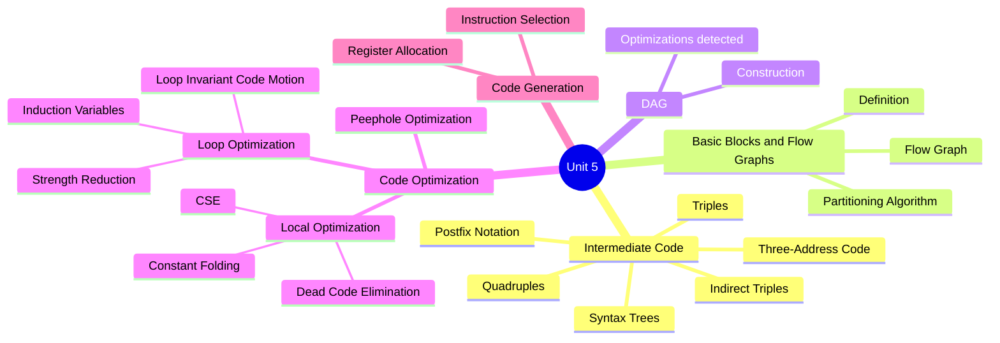
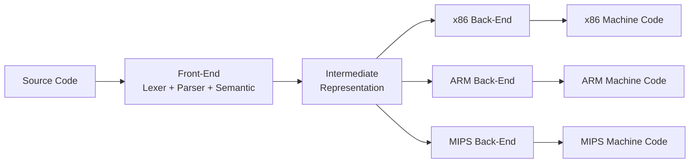
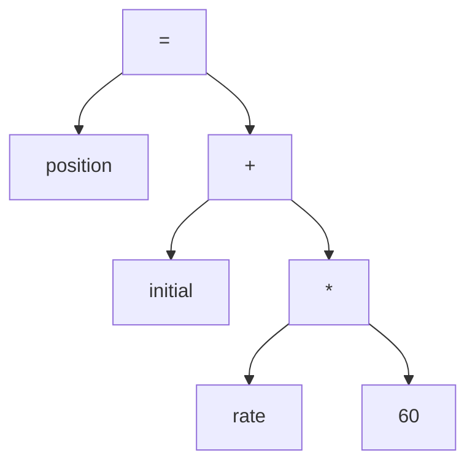
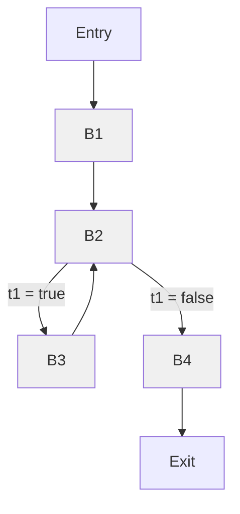
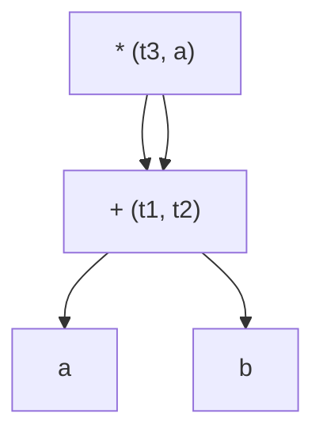
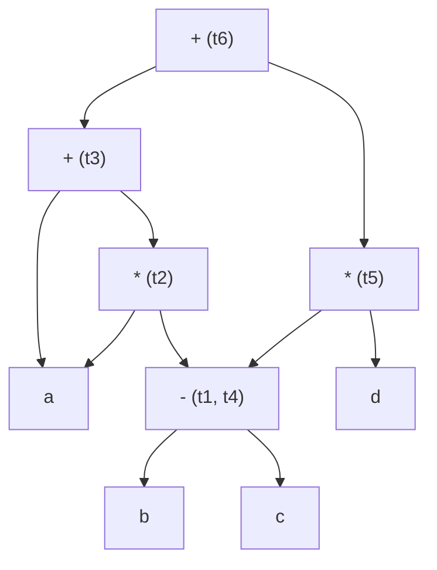
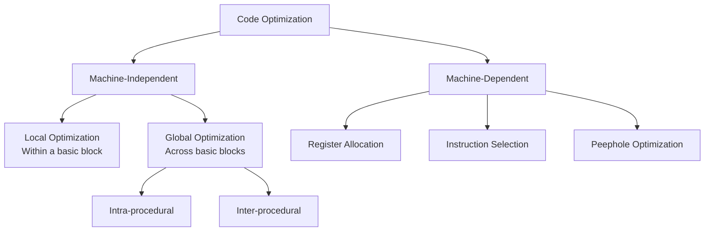
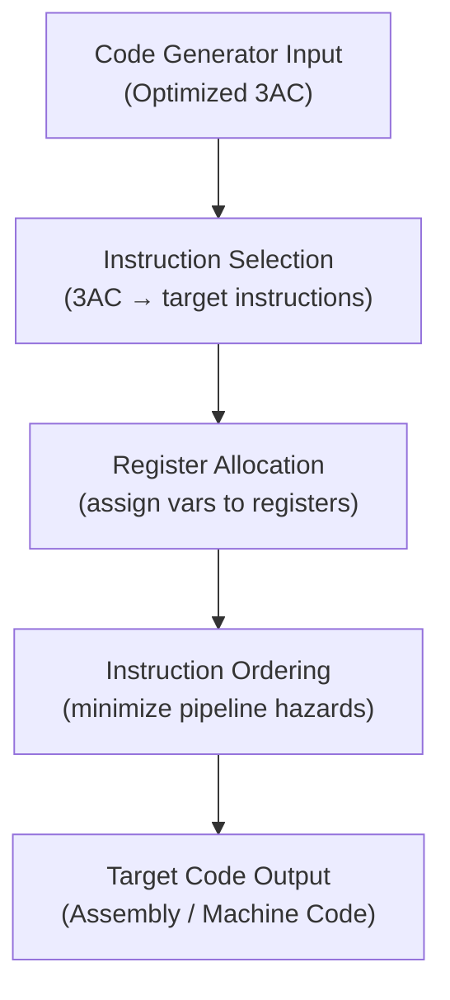
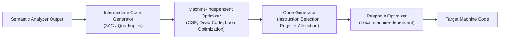

[[Overview]] | [[Syllabus]] | [[Unit-1]] | [[Unit-2]] | [[Unit-3]] | [[Unit-4]] | [[Unit-5]]

---

# Unit 5: Code Generation and Optimization *(8 Hours)*

> [!important] Learning Objectives
> After completing this unit, you should be able to:
> - Generate three-address code (3AC) from expressions and statements
> - Represent 3AC using quadruples, triples, and indirect triples
> - Identify basic blocks and construct a flow graph
> - Build a Directed Acyclic Graph (DAG) for a basic block
> - Apply local and global code optimization techniques
> - Explain register allocation strategies
> - Describe the final code generation phase

---

## Topics at a Glance



---

## 5.1 Intermediate Code Generation

### 5.1.1 Why Intermediate Code?

A compiler could, in theory, translate source code directly to machine code. However, generating intermediate code (IR) provides two key benefits:

1. **Retargetability:** The same front-end (parser, semantic analyser) can produce IR, and different back-ends can translate that IR to different target machines (x86, ARM, MIPS).
2. **Optimization:** Machine-independent optimizations are easier and more powerful when applied to IR before target-specific code is generated.



### 5.1.2 Postfix Notation (Reverse Polish Notation)

==Postfix notation== places the operator after its operands. It is a linearized representation of an expression tree and can be evaluated using a stack without parentheses.

**Algorithm: Infix to Postfix (using stack)**

```
1. Scan expression left to right
2. If operand → output it
3. If '(' → push to stack
4. If ')' → pop and output until '(' is found
5. If operator → pop operators of greater or equal precedence, then push current
6. At end → pop all remaining operators
```

| Expression (Infix) | Postfix |
|---|---|
| `a + b` | `a b +` |
| `a + b * c` | `a b c * +` |
| `(a + b) * c` | `a b + c *` |
| `a * b + c * d` | `a b * c d * +` |
| `a + b * c - d / e` | `a b c * + d e / -` |

**Worked Example:** Convert `(a + b) * (a + b) - c * d` to postfix:

```
Tokens: ( a + b ) * ( a + b ) - c * d
Step 1: ( → push stack: [( ]
Step 2: a → output: a
Step 3: + → push stack: [( +]
Step 4: b → output: a b
Step 5: ) → pop until (: output a b +, stack: []
Step 6: * → push stack: [*]
Step 7: ( → push stack: [* (]
Step 8: a → output: a b + a
Step 9: + → push stack: [* ( +]
Step 10: b → output: a b + a b
Step 11: ) → pop until (: output a b + a b +, stack: [*]
Step 12: - → pop * (higher prec), output a b + a b + *, push -, stack: [-]
Step 13: c → output: a b + a b + * c
Step 14: * → push stack: [- *]
Step 15: d → output: a b + a b + * c d
Step 16: End → pop all: a b + a b + * c d * -

Result: a b + a b + * c d * -
```

### 5.1.3 Syntax Trees (Abstract Syntax Trees)

An ==Abstract Syntax Tree (AST)== is a condensed form of a parse tree where:
- Leaves represent operands (identifiers, constants)
- Internal nodes represent operators
- Parentheses and non-essential grammar symbols are eliminated

**Example:** AST for `position = initial + rate * 60`



### 5.1.4 Three-Address Code (3AC)

==Three-address code== is an IR where each instruction has at most one operator and at most three addresses (two operands and one result). Temporary variables (t1, t2, ...) are used to hold intermediate values.

**General form:** `result = arg1 op arg2`

**Types of 3AC instructions:**

| Type | Example |
|------|---------|
| Binary assignment | `t1 = a + b` |
| Unary assignment | `t1 = -a` |
| Copy | `a = b` |
| Unconditional jump | `goto L` |
| Conditional jump | `if a < b goto L` |
| Parameter passing | `param a` |
| Procedure call | `call p, n` |
| Indexed assignment | `a = b[i]` or `a[i] = b` |
| Address and pointer | `a = &b`, `a = *b`, `*a = b` |

**Worked Example:** Generate 3AC for `a = -b * (c + d)`

```
t1 = -b           (unary minus)
t2 = c + d        (addition)
t3 = t1 * t2      (multiplication)
a  = t3           (assignment)
```

**Worked Example:** Generate 3AC for `(a + b) * (a + b) - c * d`

```
t1 = a + b
t2 = a + b        (could be optimized to t2 = t1 by CSE)
t3 = t1 * t2
t4 = c * d
t5 = t3 - t4
```

**Worked Example:** 3AC for `position = initial + rate * 60`

```
t1 = rate * 60
t2 = initial + t1
position = t2
```

### 5.1.5 Representations of Three-Address Code

#### Quadruples

==Quadruples== use a four-field record: `(operator, arg1, arg2, result)`.

**Example:** For `a = -b * (c + d)`:

| Position | Operator | Arg1 | Arg2 | Result |
|----------|----------|------|------|--------|
| 0 | `minus` | `b` | - | `t1` |
| 1 | `*` | `t1` | - | `t2` (wait - after `c+d`) |

Corrected for `t1 = -b`, `t2 = c + d`, `t3 = t1 * t2`, `a = t3`:

| Index | Op | Arg1 | Arg2 | Result |
|-------|----|------|------|--------|
| 0 | `uminus` | `b` | | `t1` |
| 1 | `+` | `c` | `d` | `t2` |
| 2 | `*` | `t1` | `t2` | `t3` |
| 3 | `=` | `t3` | | `a` |

**Advantage:** Easy to rearrange instructions (for optimization). Result field makes the value explicit.

#### Triples

==Triples== use three fields `(operator, arg1, arg2)` and implicitly number each instruction. References to a previous result use the instruction's index number (a pointer) instead of a temporary variable name.

| Index | Op | Arg1 | Arg2 |
|-------|----|------|------|
| 0 | `uminus` | `b` | |
| 1 | `+` | `c` | `d` |
| 2 | `*` | (0) | (1) |
| 3 | `=` | `a` | (2) |

**Advantage:** Saves the space of the result field. **Disadvantage:** Harder to rearrange (instruction indices change).

#### Indirect Triples

==Indirect triples== use a separate array of pointers into the triples array. Reordering is done by rearranging the pointer array, not the triples themselves.

| Pointer Array | Triples |
|---|---|
| [0] → 35 | 35: `(uminus, b, -)` |
| [1] → 36 | 36: `(+, c, d)` |
| [2] → 37 | 37: `(*, (35), (36))` |
| [3] → 38 | 38: `(=, a, (37))` |

**Comparison of Representations:**

| Property | Quadruples | Triples | Indirect Triples |
|----------|-----------|---------|-----------------|
| Space | More (4 fields) | Less (3 fields) | Moderate |
| Rearranging | Easy | Hard (indices change) | Easy (rearrange pointers) |
| Temporary names | Explicit | Implicit (by index) | Implicit |
| Used in | Most compilers | Some compilers | Optimizing compilers |

---

## 5.2 Basic Blocks and Flow Graphs

### 5.2.1 What is a Basic Block?

A ==basic block== is a maximal sequence of consecutive three-address instructions such that:
- Control enters only at the beginning (first instruction)
- Control leaves only at the end (last instruction)
- No jumps into or out of the middle

Basic blocks are the fundamental unit for local optimization.

### 5.2.2 Algorithm to Partition 3AC into Basic Blocks

**Step 1: Identify leaders.** A leader is the first instruction of a basic block. The following are leaders:
- The first instruction of the program
- Any instruction that is the target of a conditional or unconditional jump
- Any instruction that immediately follows a conditional or unconditional jump

**Step 2: Form basic blocks.** Each leader starts a new basic block. A basic block consists of the leader and all instructions up to (but not including) the next leader.

**Example:** Partition the following 3AC for computing `sum = 1 + 2 + ... + 100`:

```
(1)  i = 1
(2)  s = 0
(3)  t1 = i <= 100      <- L1 (target of jump from (7))
(4)  if t1 = false goto L2
(5)  s = s + i
(6)  i = i + 1
(7)  goto L1            <- (3) is target
(8)  ...                <- L2 (target of jump from (4))
```

Leaders: (1) - first instruction, (3) - target of goto L1, (8) - target of goto L2, and (5) follows conditional jump.

| Basic Block | Instructions |
|-------------|-------------|
| B1 | (1), (2) |
| B2 | (3), (4) |
| B3 | (5), (6), (7) |
| B4 | (8), ... |

### 5.2.3 Flow Graph

A ==flow graph== (control flow graph) is a directed graph where:
- Each node is a basic block
- Directed edges represent possible control flow transfers



---

## 5.3 Directed Acyclic Graph (DAG) for Basic Blocks

### 5.3.1 What is a DAG?

A ==Directed Acyclic Graph (DAG)== is a data structure used to represent the computations in a basic block. It:
- Has leaf nodes for variables and constants (inputs)
- Has interior nodes for operations
- Shares nodes for common subexpressions (CSE detection)
- Has labels on nodes representing the variables that hold that value

### 5.3.2 DAG Construction Algorithm

For each instruction `a = b op c` (or `a = op b`):
1. If node for `b` does not exist, create a leaf for `b`
2. If node for `c` does not exist, create a leaf for `c`
3. If a node `n` with operation `op` and children for `b` and `c` already exists, set `n` as the node for `a` (CSE detected)
4. Otherwise, create a new internal node with `op`, children `b` and `c`
5. Remove `a` from the label of any previous node; add `a` as a label to node `n`

**Worked Example:** Build a DAG for:

```
t1 = a + b
t2 = a + b    (CSE - same as t1)
t3 = t1 * t2
a  = t3
```



The key observation is that `a + b` is computed only once. The node for `+` is shared by both `t1` and `t2`. This is ==Common Sub-expression Elimination (CSE)==.

**Worked Example:** DAG for `a + a * (b - c) + (b - c) * d`

```
t1 = b - c
t2 = a * t1
t3 = a + t2
t4 = b - c     (= t1, CSE)
t5 = t4 * d    (= t1 * d)
t6 = t3 + t5
```

In the DAG, the node for `b - c` is shared between t1 and t4.



---

## 5.4 Code Optimization

### 5.4.1 Classification of Optimizations



> [!note] When to Optimize
> Optimizations can be applied at multiple stages: at the IR level (machine-independent) and at the target code level (machine-dependent). Machine-independent optimizations offer the best portability.

### 5.4.2 Local Optimizations (Within a Basic Block)

#### Constant Folding

==Constant folding== evaluates constant expressions at compile time rather than at run time.

```
Before:           After:
t1 = 2 * 3        t1 = 6
t2 = t1 + 4       t2 = 10
```

#### Constant Propagation

If a variable is assigned a constant value, replace all subsequent uses of that variable with the constant value.

```
Before:           After:
x = 5             x = 5
y = x + 3         y = 5 + 3   → y = 8 (combined with folding)
```

#### Common Subexpression Elimination (CSE)

==CSE== detects expressions that have already been computed and whose operands have not changed, and replaces subsequent computations with the previously computed value.

```
Before:                    After:
t1 = a + b                 t1 = a + b
t2 = a + b                 t2 = t1        (t2 = t1, same computation)
t3 = t1 * t2               t3 = t1 * t1
```

Using a DAG automatically detects CSEs.

#### Dead Code Elimination

==Dead code== is code that computes values that are never subsequently used. It can be safely removed.

```
Before:           After:
x = 5             x = 5
y = x + 1         y = x + 1
x = 10            x = 10    (x = 5 is dead because x is redefined before use)
                  (y = x + 1 might be dead if y is never used)
```

#### Algebraic Simplification

Apply mathematical identities to simplify expressions.

```
x = x + 0     →  (eliminate - identity for addition)
x = x * 1     →  (eliminate - identity for multiplication)
x = x * 0     →  x = 0
x = x ^ 2     →  x = x * x  (avoid pow() call)
x = 2 * y     →  x = y + y  (strength reduction)
```

### 5.4.3 Loop Optimization

Loops are the most important target for optimization because a small improvement inside a loop that executes 10,000 times yields a 10,000x return.

#### Loop Invariant Code Motion (Frequency Reduction)

==Loop invariant code== is code inside a loop whose result does not change from one iteration to the next. It can be moved to the pre-header (a block just before the loop entry).

```c
// Before optimization
for (int i = 0; i < n; i++) {
    int limit = max_size * scale;   // loop invariant - same every iteration
    a[i] = a[i] + limit;
}

// After optimization (code hoisted out of loop)
int limit = max_size * scale;       // moved to pre-header
for (int i = 0; i < n; i++) {
    a[i] = a[i] + limit;
}
```

**Conditions for code motion:** An expression `e` is loop invariant if all its operands are:
- Constants, or
- Variables with only one reaching definition, which is itself outside the loop

#### Strength Reduction

==Strength reduction== replaces an expensive operation with a cheaper equivalent operation. The classic example is replacing multiplication inside a loop with repeated addition.

```c
// Before: multiplication each iteration
for (int i = 0; i < n; i++) {
    int val = i * 4;   // multiplication
    a[val] = 0;
}

// After: addition each iteration (cheaper)
int val = 0;
for (int i = 0; i < n; i++) {
    a[val] = 0;
    val = val + 4;     // addition replaces multiplication
}
```

| Before | After (Strength Reduction) |
|--------|--------------------------|
| `x = y ^ 2` | `x = y * y` |
| `x = i * constant` | `x = x + constant` (in loop) |
| `x = 2 * y` | `x = y + y` |
| `x = y / 2` | `x = y >> 1` (right shift, for powers of 2) |

#### Induction Variable Elimination

An ==induction variable== is a variable whose value changes by a fixed amount each time the loop body executes. After strength reduction, derived induction variables may become usable directly, allowing the original induction variable to be eliminated if it is only used in the loop test.

```
Before strength reduction:
  i: 0, 1, 2, 3, ...     (basic induction variable)
  val = i * 4: 0, 4, 8, 12, ...  (derived)

After strength reduction:
  val: 0, 4, 8, 12, ...
  i: only used in test (i < n)

If we can express the test in terms of val (val < n*4), 
we can eliminate i entirely.
```

### 5.4.4 Peephole Optimization

==Peephole optimization== is a local, machine-dependent optimization. It examines a small sliding window (the "peephole") of generated target code and replaces inefficient instruction sequences with better ones.

**Common peephole optimizations:**

1. **Redundant load/store elimination:**
```asm
STORE R0, x       ; Store R0 into x
LOAD  R0, x       ; Immediately load x back into R0 (redundant!)
; After: STORE R0, x   (remove the LOAD)
```

2. **Unreachable code elimination:**
```
goto L
x = 1             ; Never reached - remove this
L: ...
```

3. **Flow of control optimization (jump-to-jump):**
```
Before:           After:
goto L1           goto L2
...
L1: goto L2
```

4. **Algebraic simplifications:**
```
x = x + 0  →  remove
x = x * 1  →  remove
```

5. **Use of machine idioms:**
```
x = x + 1  →  INC x   (single increment instruction, faster)
x = x - 1  →  DEC x
```

---

## 5.5 Code Generation

### 5.5.1 The Code Generation Phase

The ==code generator== takes the optimized IR as input and produces the target machine code (or assembly language). Key tasks:

1. **Instruction selection:** Choosing which target machine instruction(s) correspond to each IR instruction
2. **Register allocation:** Deciding which variables to keep in registers
3. **Instruction ordering:** Choosing the order of instructions to minimize pipeline stalls

### 5.5.2 Register Allocation

==Register allocation== is the process of assigning program variables to machine registers. Registers are fast (no memory access), but there is a limited number. When there are more live variables than registers, some must be ==spilled== to memory.

**Key concepts:**

- **Live variable:** A variable `v` is ==live== at a point `p` if there is a path from `p` to a use of `v` with no intervening definition of `v`.
- **Register spilling:** When all registers are occupied and a new variable needs one, an existing variable must be written to memory (spill) and its register reused.
- **Graph Colouring:** The classic register allocation algorithm models the problem as a graph colouring problem. Variables that are simultaneously live (interfere) are connected by edges. A valid k-colouring (with k = number of registers) means k registers suffice.



### 5.5.3 Simple Code Generation Example

Generate code for `a = b + c * d` on a register machine (two-address instructions):

```
3AC:
  t1 = c * d
  t2 = b + t1
  a  = t2

Generated Assembly (RISC-style):
  LOAD  R1, c       ; R1 = c
  LOAD  R2, d       ; R2 = d
  MUL   R1, R1, R2  ; R1 = c * d  (t1)
  LOAD  R2, b       ; R2 = b
  ADD   R2, R2, R1  ; R2 = b + t1 (t2)
  STORE R2, a       ; a = t2
```

### 5.5.4 Next-Use Information

To generate efficient code, the compiler tracks the ==next use== of each variable: how far in the future (in instructions) is a variable next referenced? Variables with a far next use (or no next use) are good candidates for spilling from registers.

---

## 5.6 Summary: Compiler Back-End Pipeline



---

## Key Definitions

| Term | Definition |
|------|-----------|
| ==Three-Address Code (3AC)== | IR with at most one operator and three addresses per instruction; uses temporaries |
| ==Quadruples== | 4-field 3AC representation: (operator, arg1, arg2, result) |
| ==Triples== | 3-field 3AC representation: (operator, arg1, arg2); result referenced by instruction index |
| ==Indirect Triples== | Triples with a separate pointer array; enables easy reordering |
| ==Basic Block== | Maximal sequence of instructions with single entry, single exit |
| ==Leader== | First instruction of a basic block |
| ==Flow Graph== | Directed graph of basic blocks showing control flow |
| ==DAG== | Directed Acyclic Graph for a basic block; shares nodes for common subexpressions |
| ==Common Subexpression Elimination== | Detecting and reusing previously computed identical expressions |
| ==Dead Code Elimination== | Removing instructions whose results are never used |
| ==Loop Invariant Code Motion== | Moving computations that produce the same result each iteration to outside the loop |
| ==Strength Reduction== | Replacing expensive operations (multiply) with cheaper ones (add) inside loops |
| ==Induction Variable== | Variable that changes by a fixed amount on each loop iteration |
| ==Peephole Optimization== | Local machine-dependent optimization on a small window of generated instructions |
| ==Register Allocation== | Assigning program variables to CPU registers; uses graph colouring |
| ==Spilling== | Writing a register's value to memory to free the register for another variable |
| ==Live Variable== | A variable whose current value may be used before it is next defined |

---

## Interview Questions

> [!question] Q1. What is three-address code? Give an example.
> **Answer:** Three-address code (3AC) is an intermediate representation where each instruction has at most one operator and at most three addresses (two source operands and one result). Temporary variables (t1, t2, ...) hold intermediate values. Example: for `a = b + c * d`:
> ```
> t1 = c * d
> t2 = b + t1
> a  = t2
> ```
> The name "three-address" refers to the maximum of three memory locations or registers referenced per instruction.

> [!question] Q2. Differentiate between quadruples and triples.
> **Answer:** Both represent 3AC. A ==quadruple== has four fields: (op, arg1, arg2, result). The result is stored explicitly as a named temporary. A ==triple== has three fields: (op, arg1, arg2). Results are not named; instead, they are referenced by the index of the instruction that produced them (e.g., `(2)` refers to the result of instruction 2). Quadruples are easier to rearrange because renaming a temporary is not required. Triples save space but are harder to rearrange since moving an instruction changes its index.

> [!question] Q3. What is a basic block? How are leaders identified?
> **Answer:** A ==basic block== is a maximal sequence of consecutive 3AC instructions with a single entry point (no jumps into the middle) and a single exit point (no jumps out of the middle except at the last instruction). Leaders - the first instructions of basic blocks - are identified as: (1) the first instruction of the program, (2) any instruction that is the target of a conditional or unconditional jump, and (3) any instruction immediately following a jump.

> [!question] Q4. What is a DAG? How is it used for optimization?
> **Answer:** A ==Directed Acyclic Graph (DAG)== represents the computations in a basic block. Leaf nodes represent variables and constants; interior nodes represent operations. When constructing a DAG, if an operation with the same operator and operands has already been computed, the existing node is reused rather than creating a new one. This sharing automatically identifies ==common subexpressions==. Redundant computations can be eliminated by generating code for each node only once. Dead values (those not needed outside the block) can be identified as unreferenced nodes.

> [!question] Q5. Explain loop invariant code motion with an example.
> **Answer:** ==Loop invariant code motion== (also called frequency reduction) moves expressions whose values do not change across loop iterations to the pre-header block (outside the loop). This reduces the number of times the expression is evaluated from O(n) to O(1).
> ```c
> // Before (limit computed every iteration):
> for (i = 0; i < n; i++)
>     a[i] = b[i] + max * scale;
>
> // After (max * scale computed once):
> limit = max * scale;
> for (i = 0; i < n; i++)
>     a[i] = b[i] + limit;
> ```
> The expression `max * scale` is loop invariant because `max` and `scale` are not modified inside the loop.

> [!question] Q6. What is strength reduction? Why is it useful in loops?
> **Answer:** ==Strength reduction== replaces an expensive operation with a cheaper equivalent. The most common case in loops is replacing multiplication by an induction variable with cumulative addition. For example, `i * 4` computed every iteration becomes an addition `val = val + 4` per iteration, where `val` starts at `0`. Since addition is faster than multiplication on most hardware, this reduces execution time inside the loop body.

> [!question] Q7. What is peephole optimization? List four types.
> **Answer:** ==Peephole optimization== examines a small window of target machine instructions and replaces inefficient patterns with better ones. It is machine-dependent. Four common types are: (1) ==Redundant load-store elimination== - removing a `LOAD x` that immediately follows a `STORE x` since the value is already in the register. (2) ==Unreachable code elimination== - removing instructions after an unconditional `goto` that can never be executed. (3) ==Jump-to-jump optimization== - replacing `goto L1` where `L1: goto L2` with `goto L2` directly. (4) ==Algebraic simplifications== - replacing `ADD R0, 0` with nothing, or `MUL R0, 1` with nothing.

> [!question] Q8. What is register allocation? What is the graph colouring approach?
> **Answer:** ==Register allocation== assigns program variables to the limited set of CPU registers to minimize memory accesses. Variables that cannot be assigned a register are "spilled" to memory. The ==graph colouring== approach builds an ==interference graph== where each variable is a node and an edge connects two variables if they are simultaneously live (both have values needed at the same program point). Assigning registers corresponds to colouring the graph such that no two adjacent nodes share the same colour. If the graph can be coloured with k colours (where k is the number of registers), no spilling is needed. If not, some variables must be spilled.

---

## Practice Questions

> [!question] Short Answer Questions
> 1. Write the three-address code for `x = (a + b) * (a - b)`. Also show the quadruples.
> 2. Partition the following sequence into basic blocks and draw the flow graph.
> 3. Draw a DAG for `t1 = a * b; t2 = a * b; t3 = t1 + t2`.
> 4. What is constant folding? Give an example where it applies.
> 5. Differentiate between local and global code optimization.
> 6. Convert the expression `a * b + a * b - c` to postfix notation.
> 7. What is a live variable? How does it affect register allocation?
> 8. Explain induction variable elimination with an example.
> 9. What is the difference between machine-independent and machine-dependent optimization?
> 10. What is the role of the next-use information in code generation?

---

## Revision Summary

> [!summary] Unit 5 - Core Concepts
> - ==3AC== has at most 3 addresses per instruction; uses temporaries t1, t2, ...
> - Postfix: operator after operands; evaluated using a stack; no parentheses needed.
> - ==Quadruples==: (op, arg1, arg2, result) - easy to rearrange.
> - ==Triples==: (op, arg1, arg2) - result by instruction index - harder to rearrange.
> - ==Leaders== = first instruction + targets of jumps + instructions after jumps.
> - ==Basic block== = maximal straight-line code between leaders.
> - ==DAG==: interior node sharing detects common subexpressions automatically.
> - ==CSE==: reuse already-computed value; ==Dead code==: eliminate unused computations.
> - ==Loop invariant code motion==: hoist expressions outside loop body.
> - ==Strength reduction==: replace `i * c` with `val += c` inside loop.
> - ==Peephole==: local machine-dependent, sliding window, eliminates redundant patterns.
> - ==Register allocation==: graph colouring; variables live simultaneously cannot share a register.
> - ==Spilling==: saving a register's value to memory when registers are exhausted.

---

[[Unit-4|Previous: Unit 4 - Syntax Analysis]] | [[Overview]] | [[Revision]] | [[Important-Questions]]
