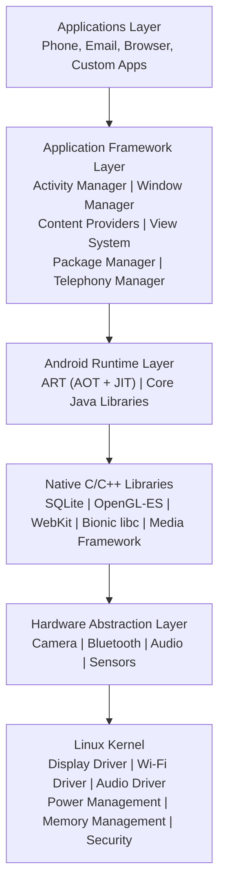
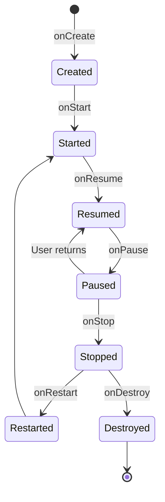

[[Overview]] | [[Syllabus]] | [[Unit-1]] | [[Unit-2]] | [[Unit-3]] | [[Unit-4]] | [[Unit-5]] | [[Revision]] | [[Interview-Prep]]

---

# CS-357 Android Programming - Important Exam Questions

> [!important]
> Questions are organized by unit and marks weightage as per SPPU NEP CBCS examination pattern. Model answers are provided for all questions.

---

## Unit 1: Introduction to Android

### Short Answer (2 Marks)

**Q1. What is AndroidManifest.xml? List any four elements declared in it.**

**Answer:** `AndroidManifest.xml` is the configuration file that every Android application must include at the root of its source set. It describes the application structure to the Android OS before any code runs.

Four elements declared in AndroidManifest.xml:
1. Application components (Activity, Service, BroadcastReceiver, ContentProvider)
2. Required permissions (e.g., `INTERNET`, `READ_CONTACTS`)
3. Hardware and software features the app requires
4. The minimum and target Android API levels

---

**Q2. What is ART? How does it differ from Dalvik?**

**Answer:** ==ART (Android Runtime)== is the managed runtime used by Android applications since Android 5.0 (Lollipop). It replaced the older Dalvik runtime.

| Feature | Dalvik | ART |
|---|---|---|
| Compilation | JIT (Just-In-Time) at runtime | AOT (Ahead-Of-Time) at install time + JIT |
| App startup | Slower (compiles on run) | Faster (already compiled) |
| Storage | Less disk space | More disk space needed |
| Battery | More CPU usage at runtime | Less CPU at runtime |

---

### Long Answer (5-8 Marks)

**Q3. Draw and explain the Android Architecture with all layers.**

**Answer:** Android follows a layered software stack architecture. From bottom to top:



1. **Linux Kernel** - Foundation. Provides process management, memory management, device drivers, security, and networking.
2. **HAL (Hardware Abstraction Layer)** - Defines standard interfaces for hardware vendors. Isolates higher layers from hardware specifics.
3. **Native Libraries** - C/C++ libraries used by Android components (SQLite for databases, OpenGL ES for 2D/3D graphics, WebKit for browser engine).
4. **Android Runtime (ART)** - Every app runs in its own process with its own instance of ART. Uses AOT compilation to convert `.dex` bytecode to native machine code at install time.
5. **Application Framework** - Java-based APIs used by app developers. Includes Activity Manager (lifecycle), Content Providers (data sharing), View System (UI components).
6. **Applications** - Pre-installed and user-installed applications that run on top of the framework.

---

**Q4. Explain the Android Activity Lifecycle in detail with a diagram.**

**Answer:** An ==Activity== represents a single screen in an Android application. Android manages Activity instances through a well-defined lifecycle consisting of seven callback methods.



| Method | When Called | Purpose |
|---|---|---|
| `onCreate()` | Activity first created | Inflate layout (`setContentView`), initialize data, bind views |
| `onStart()` | Activity becomes visible | Register broadcasts, refresh UI data |
| `onResume()` | Activity gains focus | Start animations, audio, camera |
| `onPause()` | Activity loses focus | Save unsaved data, pause animations |
| `onStop()` | Activity completely hidden | Release camera/sensors, heavy cleanup |
| `onRestart()` | Activity returning from Stopped | Reload fresh data |
| `onDestroy()` | Activity being destroyed | Final cleanup, close database connections |

**Scenario - Back button pressed:**
`onPause()` -> `onStop()` -> `onDestroy()`

**Scenario - Home button pressed:**
`onPause()` -> `onStop()` (Activity remains in memory, not destroyed)

**Scenario - Another Activity opens on top:**
`onPause()` -> `onStop()` -> (User returns) -> `onRestart()` -> `onStart()` -> `onResume()`

---

## Unit 2: UI Design and Layouts

### Short Answer (2 Marks)

**Q5. What is the difference between `wrap_content` and `match_parent`?**

**Answer:**
- `wrap_content` - The view sizes itself to fit its content. For a `TextView`, it will be as wide as the text it contains.
- `match_parent` - The view expands to fill its parent container's available space. (Previously called `fill_parent` in older API levels.)

---

**Q6. What is a ViewHolder pattern in RecyclerView?**

**Answer:** The ==ViewHolder pattern== caches references to the child views of each item layout, avoiding expensive `findViewById()` calls during scrolling. In `RecyclerView`, this pattern is enforced by requiring the Adapter to subclass `RecyclerView.ViewHolder`. This prevents the framework from having to traverse the view hierarchy on every `onBindViewHolder()` call, significantly improving scroll performance.

---

### Long Answer (5-8 Marks)

**Q7. Explain ConstraintLayout and how it differs from LinearLayout and RelativeLayout.**

**Answer:** ==ConstraintLayout== is a flexible layout manager introduced in Android API 9 (via support library) that allows you to create large, complex layouts with a flat view hierarchy, minimizing nested ViewGroups.

**ConstraintLayout Positioning:**
Views are positioned by applying constraints to other views, to the parent, or to guidelines. Each view needs at least one horizontal and one vertical constraint.

```xml
<androidx.constraintlayout.widget.ConstraintLayout
    android:layout_width="match_parent"
    android:layout_height="match_parent">

    <Button
        android:id="@+id/btnSubmit"
        android:layout_width="wrap_content"
        android:layout_height="wrap_content"
        android:text="Submit"
        app:layout_constraintTop_toTopOf="parent"
        app:layout_constraintStart_toStartOf="parent"
        app:layout_constraintEnd_toEndOf="parent"
        app:layout_constraintBottom_toBottomOf="parent" />

</androidx.constraintlayout.widget.ConstraintLayout>
```

**Comparison:**

| Feature | LinearLayout | RelativeLayout | ConstraintLayout |
|---|---|---|---|
| Nesting | Requires deep nesting | Moderate | Flat hierarchy |
| Positioning | Sequential | Relative to parent/siblings | Constraint-based anchoring |
| Performance | Good for shallow | Can double-measure | Best overall |
| Editor support | Basic | Basic | Advanced (drag-and-drop) |
| Chain support | No | No | Yes (spread, packed, weighted) |
| Guideline support | No | No | Yes |

---

**Q8. How do you implement a RecyclerView with a custom Adapter? Explain with code.**

**Answer:** RecyclerView requires three components: a data source, a `RecyclerView.Adapter`, and a `LayoutManager`.

**Step 1: Item Layout (res/layout/item_student.xml)**
```xml
<LinearLayout xmlns:android="http://schemas.android.com/apk/res/android"
    android:layout_width="match_parent"
    android:layout_height="wrap_content"
    android:padding="8dp"
    android:orientation="vertical">

    <TextView android:id="@+id/tvName"
        android:layout_width="wrap_content"
        android:layout_height="wrap_content"
        android:textSize="16sp" />

    <TextView android:id="@+id/tvMarks"
        android:layout_width="wrap_content"
        android:layout_height="wrap_content" />
</LinearLayout>
```

**Step 2: Adapter**
```java
public class StudentAdapter extends RecyclerView.Adapter<StudentAdapter.StudentViewHolder> {

    private List<String> studentList;

    public StudentAdapter(List<String> studentList) {
        this.studentList = studentList;
    }

    @NonNull
    @Override
    public StudentViewHolder onCreateViewHolder(@NonNull ViewGroup parent, int viewType) {
        View view = LayoutInflater.from(parent.getContext())
            .inflate(R.layout.item_student, parent, false);
        return new StudentViewHolder(view);
    }

    @Override
    public void onBindViewHolder(@NonNull StudentViewHolder holder, int position) {
        holder.tvName.setText(studentList.get(position));
    }

    @Override
    public int getItemCount() {
        return studentList.size();
    }

    static class StudentViewHolder extends RecyclerView.ViewHolder {
        TextView tvName;
        StudentViewHolder(View itemView) {
            super(itemView);
            tvName = itemView.findViewById(R.id.tvName);
        }
    }
}
```

**Step 3: Activity**
```java
RecyclerView recyclerView = findViewById(R.id.recyclerView);
recyclerView.setLayoutManager(new LinearLayoutManager(this));
recyclerView.setAdapter(new StudentAdapter(dataList));
```

---

## Unit 3: Intents and Navigation

### Short Answer (2 Marks)

**Q9. What is the difference between explicit and implicit intents?**

**Answer:**
- ==Explicit Intent== - Specifies the exact component (class name) to start. Used to launch activities within the same application.
- ==Implicit Intent== - Does not name a specific component but instead declares an action to be performed. The Android system finds the appropriate component by matching it with intent filters declared in other apps' manifests.

---

**Q10. What are Intent Extras? How are they used?**

**Answer:** Intent extras are key-value pairs of additional data attached to an Intent object. They allow data to be passed between components (e.g., from one Activity to another).

```java
// Sending
Intent intent = new Intent(this, ProfileActivity.class);
intent.putExtra("USER_ID", 101);
intent.putExtra("USER_NAME", "Amit");
startActivity(intent);

// Receiving
int userId   = getIntent().getIntExtra("USER_ID", -1);
String name  = getIntent().getStringExtra("USER_NAME");
```

---

### Long Answer (5-8 Marks)

**Q11. Explain Fragments in Android. How do you add a Fragment to an Activity?**

**Answer:** A ==Fragment== is a modular, reusable portion of a user interface that can be embedded in an Activity. Fragments have their own lifecycle, layout, and behavior, but always exist within a host Activity.

**Advantages of Fragments:**
- Code reusability across different screen sizes (phone/tablet)
- Easier navigation management (back stack)
- Modular UI design

**Fragment Lifecycle:**
`onAttach()` -> `onCreate()` -> `onCreateView()` -> `onViewCreated()` -> `onStart()` -> `onResume()` -> `onPause()` -> `onStop()` -> `onDestroyView()` -> `onDestroy()` -> `onDetach()`

**Adding a Fragment Programmatically:**
```java
// In Activity
getSupportFragmentManager()
    .beginTransaction()
    .replace(R.id.fragment_container, new HomeFragment())
    .addToBackStack(null)  // allows back button to pop fragment
    .commit();
```

**Adding a Fragment via XML:**
```xml
<fragment
    android:id="@+id/homeFragment"
    android:name="com.example.app.HomeFragment"
    android:layout_width="match_parent"
    android:layout_height="match_parent" />
```

---

## Unit 4: Event Handling and Menus

### Short Answer (2 Marks)

**Q12. What is the difference between Options Menu and Context Menu?**

**Answer:**
- ==Options Menu== - App-level menu that appears in the Action Bar / Toolbar when the user taps the overflow (three-dot) icon. Created using `onCreateOptionsMenu()`.
- ==Context Menu== - Appears when the user long-presses a specific View. Provides actions relevant to that specific item. Created using `onCreateContextMenu()`, which requires registering the view with `registerForContextMenu(view)`.

---

### Long Answer (5-8 Marks)

**Q13. Explain different ways of handling click events in Android with code examples.**

**Answer:** Android provides multiple approaches to handle click events:

**Approach 1: XML `android:onClick` attribute**
```xml
<Button android:onClick="onSubmitClicked" />
```
```java
public void onSubmitClicked(View view) {
    Toast.makeText(this, "Submitted", Toast.LENGTH_SHORT).show();
}
```

**Approach 2: Anonymous inner class**
```java
Button btnLogin = findViewById(R.id.btnLogin);
btnLogin.setOnClickListener(new View.OnClickListener() {
    @Override
    public void onClick(View v) {
        performLogin();
    }
});
```

**Approach 3: Lambda expression (Java 8+)**
```java
btnLogin.setOnClickListener(v -> performLogin());
```

**Approach 4: Activity implements OnClickListener**
```java
public class MainActivity extends AppCompatActivity
    implements View.OnClickListener {

    @Override
    protected void onCreate(Bundle savedInstanceState) {
        super.onCreate(savedInstanceState);
        setContentView(R.layout.activity_main);
        findViewById(R.id.btnLogin).setOnClickListener(this);
    }

    @Override
    public void onClick(View v) {
        if (v.getId() == R.id.btnLogin) {
            performLogin();
        }
    }
}
```

---

**Q14. How do you create and handle an Options Menu in Android?**

**Answer:**

**Step 1: Create menu XML (res/menu/main_menu.xml)**
```xml
<menu xmlns:android="http://schemas.android.com/apk/res/android"
    xmlns:app="http://schemas.android.com/apk/res-auto">
    <item
        android:id="@+id/action_settings"
        android:title="Settings"
        app:showAsAction="never" />
    <item
        android:id="@+id/action_search"
        android:title="Search"
        android:icon="@drawable/ic_search"
        app:showAsAction="ifRoom" />
</menu>
```

**Step 2: Inflate in Activity**
```java
@Override
public boolean onCreateOptionsMenu(Menu menu) {
    getMenuInflater().inflate(R.menu.main_menu, menu);
    return true;
}
```

**Step 3: Handle item selection**
```java
@Override
public boolean onOptionsItemSelected(MenuItem item) {
    int id = item.getItemId();
    if (id == R.id.action_settings) {
        startActivity(new Intent(this, SettingsActivity.class));
        return true;
    } else if (id == R.id.action_search) {
        // handle search
        return true;
    }
    return super.onOptionsItemSelected(item);
}
```

---

## Unit 5: Data Storage

### Short Answer (2 Marks)

**Q15. What is SharedPreferences? When should you use it?**

**Answer:** ==SharedPreferences== is a mechanism for persisting small amounts of primitive data (key-value pairs) as an XML file in the application's private storage. It is appropriate for storing:
- User settings and preferences (theme, language)
- Login state and session tokens
- Simple application flags and counters

It should NOT be used for large datasets, binary files, or complex structured data.

---

**Q16. What is the difference between `getWritableDatabase()` and `getReadableDatabase()`?**

**Answer:**
- `getWritableDatabase()` - Opens the database for both reading and writing. May throw an exception if disk space is insufficient. Required for INSERT, UPDATE, and DELETE operations.
- `getReadableDatabase()` - Opens the database for reading only. If the database cannot be opened for writing (e.g., disk full), it falls back gracefully to a read-only mode. Use this for SELECT queries to avoid unnecessarily locking the database for writes.

---

### Long Answer (5-8 Marks)

**Q17. Explain SQLiteOpenHelper. Write a complete DatabaseHelper class with CRUD operations for a `student` table.**

**Answer:** ==SQLiteOpenHelper== is an abstract helper class that manages database creation and schema version upgrades. The developer subclasses it, defines the schema, and provides implementations for `onCreate()` and `onUpgrade()`.

**DatabaseHelper.java:**
```java
public class DatabaseHelper extends SQLiteOpenHelper {

    private static final String DB_NAME    = "school.db";
    private static final int    DB_VERSION = 1;

    public static final String TABLE   = "student";
    public static final String COL_ID  = "_id";
    public static final String COL_NAME = "name";
    public static final String COL_MARKS = "marks";

    private static final String CREATE_TABLE =
        "CREATE TABLE " + TABLE + " (" +
        COL_ID    + " INTEGER PRIMARY KEY AUTOINCREMENT, " +
        COL_NAME  + " TEXT NOT NULL, " +
        COL_MARKS + " REAL);";

    public DatabaseHelper(Context context) {
        super(context, DB_NAME, null, DB_VERSION);
    }

    @Override
    public void onCreate(SQLiteDatabase db) {
        db.execSQL(CREATE_TABLE);
    }

    @Override
    public void onUpgrade(SQLiteDatabase db, int oldVersion, int newVersion) {
        db.execSQL("DROP TABLE IF EXISTS " + TABLE);
        onCreate(db);
    }

    // CREATE
    public long insert(String name, float marks) {
        SQLiteDatabase db = getWritableDatabase();
        ContentValues cv = new ContentValues();
        cv.put(COL_NAME, name);
        cv.put(COL_MARKS, marks);
        long id = db.insert(TABLE, null, cv);
        db.close();
        return id;
    }

    // READ ALL
    public Cursor getAll() {
        SQLiteDatabase db = getReadableDatabase();
        return db.rawQuery("SELECT * FROM " + TABLE, null);
    }

    // UPDATE
    public int update(int id, String name, float marks) {
        SQLiteDatabase db = getWritableDatabase();
        ContentValues cv = new ContentValues();
        cv.put(COL_NAME, name);
        cv.put(COL_MARKS, marks);
        int rows = db.update(TABLE, cv, COL_ID + "=?",
            new String[]{String.valueOf(id)});
        db.close();
        return rows;
    }

    // DELETE
    public int delete(int id) {
        SQLiteDatabase db = getWritableDatabase();
        int rows = db.delete(TABLE, COL_ID + "=?",
            new String[]{String.valueOf(id)});
        db.close();
        return rows;
    }
}
```

---

**Q18. What is a ContentProvider in Android? Explain its components and the content URI structure.**

**Answer:** A ==ContentProvider== is one of the four fundamental Android application components (Activity, Service, BroadcastReceiver, ContentProvider). It manages access to a central repository of data and exposes it to other applications through a standard, URI-based interface.

**Key Components:**

| Component | Role |
|---|---|
| ContentProvider | The data manager; overrides query, insert, update, delete, getType |
| ContentResolver | Client-side API used to call the provider's methods |
| Content URI | Unique address identifying the provider and the specific data |
| UriMatcher | Helper class to match URIs to operations |

**Content URI Structure:**
```
content://com.example.schoolapp.provider/student/5
    |               |                      |      |
  scheme        authority                table   row ID
```

**Declaration in AndroidManifest.xml:**
```xml
<provider
    android:name=".StudentProvider"
    android:authorities="com.example.schoolapp.provider"
    android:exported="true" />
```

---

**Q19. Explain the difference between SharedPreferences and SQLite for data storage.**

**Answer:**

| Parameter | SharedPreferences | SQLite |
|---|---|---|
| Data Type | Primitive types only (String, int, boolean, float, long) | All SQL types (TEXT, INTEGER, REAL, BLOB) |
| Structure | Flat key-value pairs | Relational tables with rows and columns |
| Query support | No; only key lookup | Full SQL queries (SELECT, JOIN, WHERE) |
| Best for | Settings, flags, session tokens | Structured data (contacts, products, records) |
| File location | `/data/data/<pkg>/shared_prefs/*.xml` | `/data/data/<pkg>/databases/*.db` |
| Max data size | Small amounts only | Limited by device storage |
| API complexity | Simple (put/get/edit) | Moderate (open, ContentValues, Cursor) |

---

**Q20. Write an Android Activity that uses SharedPreferences to save and retrieve a user's name and display it in a TextView.**

**Answer:**

**activity_main.xml:**
```xml
<LinearLayout xmlns:android="http://schemas.android.com/apk/res/android"
    android:layout_width="match_parent"
    android:layout_height="match_parent"
    android:orientation="vertical"
    android:padding="16dp">

    <EditText android:id="@+id/etName"
        android:layout_width="match_parent"
        android:layout_height="wrap_content"
        android:hint="Enter your name" />

    <Button android:id="@+id/btnSave"
        android:layout_width="wrap_content"
        android:layout_height="wrap_content"
        android:text="Save" />

    <TextView android:id="@+id/tvDisplay"
        android:layout_width="wrap_content"
        android:layout_height="wrap_content"
        android:textSize="18sp" />
</LinearLayout>
```

**MainActivity.java:**
```java
public class MainActivity extends AppCompatActivity {

    private static final String PREFS = "UserPrefs";
    private static final String KEY   = "name";
    private EditText etName;
    private TextView tvDisplay;

    @Override
    protected void onCreate(Bundle savedInstanceState) {
        super.onCreate(savedInstanceState);
        setContentView(R.layout.activity_main);

        etName    = findViewById(R.id.etName);
        tvDisplay = findViewById(R.id.tvDisplay);
        Button btnSave = findViewById(R.id.btnSave);

        // Load saved name on startup
        SharedPreferences prefs = getSharedPreferences(PREFS, MODE_PRIVATE);
        String savedName = prefs.getString(KEY, "");
        if (!savedName.isEmpty()) {
            tvDisplay.setText("Hello, " + savedName + "!");
        }

        btnSave.setOnClickListener(v -> {
            String name = etName.getText().toString().trim();
            if (!name.isEmpty()) {
                prefs.edit().putString(KEY, name).apply();
                tvDisplay.setText("Hello, " + name + "!");
            } else {
                Toast.makeText(this, "Enter a name first", Toast.LENGTH_SHORT).show();
            }
        });
    }
}
```

---

**Q21. What happens if `DATABASE_VERSION` is not incremented when you change the schema in SQLiteOpenHelper?**

**Answer:** If you modify the database schema (add/remove tables or columns) without incrementing `DATABASE_VERSION`, the `onUpgrade()` method will NOT be called. The existing database file on the device will remain unchanged, causing your new code to fail because it tries to access columns or tables that do not exist in the old schema. This results in a `SQLiteException` at runtime.

The correct procedure for schema changes is:
1. Increment `DATABASE_VERSION` by 1.
2. Implement the migration logic in `onUpgrade()` (e.g., `ALTER TABLE` to add new columns, or drop and recreate tables).
3. On the next app launch, `onUpgrade()` is called automatically with the old and new version numbers.

---

[[Revision]] | [[Interview-Prep]]
