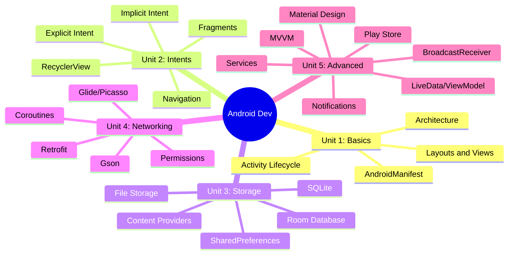
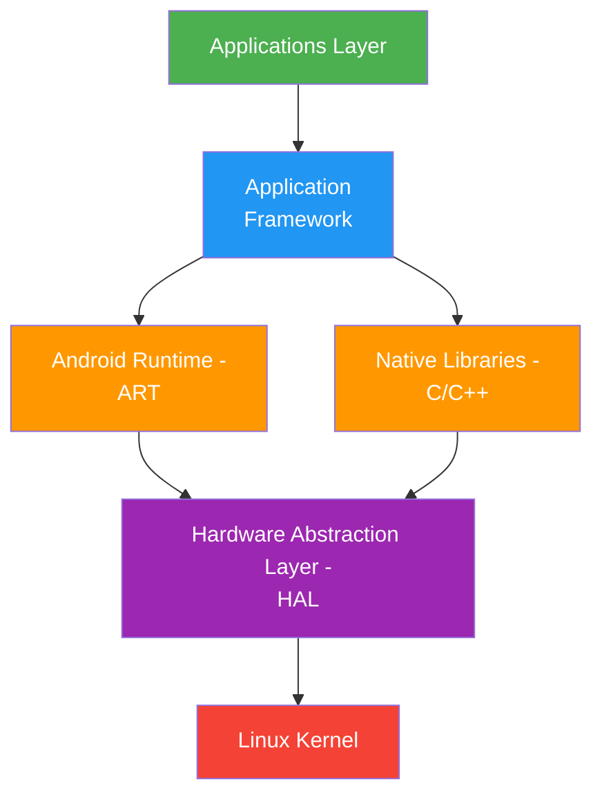

[[00-Dashboard/Home|Home]] | [[02-Semester-VI/Semester-VI-Dashboard|Semester VI]] | [[Overview]] | [[Syllabus]] | [[Unit-1]] | [[Unit-2]] | [[Unit-3]] | [[Unit-4]] | [[Unit-5]] | [[Important-Questions|Imp. Qs]] | [[Revision]] | [[Interview-Prep]]

# CS-357 Android Programming - Overview

> [!important] Subject at a Glance
> **Code:** CS-357-MJ-T | **Type:** Major Theory | **Semester:** VI
> **Credits:** 3 | **Platform:** Android Studio (Kotlin/Java)
> This subject covers **Android application development** from scratch - architecture, UI design, data storage, networking, and advanced topics like MVVM, LiveData, and Play Store publishing.

---

## Quick Navigation

| File | Description |
|------|-------------|
| [[Syllabus]] | Full syllabus, unit-wise topics, reference books |
| [[Unit-1]] | Introduction to Android - architecture, lifecycle, layouts, views |
| [[Unit-2]] | Activities and Intents - explicit/implicit intents, fragments, RecyclerView |
| [[Unit-3]] | Data Storage - SharedPreferences, SQLite, Room, Content Providers |
| [[Unit-4]] | Networking and Web Services - Retrofit, Gson, Coroutines, Glide |
| [[Unit-5]] | Advanced Android - Services, BroadcastReceivers, MVVM, Material Design |
| [[Important-Questions]] | Chapter-wise important questions for exam |
| [[Revision]] | Quick revision notes and cheat sheets |
| [[Interview-Prep]] | 30+ interview Q&A for placements |

---

## Learning Objectives

By the end of this course, you will be able to:

- [x] Understand Android **architecture layers** and the **Activity lifecycle**
- [x] Build UIs using **XML layouts** (LinearLayout, RelativeLayout, ConstraintLayout)
- [x] Navigate between screens using **Intents** and **Fragments**
- [x] Display lists efficiently using **RecyclerView** and Adapter pattern
- [x] Persist data with **SharedPreferences**, **SQLite**, and **Room** database
- [x] Consume REST APIs using the **Retrofit** library with JSON parsing (Gson)
- [x] Implement **MVVM architecture** with **ViewModel** and **LiveData**
- [x] Send **Notifications**, run **Services**, and handle **BroadcastReceivers**
- [x] Follow **Material Design** guidelines and understand Play Store publishing

---

## Subject Mind Map

---

## Android Architecture Layers

---

## Unit Summary

| # | Unit | Key Topics |
|---|------|------------|
| 1 | Introduction to Android | History, Architecture, Studio setup, Activity lifecycle, Layouts, Basic Views |
| 2 | Activities and Intents | Explicit/Implicit Intents, Data passing, Fragments, RecyclerView, Navigation |
| 3 | Data Storage | SharedPreferences, SQLite, Room DB, File storage, Content Providers |
| 4 | Networking and Web Services | HTTP, Retrofit, Gson, Coroutines, Glide/Picasso, Permissions |
| 5 | Advanced Android | Services, BroadcastReceivers, Notifications, MVVM, Material Design, Play Store |

---

## Key Terms Glossary

| Term | Definition |
|------|-----------|
| ==Activity== | Single screen with a user interface |
| ==Intent== | Message to start components (activities, services) |
| ==Fragment== | Reusable portion of UI within an Activity |
| ==ART== | Android Runtime - compiles DEX bytecode to native code |
| ==RecyclerView== | Efficient list/grid view using ViewHolder pattern |
| ==Room== | Abstraction layer over SQLite with compile-time SQL checks |
| ==Retrofit== | Type-safe HTTP client for Android/Java |
| ==LiveData== | Observable data holder that respects lifecycle |
| ==ViewModel== | Stores UI-related data surviving configuration changes |
| ==MVVM== | Model-View-ViewModel - architectural pattern |
| ==Coroutine== | Kotlin concurrency mechanism for async operations |

---

## Reference Materials

| # | Resource | Notes |
|---|----------|-------|
| 1 | Android Developer Docs | developer.android.com - official reference |
| 2 | Android Programming: The Big Nerd Ranch Guide | Comprehensive guide |
| 3 | Kotlin in Action | For Kotlin fundamentals |
| 4 | Head First Android Development | Beginner friendly |

---

> [!tip] Study Priority
> Focus on **Unit 1 (lifecycle)**, **Unit 2 (intents/fragments)**, and **Unit 3 (Room DB)** - these carry the most exam weight. Unit 5 MVVM is essential for interviews.

---

## Backlinks

- [[00-Dashboard/Home|Semester VI Home]]
- [[Important-Questions]]
- [[Revision]]
- [[Interview-Prep]]
