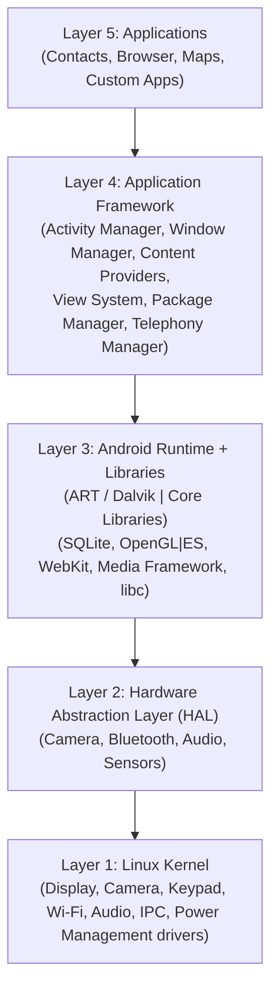
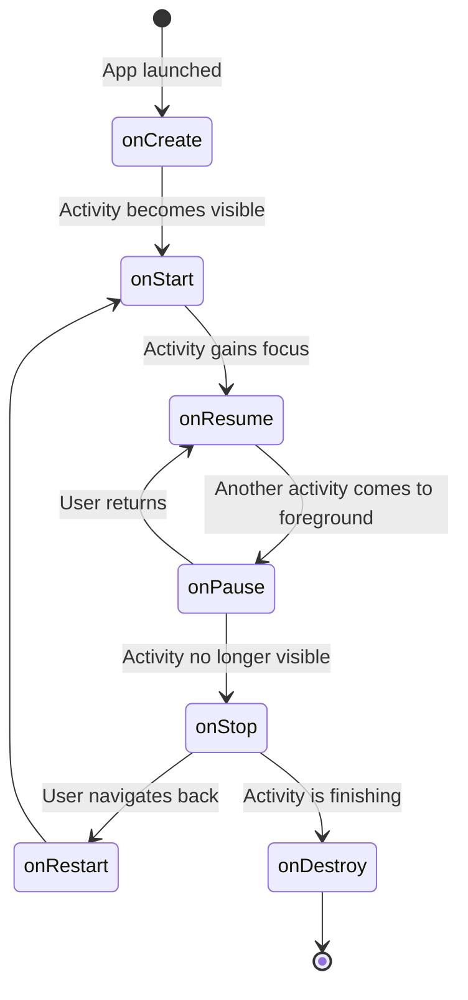
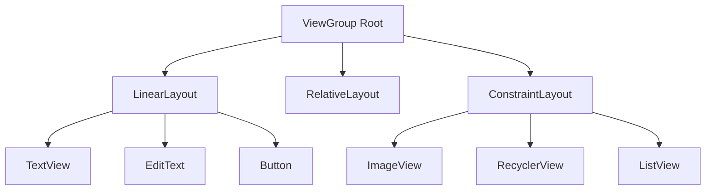
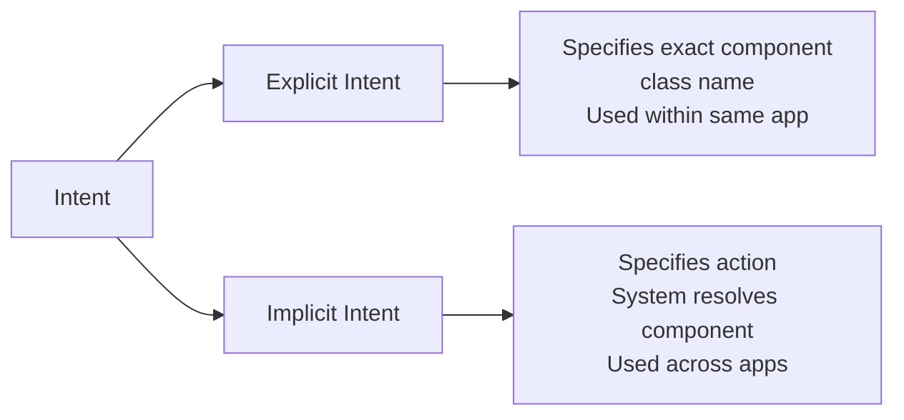
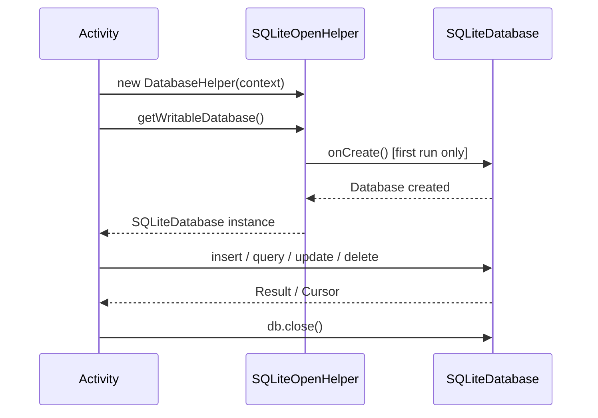

[[Overview]] | [[Syllabus]] | [[Unit-1]] | [[Unit-2]] | [[Unit-3]] | [[Unit-4]] | [[Unit-5]] | [[Important-Questions]] | [[Interview-Prep]]

---

# CS-357 Android Programming - Complete Revision Guide

> [!important]
> This revision guide covers all 5 units of CS-357-MJ-T as per SPPU NEP CBCS 2026-27 syllabus. Refer to individual unit notes for detailed explanations and code examples.

---

## Unit 1: Introduction to Android

### Android Architecture Layers



| Layer | Components |
|---|---|
| Applications | Pre-installed and user-installed apps |
| Application Framework | Activity Manager, Content Providers, View System, Resource Manager |
| Android Runtime | ART (Android Runtime) - compiles bytecode to native via AOT/JIT |
| Libraries | SQLite, OpenGL, WebKit, SSL |
| HAL | Hardware Abstraction Layer - abstracts hardware from framework |
| Linux Kernel | Device drivers, memory management, security, networking |

### Activity Lifecycle



| Callback | State | Key Action |
|---|---|---|
| `onCreate()` | Created | Initialize UI, inflate layout, bind data |
| `onStart()` | Started | Activity visible but not interactive |
| `onResume()` | Resumed | Activity in foreground, fully interactive |
| `onPause()` | Paused | Partial visibility, save unsaved data |
| `onStop()` | Stopped | Completely hidden, release heavy resources |
| `onRestart()` | Restarted | Called before `onStart()` on navigation back |
| `onDestroy()` | Destroyed | Final cleanup, release all resources |

> [!tip]
> For SPPU exams: memorize the complete lifecycle sequence. The most commonly asked transition is `onPause -> onStop -> onDestroy` (when back button is pressed).

### AndroidManifest.xml Key Elements

```xml
<manifest package="com.example.app">
    <uses-permission android:name="android.permission.INTERNET" />
    <application android:label="@string/app_name"
                 android:icon="@mipmap/ic_launcher">
        <activity android:name=".MainActivity"
                  android:exported="true">
            <intent-filter>
                <action android:name="android.intent.action.MAIN" />
                <category android:name="android.intent.category.LAUNCHER" />
            </intent-filter>
        </activity>
    </application>
</manifest>
```

---

## Unit 2: UI Design and Layouts

### Layout Hierarchy



### Layout Comparison Table

| Layout | Positioning Method | Best Use Case | Performance |
|---|---|---|---|
| LinearLayout | Sequential (horizontal / vertical) | Simple forms, toolbars | Good for shallow hierarchies |
| RelativeLayout | Relative to parent or siblings | Moderate complexity | Can cause double measurement |
| ConstraintLayout | Constraint-based anchoring | Complex, flat hierarchies | Best (replaces both above) |

### Common View Attributes

| View | Key XML Attributes |
|---|---|
| `TextView` | `android:text`, `android:textSize`, `android:textColor` |
| `EditText` | `android:hint`, `android:inputType` |
| `Button` | `android:onClick`, `android:text` |
| `ImageView` | `android:src`, `android:scaleType` |
| `RecyclerView` | `app:layoutManager`, `android:orientation` |

### RecyclerView vs ListView

| Feature | ListView | RecyclerView |
|---|---|---|
| View recycling | Optional (ViewHolder pattern) | Mandatory (enforced) |
| Layout managers | Vertical list only | LinearLayout, Grid, Staggered |
| Item animations | Not supported | Built-in `ItemAnimator` |
| Item decorators | Not supported | `ItemDecoration` supported |
| Performance | Lower for large datasets | Higher |

---

## Unit 3: Intents and Navigation

### Intent Types



| Intent Type | Use Case | Example |
|---|---|---|
| Explicit | Start specific Activity within your app | `new Intent(this, DetailActivity.class)` |
| Implicit | Share content, open URL, send email | `new Intent(Intent.ACTION_VIEW, uri)` |

### Passing Data with Intents

```java
// Sending Activity
Intent intent = new Intent(this, DetailActivity.class);
intent.putExtra("STUDENT_NAME", "Amit");
intent.putExtra("STUDENT_MARKS", 92);
startActivity(intent);

// Receiving Activity
String name  = getIntent().getStringExtra("STUDENT_NAME");
int    marks = getIntent().getIntExtra("STUDENT_MARKS", 0);
```

### Fragment Lifecycle (key states)

| Fragment Callback | When Called |
|---|---|
| `onAttach()` | Fragment attached to Activity |
| `onCreate()` | Fragment initializing |
| `onCreateView()` | Fragment's view hierarchy created |
| `onViewCreated()` | After `onCreateView()` completes |
| `onDestroyView()` | Fragment's view being removed |
| `onDetach()` | Fragment detached from Activity |

---

## Unit 4: Event Handling and Menus

### Click Listener Patterns

**Pattern 1: Anonymous inner class**
```java
button.setOnClickListener(new View.OnClickListener() {
    @Override
    public void onClick(View v) {
        // handle click
    }
});
```

**Pattern 2: Lambda (Java 8+)**
```java
button.setOnClickListener(v -> {
    // handle click
});
```

### Menu Types Comparison

| Menu Type | How Triggered | Created In | Item Selected In |
|---|---|---|---|
| Options Menu | App bar / overflow menu | `onCreateOptionsMenu()` | `onOptionsItemSelected()` |
| Context Menu | Long-press on a View | `onCreateContextMenu()` | `onContextItemSelected()` |
| Popup Menu | Anchored to a specific View | `PopupMenu` constructor | `PopupMenu.OnMenuItemClickListener` |

---

## Unit 5: Data Storage

### SharedPreferences - Write/Read Pattern

```java
// WRITE
SharedPreferences.Editor editor =
    getSharedPreferences("prefs", MODE_PRIVATE).edit();
editor.putString("key", "value");
editor.apply();

// READ
String val = getSharedPreferences("prefs", MODE_PRIVATE)
    .getString("key", "default");
```

### SQLite CRUD Quick Reference

| Operation | Method | Returns |
|---|---|---|
| INSERT | `db.insert(table, null, contentValues)` | Row ID (`long`), -1 on error |
| SELECT | `db.query(...)` or `db.rawQuery(...)` | `Cursor` |
| UPDATE | `db.update(table, values, where, args)` | Rows affected (`int`) |
| DELETE | `db.delete(table, where, args)` | Rows deleted (`int`) |

### SQLite Lifecycle



### Storage Mechanism Decision Table

| Scenario | Recommended Storage |
|---|---|
| Remember user theme preference | SharedPreferences |
| Store student records with search | SQLite (SQLiteOpenHelper or Room) |
| Share contact data with other apps | ContentProvider |
| Save a downloaded PDF | Internal or External Storage |
| Profile photo (private) | Internal Storage |

---

## Key Terminology Quick Reference

| Term | Definition |
|---|---|
| ==APK== | Android Package Kit - the installable file format for Android apps |
| ==ART== | Android Runtime - replaces Dalvik; uses AOT + JIT compilation |
| ==AndroidManifest.xml== | App configuration file declaring components, permissions, features |
| ==Activity== | Single screen with a user interface |
| ==Fragment== | Modular reusable UI component hosted inside an Activity |
| ==Intent== | Messaging object used to request actions from other components |
| ==ContentValues== | Key-value map used to insert/update rows in SQLite |
| ==Cursor== | Pointer into SQLite result set for row-by-row access |
| ==ViewHolder== | Pattern to cache View references in RecyclerView for performance |
| ==ConstraintLayout== | Flat, performant layout using constraint-based positioning |

---

## SPPU Exam Weightage Summary

| Unit | Topic | Hours | Expected Marks |
|---|---|---|---|
| 1 | Introduction to Android | 4H | 10-15 |
| 2 | UI Design and Layouts | 6H | 15-20 |
| 3 | Intents and Navigation | 6H | 15-20 |
| 4 | Event Handling and Menus | 6H | 10-15 |
| 5 | Data Storage | 8H | 20-25 |

> [!note]
> Unit 5 (Data Storage) carries the highest lecture hours and is typically the most heavily tested. Ensure you can write the complete `DatabaseHelper` class and all four CRUD methods from memory.

---

[[Important-Questions]] | [[Interview-Prep]]
