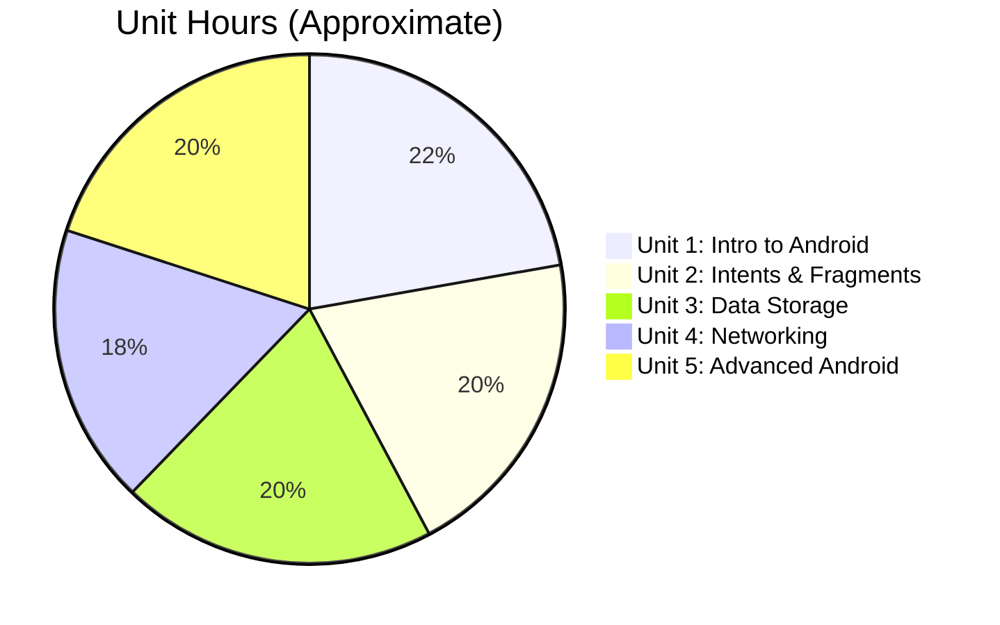

[[00-Dashboard/Home|Home]] | [[02-Semester-VI/Semester-VI-Dashboard|Semester VI]] | [[Overview]] | [[Syllabus]] | [[Unit-1]] | [[Unit-2]] | [[Unit-3]] | [[Unit-4]] | [[Unit-5]] | [[Important-Questions|Imp. Qs]] | [[Revision]] | [[Interview-Prep]]

# CS-357 Android Programming - Syllabus

> [!note] Course Details
> **Subject Code:** CS-357-MJ-T | **Type:** Major Theory
> **Semester:** VI | **Program:** TY B.Sc. Computer Science
> **Platform:** Android Studio | **Language:** Java / Kotlin

---

## Unit-wise Syllabus

### Unit 1: Introduction to Android

> [!note] → [[Unit-1|See detailed notes]]

| Topic | Sub-topics |
|-------|-----------|
| Android History | Evolution of Android, versions, codenames |
| Android Architecture | Linux Kernel, HAL, Native Libraries, ART, Framework, Applications |
| Android Studio Setup | Installation, SDK setup, Emulator/AVD configuration |
| AVD | Android Virtual Device creation and management |
| Project Structure | `src/`, `res/`, `manifests/`, `Gradle Scripts` |
| AndroidManifest.xml | Components declaration, permissions, intent filters |
| build.gradle | Dependencies, SDK versions, build configurations |
| Activity Lifecycle | `onCreate`, `onStart`, `onResume`, `onPause`, `onStop`, `onDestroy` |
| Layouts | LinearLayout, RelativeLayout, ConstraintLayout |
| Basic Views | TextView, EditText, Button, ImageView, CheckBox, RadioButton, Spinner |

---

### Unit 2: Activities and Intents

> [!note] → [[Unit-2|See detailed notes]]

| Topic | Sub-topics |
|-------|-----------|
| Explicit Intents | Starting specific activity, `Intent(this, Target::class.java)` |
| Implicit Intents | Action-based, system components, intent filters |
| Passing Data | `putExtra()`, `getExtra()`, `Bundle`, Parcelable/Serializable |
| Activity Result API | `registerForActivityResult`, `ActivityResultLauncher` |
| Context | Application context vs Activity context |
| Fragments | Fragment lifecycle, `FragmentManager`, back stack |
| Fragment Communication | Interface-based, ViewModel-shared, arguments |
| RecyclerView | ViewHolder pattern, `RecyclerView.Adapter`, `LayoutManager` |
| Adapter Pattern | `ArrayAdapter`, `BaseAdapter`, custom adapters |
| Navigation Component | `NavGraph`, `NavController`, `NavHostFragment`, Safe Args |

---

### Unit 3: Data Storage

> [!note] → [[Unit-3|See detailed notes]]

| Topic | Sub-topics |
|-------|-----------|
| SharedPreferences | `getSharedPreferences`, `edit()`, `commit()`/`apply()`, reading values |
| SQLite Database | `SQLiteOpenHelper`, `onCreate`, `onUpgrade`, CRUD with `ContentValues` |
| SQLite Cursor | `query()`, `rawQuery()`, `Cursor` iteration |
| Room Database | Architecture, setup, dependencies |
| Room Entity | `@Entity`, `@PrimaryKey`, `@ColumnInfo` annotations |
| Room DAO | `@Dao`, `@Query`, `@Insert`, `@Update`, `@Delete` |
| Room Database Class | `@Database`, `RoomDatabase`, singleton pattern |
| LiveData with Room | `LiveData<List<T>>` return type, observer pattern |
| File Storage | Internal storage, external storage, `FileOutputStream`/`FileInputStream` |
| Content Providers | `ContentResolver`, URI-based data access, custom provider basics |

---

### Unit 4: Networking and Web Services

> [!note] → [[Unit-4|See detailed notes]]

| Topic | Sub-topics |
|-------|-----------|
| HTTP Basics | Request/Response, REST principles, status codes |
| REST API Consumption | Reading API docs, JSON structure |
| Retrofit Library | Setup, `@GET/@POST/@PUT/@DELETE`, `Call<T>`, `Callback<T>` |
| Retrofit Converters | Gson converter factory, serialization/deserialization |
| AsyncTask (deprecated) | `doInBackground`, `onPostExecute` - historical context |
| Coroutines | `viewModelScope.launch`, `suspend` functions, `withContext(Dispatchers.IO)` |
| JSON Parsing | Gson library, `fromJson()`, data classes/POJOs |
| Image Loading | Glide (`Glide.with().load().into()`), Picasso |
| Permissions | `INTERNET`, `READ/WRITE_EXTERNAL_STORAGE`, runtime permissions |
| Error Handling | `onFailure`, try-catch in coroutines |

---

### Unit 5: Advanced Android

> [!note] → [[Unit-5|See detailed notes]]

| Topic | Sub-topics |
|-------|-----------|
| Services | Started service, `IntentService`, Bound service, Foreground service |
| Service Lifecycle | `onStartCommand`, `onBind`, `onDestroy` |
| Broadcast Receivers | `BroadcastReceiver`, `onReceive()`, static/dynamic registration |
| Notifications | `NotificationCompat.Builder`, `NotificationChannel` (API 26+) |
| Notification Actions | Pending intents, notification groups |
| MVVM Architecture | Model, View, ViewModel roles and responsibilities |
| ViewModel | `AndroidViewModel`, `ViewModelProvider`, scope |
| LiveData | `MutableLiveData`, `observe()`, lifecycle awareness |
| Material Design | Material Components library, themes, styles |
| Material Widgets | `MaterialButton`, `TextInputLayout`, `BottomNavigationView`, `Snackbar` |
| Play Store Publishing | APK vs AAB, signing, release build, Play Console |

---

## Unit Hours Distribution

---

## Reference Books & Resources

| # | Resource | Notes |
|---|----------|-------|
| 1 | Android Developer Documentation | developer.android.com - always current |
| 2 | Android Programming: The Big Nerd Ranch Guide | Comprehensive TY-level textbook |
| 3 | Kotlin in Action | For Kotlin-specific syntax |
| 4 | Head First Android Development | Visual, beginner-friendly |
| 5 | Udacity Android Fundamentals (free) | Project-based online course |

---

## Tools & Environment

| Tool | Purpose |
|------|---------|
| Android Studio | Primary IDE (Chipmunk/Flamingo+ recommended) |
| Android Emulator / AVD | Testing without physical device |
| Gradle | Build system and dependency management |
| Logcat | Runtime logging and debugging |
| ADB | Android Debug Bridge - device communication |

---

## Related Notes

- [[Overview|Subject Overview]]
- [[Unit-1|Unit 1: Introduction to Android]]
- [[Unit-2|Unit 2: Activities and Intents]]
- [[Unit-3|Unit 3: Data Storage]]
- [[Unit-4|Unit 4: Networking & Web Services]]
- [[Unit-5|Unit 5: Advanced Android]]
- [[Important-Questions]]
- [[Revision]]
- [[Interview-Prep]]
