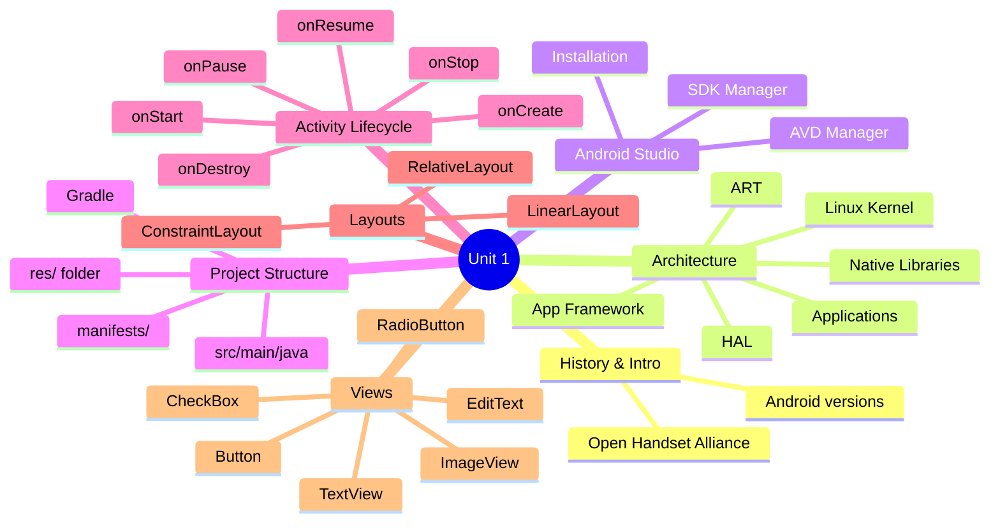
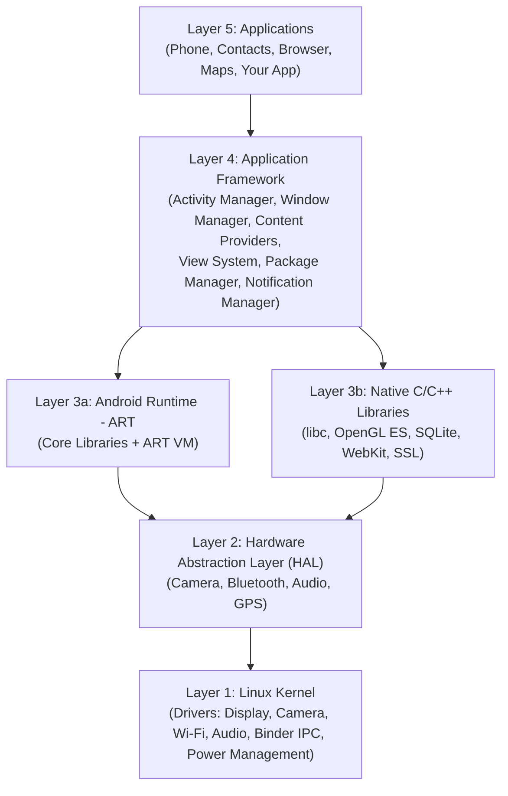
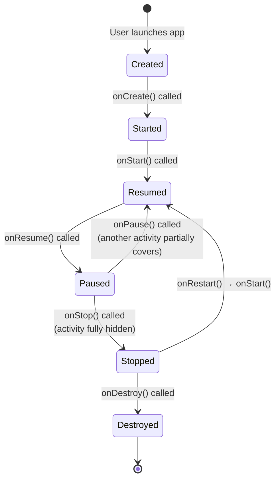

[[00-Dashboard/Home|Home]] | [[02-Semester-VI/Semester-VI-Dashboard|Semester VI]] | [[Overview]] | [[Syllabus]] | [[Unit-1]] | [[Unit-2]] | [[Unit-3]] | [[Unit-4]] | [[Unit-5]] | [[Important-Questions|Imp. Qs]] | [[Revision]] | [[Interview-Prep]]


# Unit 1: Introduction to Android

> [!important] Learning Objectives
> After this unit, you should be able to:
> - Explain the Android architecture layers
> - Set up Android Studio and create an AVD
> - Understand the Activity lifecycle and all callback methods
> - Build basic UIs using LinearLayout, RelativeLayout, and ConstraintLayout
> - Use common views: TextView, EditText, Button, ImageView, CheckBox, RadioButton

---

## Topics at a Glance



---

## 1.1 Android History & Introduction

### What is Android?

==Android== is an open-source, **Linux-based mobile operating system** developed by Google and released in 2008. It is maintained by the **Open Handset Alliance (OHA)** - a consortium of hardware, software, and telecom companies.

**Key facts:**
- Language: primarily **Java** and **Kotlin** (Google's preferred since 2017)
- Market share: ~72% of global mobile OS market
- App distribution: **Google Play Store**

### Android Version History (Key Milestones)

| Version | Name | API Level | Year |
|---------|------|-----------|------|
| 1.0 | - | 1 | 2008 |
| 4.0 | Ice Cream Sandwich | 14 | 2011 |
| 5.0 | Lollipop | 21 | 2014 |
| 6.0 | Marshmallow | 23 | 2015 |
| 8.0 | Oreo | 26 | 2017 |
| 9.0 | Pie | 28 | 2018 |
| 10 | Q | 29 | 2019 |
| 11 | R | 30 | 2020 |
| 12 | S | 31 | 2021 |
| 13 | T | 33 | 2022 |
| 14 | U | 34 | 2023 |

---

## 1.2 Android Architecture

The Android architecture consists of **5 layers** (bottom to top):



### Layer Details

| Layer | Components | Purpose |
|-------|-----------|---------|
| ==Linux Kernel== | Device drivers, memory management, process management | Core OS functions, hardware abstraction |
| ==HAL (Hardware Abstraction Layer)== | Camera, Bluetooth, Audio modules | Provides standard interface to hardware |
| ==Native Libraries== | libc, OpenGL ES, SQLite, WebKit | C/C++ libraries used by framework |
| ==ART (Android Runtime)== | AOT compiler, core Java libraries | Executes app bytecode |
| ==Application Framework== | Activity Manager, Content Providers, View System | APIs for app development |
| ==Applications== | Built-in + user apps | The apps users interact with |

### ART vs Dalvik

| Feature | Dalvik (old) | ART (Android 5.0+) |
|---------|-------------|-------------------|
| Compilation | JIT (Just-In-Time) | AOT (Ahead-Of-Time) |
| Performance | Slower at runtime | Faster execution |
| Install time | Fast | Slower (compiles at install) |
| Battery | More usage | Less usage |
| Storage | Less | More (compiled code stored) |

---

## 1.3 Android Studio Setup

### Installation

1. Download Android Studio from **developer.android.com/studio**
2. Run installer, install with default settings
3. Launch → Complete Setup Wizard (downloads Android SDK)
4. Accept SDK licenses

### SDK Manager

Access via: **Tools → SDK Manager**

| SDK Component | Purpose |
|--------------|---------|
| Android SDK Platform | Core platform files for target API |
| Android Emulator | Run apps without physical device |
| Android SDK Platform-Tools | `adb` (Android Debug Bridge) |
| Android SDK Build-Tools | Build tools, `aapt`, `dx` |

### AVD - Android Virtual Device

==AVD== is a software emulator of an Android device.

**Create AVD:** Tools → AVD Manager → Create Virtual Device
- Select hardware profile (Pixel 4, Nexus 5X, etc.)
- Select system image (Android version/API level)
- Configure AVD (RAM, storage, orientation)

---

## 1.4 Project Structure

When you create a new Android project, the structure is:

```
MyApp/
├── app/
│   ├── src/
│   │   └── main/
│   │       ├── java/com.example.myapp/
│   │       │   └── MainActivity.kt        ← Your Kotlin/Java code
│   │       ├── res/
│   │       │   ├── layout/                ← XML layout files
│   │       │   │   └── activity_main.xml
│   │       │   ├── drawable/              ← Images, icons
│   │       │   ├── values/
│   │       │   │   ├── strings.xml        ← String resources
│   │       │   │   ├── colors.xml         ← Color definitions
│   │       │   │   └── themes.xml         ← App theme
│   │       │   └── mipmap/                ← App launcher icons
│   │       └── AndroidManifest.xml        ← App declaration
│   ├── build.gradle (Module)              ← Module-level build config
│   └── proguard-rules.pro
├── build.gradle (Project)                 ← Project-level build config
├── settings.gradle
└── gradle.properties
```

### AndroidManifest.xml

==AndroidManifest.xml== is the **central configuration file** of every Android app. It declares:

```xml
<?xml version="1.0" encoding="utf-8"?>
<manifest xmlns:android="http://schemas.android.com/apk/res/android"
    package="com.example.myapp">

    <!-- Permissions -->
    <uses-permission android:name="android.permission.INTERNET"/>
    <uses-permission android:name="android.permission.CAMERA"/>

    <application
        android:allowBackup="true"
        android:icon="@mipmap/ic_launcher"
        android:label="@string/app_name"
        android:theme="@style/Theme.MyApp">

        <!-- Main Activity (launcher) -->
        <activity
            android:name=".MainActivity"
            android:exported="true">
            <intent-filter>
                <action android:name="android.intent.action.MAIN"/>
                <category android:name="android.intent.category.LAUNCHER"/>
            </intent-filter>
        </activity>

        <!-- Other activities -->
        <activity android:name=".SecondActivity"/>

        <!-- Services, Receivers, Providers declared here -->
        <service android:name=".MyService"/>
        <receiver android:name=".MyReceiver"/>
        
    </application>
</manifest>
```

**What Manifest declares:**
- App package name
- All Activities, Services, BroadcastReceivers, ContentProviders
- Permissions required by the app
- Hardware features required (`uses-feature`)
- Minimum and target SDK versions

### build.gradle (Module level)

```groovy
android {
    compileSdk 34

    defaultConfig {
        applicationId "com.example.myapp"
        minSdk 24        // Minimum Android version supported
        targetSdk 34     // Target Android version
        versionCode 1    // Internal version number
        versionName "1.0"  // Display version
    }
    
    buildTypes {
        release {
            minifyEnabled false
            proguardFiles getDefaultProguardFile('proguard-android-optimize.txt')
        }
    }
}

dependencies {
    implementation 'androidx.appcompat:appcompat:1.6.1'
    implementation 'com.google.android.material:material:1.11.0'
    implementation 'androidx.constraintlayout:constraintlayout:2.1.4'
    // Retrofit for networking
    implementation 'com.squareup.retrofit2:retrofit:2.9.0'
    // Room for database
    implementation 'androidx.room:room-runtime:2.6.1'
}
```

---

## 1.5 Activity Lifecycle

### What is an Activity?

==Activity== represents a **single screen** in an Android application. It has a well-defined lifecycle managed by the Android OS.



### Lifecycle Callback Methods

| Method | Triggered When | Common Usage |
|--------|---------------|-------------|
| `onCreate()` | Activity is first created | Initialize UI, set content view, bind data |
| `onStart()` | Activity becomes visible | Start animations, connect to services |
| `onResume()` | Activity starts interacting with user | Start camera, play audio, resume sensors |
| `onPause()` | Another activity partially covers this | Pause animations, save draft data |
| `onStop()` | Activity is no longer visible | Release heavy resources, stop location updates |
| `onRestart()` | Activity returning from stopped state | Refresh data before becoming visible |
| `onDestroy()` | Activity is about to be destroyed | Final cleanup, release all resources |

### MainActivity.kt Example

```kotlin
class MainActivity : AppCompatActivity() {

    override fun onCreate(savedInstanceState: Bundle?) {
        super.onCreate(savedInstanceState)
        setContentView(R.layout.activity_main)
        // Initialize views, set listeners, load data
        Log.d("Lifecycle", "onCreate called")
    }

    override fun onStart() {
        super.onStart()
        Log.d("Lifecycle", "onStart called")
    }

    override fun onResume() {
        super.onResume()
        Log.d("Lifecycle", "onResume called - activity interactive")
    }

    override fun onPause() {
        super.onPause()
        Log.d("Lifecycle", "onPause called - save draft/pause")
    }

    override fun onStop() {
        super.onStop()
        Log.d("Lifecycle", "onStop called - not visible")
    }

    override fun onDestroy() {
        super.onDestroy()
        Log.d("Lifecycle", "onDestroy called - cleanup")
    }
}
```

> [!warning] Always call super
> Always call `super.onCreate()`, `super.onStart()`, etc. before your code. Failing to do so causes a `RuntimeException`.

---

## 1.6 Layouts

### LinearLayout

==LinearLayout== arranges children **linearly** - either horizontally or vertically.

```xml
<!-- Vertical LinearLayout -->
<LinearLayout
    xmlns:android="http://schemas.android.com/apk/res/android"
    android:layout_width="match_parent"
    android:layout_height="match_parent"
    android:orientation="vertical"
    android:padding="16dp">

    <TextView
        android:layout_width="match_parent"
        android:layout_height="wrap_content"
        android:text="Name:"
        android:layout_weight="1"/>

    <EditText
        android:layout_width="match_parent"
        android:layout_height="wrap_content"
        android:hint="Enter your name"
        android:layout_weight="2"/>

</LinearLayout>
```

**`layout_weight`** distributes remaining space proportionally.

---

### RelativeLayout

==RelativeLayout== positions children **relative to each other** or to the parent.

```xml
<RelativeLayout
    android:layout_width="match_parent"
    android:layout_height="match_parent">

    <TextView
        android:id="@+id/labelText"
        android:layout_width="wrap_content"
        android:layout_height="wrap_content"
        android:text="Username:"
        android:layout_alignParentTop="true"
        android:layout_marginTop="16dp"/>

    <EditText
        android:id="@+id/usernameInput"
        android:layout_width="match_parent"
        android:layout_height="wrap_content"
        android:layout_below="@id/labelText"   <!-- Position relative to labelText -->
        android:layout_marginTop="8dp"/>

    <Button
        android:layout_width="wrap_content"
        android:layout_height="wrap_content"
        android:text="Login"
        android:layout_below="@id/usernameInput"
        android:layout_centerHorizontal="true"/>

</RelativeLayout>
```

**Key attributes:**
- `layout_below`, `layout_above`, `layout_toLeftOf`, `layout_toRightOf`
- `layout_alignParentTop/Bottom/Left/Right`
- `layout_centerInParent`, `layout_centerHorizontal`

---

### ConstraintLayout

==ConstraintLayout== is the most **flexible and recommended** layout. Each view is positioned using **constraints** to parent or sibling views.

```xml
<androidx.constraintlayout.widget.ConstraintLayout
    android:layout_width="match_parent"
    android:layout_height="match_parent">

    <Button
        android:id="@+id/loginButton"
        android:layout_width="0dp"
        android:layout_height="wrap_content"
        android:text="Login"
        app:layout_constraintTop_toTopOf="parent"
        app:layout_constraintStart_toStartOf="parent"
        app:layout_constraintEnd_toEndOf="parent"
        android:layout_margin="16dp"/>

    <TextView
        android:id="@+id/messageText"
        android:layout_width="wrap_content"
        android:layout_height="wrap_content"
        android:text="Welcome!"
        app:layout_constraintTop_toBottomOf="@id/loginButton"
        app:layout_constraintStart_toStartOf="parent"
        android:layout_marginTop="16dp"/>

</androidx.constraintlayout.widget.ConstraintLayout>
```

| Layout | Best For | Performance |
|--------|---------|-------------|
| LinearLayout | Simple lists/forms | Good |
| RelativeLayout | Moderate complexity | Moderate |
| ==ConstraintLayout== | Complex, flat layouts | **Best** (flat hierarchy) |

---

## 1.7 Basic Views (Widgets)

### Common Views

```xml
<!-- TextView -->
<TextView
    android:id="@+id/myText"
    android:layout_width="wrap_content"
    android:layout_height="wrap_content"
    android:text="Hello Android!"
    android:textSize="18sp"
    android:textColor="#000000"
    android:textStyle="bold"/>

<!-- EditText -->
<EditText
    android:id="@+id/nameInput"
    android:layout_width="match_parent"
    android:layout_height="wrap_content"
    android:hint="Enter your name"
    android:inputType="text"/>

<!-- Button -->
<Button
    android:id="@+id/submitBtn"
    android:layout_width="wrap_content"
    android:layout_height="wrap_content"
    android:text="Submit"/>

<!-- ImageView -->
<ImageView
    android:id="@+id/profileImage"
    android:layout_width="100dp"
    android:layout_height="100dp"
    android:src="@drawable/ic_profile"
    android:contentDescription="Profile picture"/>

<!-- CheckBox -->
<CheckBox
    android:id="@+id/agreeCheck"
    android:layout_width="wrap_content"
    android:layout_height="wrap_content"
    android:text="I agree to terms"/>

<!-- RadioButton inside RadioGroup -->
<RadioGroup
    android:id="@+id/genderGroup"
    android:layout_width="wrap_content"
    android:layout_height="wrap_content"
    android:orientation="horizontal">
    
    <RadioButton
        android:id="@+id/maleRadio"
        android:layout_width="wrap_content"
        android:layout_height="wrap_content"
        android:text="Male"/>
    
    <RadioButton
        android:id="@+id/femaleRadio"
        android:layout_width="wrap_content"
        android:layout_height="wrap_content"
        android:text="Female"/>
</RadioGroup>
```

### Accessing Views in Kotlin

```kotlin
// Modern approach - ViewBinding (recommended)
private lateinit var binding: ActivityMainBinding

override fun onCreate(savedInstanceState: Bundle?) {
    super.onCreate(savedInstanceState)
    binding = ActivityMainBinding.inflate(layoutInflater)
    setContentView(binding.root)
    
    // Access views
    binding.myText.text = "Hello from Kotlin!"
    binding.submitBtn.setOnClickListener {
        val name = binding.nameInput.text.toString()
        Toast.makeText(this, "Hello, $name!", Toast.LENGTH_SHORT).show()
    }
    
    // CheckBox
    binding.agreeCheck.setOnCheckedChangeListener { _, isChecked ->
        if (isChecked) Log.d("UI", "Agreed to terms")
    }
    
    // RadioGroup
    binding.genderGroup.setOnCheckedChangeListener { _, checkedId ->
        when (checkedId) {
            R.id.maleRadio -> Log.d("UI", "Male selected")
            R.id.femaleRadio -> Log.d("UI", "Female selected")
        }
    }
}
```

### Important View Attributes

| Attribute | Values | Description |
|-----------|--------|-------------|
| `layout_width` / `layout_height` | `match_parent`, `wrap_content`, exact dp | Size of the view |
| `android:id` | `@+id/viewId` | Unique identifier |
| `android:text` | String or `@string/key` | Displayed text |
| `android:textSize` | `14sp`, `18sp` | Text size (use sp, not dp) |
| `android:padding` | `8dp`, `16dp` | Inner spacing |
| `android:margin` | `8dp`, `16dp` | Outer spacing |
| `android:visibility` | `visible`, `invisible`, `gone` | View visibility |
| `inputType` | `text`, `number`, `email`, `password` | Keyboard type for EditText |

---

## Key Definitions

| Term | Definition |
|------|-----------|
| ==Activity== | A single screen with a user interface in Android |
| ==ART== | Android Runtime - compiles DEX bytecode to native code (AOT) |
| ==AVD== | Android Virtual Device - software emulator of an Android device |
| ==AndroidManifest.xml== | Central configuration file declaring all app components |
| ==LinearLayout== | Layout arranging children linearly (horizontal/vertical) |
| ==ConstraintLayout== | Flexible layout using constraints for positioning |
| ==ViewBinding== | Feature generating binding classes for XML layouts |
| ==dp== | Density-independent pixels - for dimensions |
| ==sp== | Scale-independent pixels - for text sizes |
| ==HAL== | Hardware Abstraction Layer - standard interface to hardware |

---

## Practice Questions

> [!question] Short Answer Questions
> 1. Draw and explain the Android architecture layers.
> 2. What is the difference between ART and Dalvik?
> 3. List and explain all Activity lifecycle methods with their purposes.
> 4. What is AndroidManifest.xml? What does it contain?
> 5. Differentiate between LinearLayout, RelativeLayout, and ConstraintLayout.
> 6. What is the difference between `match_parent` and `wrap_content`?
> 7. What is an AVD? How do you create one?
> 8. Why is `ConstraintLayout` preferred over other layouts?
> 9. What is `build.gradle` and what does `minSdk`/`targetSdk` mean?
> 10. Write XML code to create a login form with EditText and Button.

---

## Navigation

- [[Overview|← Overview]]
- [[Syllabus| Syllabus]]
- [[Unit-2|Unit 2: Activities and Intents →]]
- [[Important-Questions| Important Questions]]
- [[Revision| Revision]]
