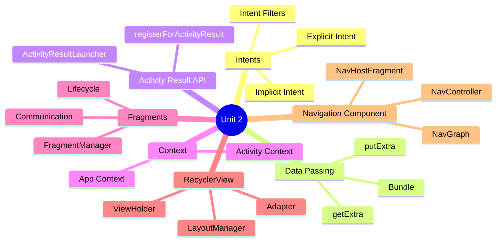
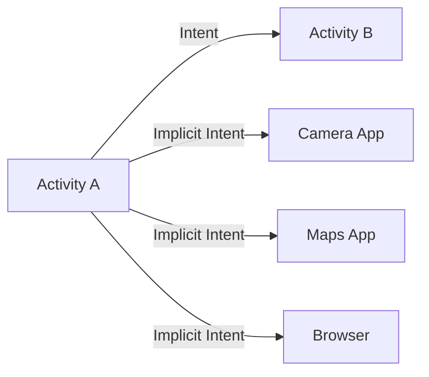
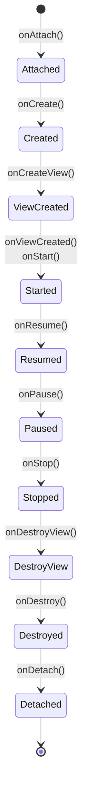
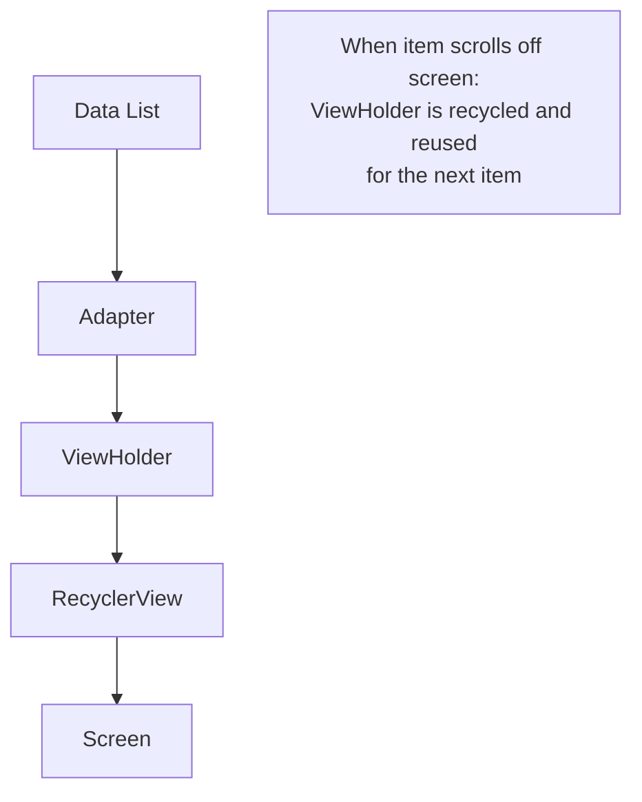

[[00-Dashboard/Home|Home]] | [[02-Semester-VI/Semester-VI-Dashboard|Semester VI]] | [[Overview]] | [[Syllabus]] | [[Unit-1]] | [[Unit-2]] | [[Unit-3]] | [[Unit-4]] | [[Unit-5]] | [[Important-Questions|Imp. Qs]] | [[Revision]] | [[Interview-Prep]]


# Unit 2: Activities and Intents

> [!important] Learning Objectives
> After this unit, you should be able to:
> - Use Explicit and Implicit Intents to start activities and system components
> - Pass data between activities using `putExtra()` and `getExtra()`
> - Use the modern Activity Result API
> - Implement Fragments with their lifecycle
> - Build scrollable lists with RecyclerView and Adapter pattern
> - Navigate between screens using the Navigation Component

---

## Topics at a Glance



---

## 2.1 Intents

### What is an Intent?

An ==Intent== is a messaging object that can be used to request an action from another **Android component** (Activity, Service, BroadcastReceiver, ContentProvider).



**Two types:**

| Type | Description | Example |
|------|-------------|---------|
| ==Explicit Intent== | Specifies exact component (class) to start | Start your own `DetailActivity` |
| ==Implicit Intent== | Specifies action; system finds matching component | "Open a URL", "Take a photo" |

---

### Explicit Intents

```kotlin
// Starting another activity in your app
val intent = Intent(this, DetailActivity::class.java)
startActivity(intent)

// Starting with data
val intent = Intent(this, DetailActivity::class.java)
intent.putExtra("user_id", 42)
intent.putExtra("user_name", "Alice Johnson")
intent.putExtra("is_admin", true)
startActivity(intent)

// Or using apply{}
val intent = Intent(this, ProfileActivity::class.java).apply {
    putExtra("userId", userId)
    putExtra("fromNotification", true)
}
startActivity(intent)

// Finishing current activity after starting new one
startActivity(intent)
finish()  // removes current activity from back stack
```

---

### Implicit Intents

Implicit intents specify an **action** and optional data - the system finds the right component.

```kotlin
// Open a URL in browser
val intent = Intent(Intent.ACTION_VIEW, Uri.parse("https://www.example.com"))
startActivity(intent)

// Make a phone call
val intent = Intent(Intent.ACTION_DIAL, Uri.parse("tel:+919876543210"))
startActivity(intent)

// Send email
val intent = Intent(Intent.ACTION_SEND).apply {
    type = "message/rfc822"
    putExtra(Intent.EXTRA_EMAIL, arrayOf("support@example.com"))
    putExtra(Intent.EXTRA_SUBJECT, "Support Request")
    putExtra(Intent.EXTRA_TEXT, "Hello, I need help with...")
}
startActivity(Intent.createChooser(intent, "Send Email"))

// Take a photo
val intent = Intent(MediaStore.ACTION_IMAGE_CAPTURE)
startActivity(intent)

// Share text
val intent = Intent(Intent.ACTION_SEND).apply {
    type = "text/plain"
    putExtra(Intent.EXTRA_TEXT, "Check out this app!")
}
startActivity(Intent.createChooser(intent, "Share via"))

// Open map
val gmmIntentUri = Uri.parse("geo:19.0760,72.8777?q=Mumbai")
val intent = Intent(Intent.ACTION_VIEW, gmmIntentUri)
intent.setPackage("com.google.android.apps.maps")
startActivity(intent)
```

### Intent Filters (in Manifest)

```xml
<!-- Making your activity respond to implicit intents -->
<activity android:name=".ViewImageActivity">
    <intent-filter>
        <action android:name="android.intent.action.VIEW"/>
        <category android:name="android.intent.category.DEFAULT"/>
        <data android:mimeType="image/*"/>
    </intent-filter>
</activity>
```

> [!warning] Check if Intent can be resolved
> Always check before starting an implicit intent to avoid crashes:
> ```kotlin
> if (intent.resolveActivity(packageManager) != null) {
>     startActivity(intent)
> } else {
>     Toast.makeText(this, "No app can handle this action", Toast.LENGTH_SHORT).show()
> }
> ```

---

## 2.2 Passing Data Between Activities

### Sending Data with putExtra()

```kotlin
// MainActivity.kt - sending data
val intent = Intent(this, DetailActivity::class.java)

// Primitive types
intent.putExtra("int_key", 42)
intent.putExtra("string_key", "Hello")
intent.putExtra("boolean_key", true)
intent.putExtra("double_key", 3.14)

// Array
intent.putExtra("int_array", intArrayOf(1, 2, 3))
intent.putExtra("string_array", arrayOf("a", "b", "c"))

// ArrayList
intent.putStringArrayListExtra("list_key", ArrayList(listOf("x", "y")))

startActivity(intent)
```

### Receiving Data with getExtra()

```kotlin
// DetailActivity.kt - receiving data
override fun onCreate(savedInstanceState: Bundle?) {
    super.onCreate(savedInstanceState)
    setContentView(R.layout.activity_detail)
    
    // Get extras (with default values)
    val userId = intent.getIntExtra("int_key", -1)            // default: -1
    val userName = intent.getStringExtra("string_key") ?: ""  // nullable
    val isAdmin = intent.getBooleanExtra("boolean_key", false) // default: false
    
    // Check if extra exists
    if (intent.hasExtra("user_id")) {
        val id = intent.getIntExtra("user_id", 0)
    }
    
    // Bundle approach
    val bundle = intent.extras
    val name = bundle?.getString("name")
    
    Log.d("Detail", "User: $userName, ID: $userId, Admin: $isAdmin")
}
```

### Parcelable (Passing Objects)

```kotlin
// Data class implementing Parcelable (use @Parcelize)
@Parcelize
data class User(
    val id: Int,
    val name: String,
    val email: String
) : Parcelable

// Sending
val user = User(1, "Alice", "alice@example.com")
intent.putExtra("user", user)

// Receiving
val user = intent.getParcelableExtra<User>("user")
// or in newer API:
val user = intent.getParcelableExtra("user", User::class.java)
```

---

## 2.3 Activity Result API

The modern way to get results back from activities (replaces deprecated `startActivityForResult`).

```kotlin
// In the calling activity
private val pickImageLauncher = registerForActivityResult(
    ActivityResultContracts.GetContent()
) { uri: Uri? ->
    uri?.let {
        // Handle selected image
        binding.imageView.setImageURI(it)
        Log.d("Image", "Selected: $it")
    }
}

// Launch the picker
binding.selectImageBtn.setOnClickListener {
    pickImageLauncher.launch("image/*")
}

// Custom result between activities
private val resultLauncher = registerForActivityResult(
    ActivityResultContracts.StartActivityForResult()
) { result ->
    if (result.resultCode == Activity.RESULT_OK) {
        val returnedData = result.data?.getStringExtra("result_key")
        binding.resultText.text = returnedData
    }
}

// In SecondActivity - returning result
val resultIntent = Intent()
resultIntent.putExtra("result_key", "Data from SecondActivity")
setResult(Activity.RESULT_OK, resultIntent)
finish()
```

---

## 2.4 Context

==Context== is an abstract class providing access to application-specific resources and classes.

| Type | When to Use | Lifecycle |
|------|-------------|-----------|
| `applicationContext` | Long-lived operations, singletons, Room, Retrofit | Lives as long as the app |
| `this` (Activity) | Creating UI elements, dialogs, toasts within activity | Lives as long as the activity |
| `requireContext()` | Inside Fragments | Fragment's host context |

```kotlin
// Application Context - for long-lived use
val sharedPrefs = applicationContext.getSharedPreferences("MyPrefs", Context.MODE_PRIVATE)

// Activity Context - for UI
val dialog = AlertDialog.Builder(this)  // 'this' = Activity context
val toast = Toast.makeText(this, "Hello!", Toast.LENGTH_SHORT)
```

> [!warning] Memory Leaks
> Don't store Activity context in objects that outlive the activity. Use `applicationContext` for database helpers, Retrofit instances, etc.

---

## 2.5 Fragments

### What is a Fragment?

A ==Fragment== represents a **reusable portion** of your app's UI. Fragments can be combined in a single activity to build multi-pane UIs and be reused across multiple activities.

### Fragment Lifecycle



### Creating a Fragment

```kotlin
// MyFragment.kt
class MyFragment : Fragment() {
    
    private var _binding: FragmentMyBinding? = null
    private val binding get() = _binding!!
    
    override fun onCreateView(
        inflater: LayoutInflater,
        container: ViewGroup?,
        savedInstanceState: Bundle?
    ): View {
        _binding = FragmentMyBinding.inflate(inflater, container, false)
        return binding.root
    }
    
    override fun onViewCreated(view: View, savedInstanceState: Bundle?) {
        super.onViewCreated(view, savedInstanceState)
        
        // Initialize UI here (after view is created)
        binding.myButton.setOnClickListener {
            Toast.makeText(requireContext(), "Fragment button!", Toast.LENGTH_SHORT).show()
        }
        
        // Get arguments passed to fragment
        val userId = arguments?.getInt("user_id")
    }
    
    override fun onDestroyView() {
        super.onDestroyView()
        _binding = null  // Prevent memory leaks
    }
    
    companion object {
        // Factory method to create fragment with arguments
        fun newInstance(userId: Int): MyFragment {
            return MyFragment().apply {
                arguments = Bundle().apply {
                    putInt("user_id", userId)
                }
            }
        }
    }
}
```

### Adding Fragment to Activity

```kotlin
// Dynamic - programmatic
supportFragmentManager.beginTransaction()
    .replace(R.id.fragment_container, MyFragment.newInstance(42))
    .addToBackStack("MyFragment")  // Allow back navigation
    .commit()

// Using static XML in layout
// activity_main.xml:
// <fragment android:name="com.example.MyFragment" ... />
```

### Fragment Communication

```kotlin
// Fragment to Activity - via ViewModel (recommended)
// Shared ViewModel
class SharedViewModel : ViewModel() {
    val selectedUser = MutableLiveData<User>()
}

// Fragment A - selects user
class ListFragment : Fragment() {
    private val sharedViewModel: SharedViewModel by activityViewModels()
    
    fun onUserClicked(user: User) {
        sharedViewModel.selectedUser.value = user
    }
}

// Fragment B - observes selection
class DetailFragment : Fragment() {
    private val sharedViewModel: SharedViewModel by activityViewModels()
    
    override fun onViewCreated(view: View, savedInstanceState: Bundle?) {
        sharedViewModel.selectedUser.observe(viewLifecycleOwner) { user ->
            binding.nameText.text = user.name
        }
    }
}
```

---

## 2.6 RecyclerView and Adapter Pattern

### Why RecyclerView?

==RecyclerView== efficiently displays large lists/grids by **recycling** views that are no longer visible, instead of creating new views for each item.



### Implementation Steps

**1. Add dependency (build.gradle):**
```groovy
implementation 'androidx.recyclerview:recyclerview:1.3.2'
```

**2. XML Layout:**
```xml
<!-- activity_main.xml -->
<androidx.recyclerview.widget.RecyclerView
    android:id="@+id/recyclerView"
    android:layout_width="match_parent"
    android:layout_height="match_parent"/>

<!-- item_user.xml -->
<LinearLayout
    android:layout_width="match_parent"
    android:layout_height="wrap_content"
    android:orientation="horizontal"
    android:padding="16dp">
    
    <ImageView
        android:id="@+id/userAvatar"
        android:layout_width="48dp"
        android:layout_height="48dp"/>
    
    <LinearLayout android:orientation="vertical">
        <TextView android:id="@+id/userName" android:layout_width="wrap_content" android:layout_height="wrap_content"/>
        <TextView android:id="@+id/userEmail" android:layout_width="wrap_content" android:layout_height="wrap_content"/>
    </LinearLayout>
</LinearLayout>
```

**3. Adapter:**
```kotlin
// UserAdapter.kt
class UserAdapter(
    private val users: List<User>,
    private val onItemClick: (User) -> Unit
) : RecyclerView.Adapter<UserAdapter.UserViewHolder>() {
    
    // ViewHolder - holds references to views in one item
    inner class UserViewHolder(private val binding: ItemUserBinding) 
        : RecyclerView.ViewHolder(binding.root) {
        
        fun bind(user: User) {
            binding.userName.text = user.name
            binding.userEmail.text = user.email
            binding.root.setOnClickListener { onItemClick(user) }
        }
    }
    
    // Called once - inflates the item layout and creates ViewHolder
    override fun onCreateViewHolder(parent: ViewGroup, viewType: Int): UserViewHolder {
        val binding = ItemUserBinding.inflate(
            LayoutInflater.from(parent.context), parent, false
        )
        return UserViewHolder(binding)
    }
    
    // Called for each visible item - binds data to ViewHolder
    override fun onBindViewHolder(holder: UserViewHolder, position: Int) {
        holder.bind(users[position])
    }
    
    // Total number of items
    override fun getItemCount() = users.size
}
```

**4. Set up in Activity:**
```kotlin
// MainActivity.kt
val users = listOf(
    User(1, "Alice", "alice@example.com"),
    User(2, "Bob", "bob@example.com")
)

val adapter = UserAdapter(users) { user ->
    // Handle click
    val intent = Intent(this, DetailActivity::class.java)
    intent.putExtra("user_id", user.id)
    startActivity(intent)
}

binding.recyclerView.apply {
    layoutManager = LinearLayoutManager(this@MainActivity)  // Vertical list
    // or: GridLayoutManager(this, 2)  // 2-column grid
    // or: StaggeredGridLayoutManager(2, VERTICAL)
    this.adapter = adapter
    addItemDecoration(DividerItemDecoration(context, LinearLayoutManager.VERTICAL))
}
```

---

## 2.7 Navigation Component

The ==Navigation Component== handles fragment transactions and back stack management.

```bash
# build.gradle dependency
implementation 'androidx.navigation:navigation-fragment-ktx:2.7.6'
implementation 'androidx.navigation:navigation-ui-ktx:2.7.6'
```

**Navigation Graph (nav_graph.xml):**
```xml
<!-- res/navigation/nav_graph.xml -->
<navigation xmlns:android="..."
    android:id="@+id/nav_graph"
    app:startDestination="@id/homeFragment">
    
    <fragment
        android:id="@+id/homeFragment"
        android:name="com.example.HomeFragment">
        <action
            android:id="@+id/action_home_to_detail"
            app:destination="@id/detailFragment"/>
    </fragment>
    
    <fragment
        android:id="@+id/detailFragment"
        android:name="com.example.DetailFragment">
        <argument
            android:name="userId"
            app:argType="integer"/>
    </fragment>
</navigation>
```

**Activity Layout:**
```xml
<androidx.fragment.app.FragmentContainerView
    android:id="@+id/nav_host_fragment"
    android:name="androidx.navigation.fragment.NavHostFragment"
    app:navGraph="@navigation/nav_graph"
    app:defaultNavHost="true"/>
```

**Navigate between fragments:**
```kotlin
// In HomeFragment
val action = HomeFragmentDirections.actionHomeToDetail(userId = 42)
findNavController().navigate(action)

// Back navigation
findNavController().navigateUp()
```

---

## Key Definitions

| Term | Definition |
|------|-----------|
| ==Intent== | Message to start Android components (Activity, Service, etc.) |
| ==Explicit Intent== | Intent specifying exact component class to start |
| ==Implicit Intent== | Intent specifying action; system finds matching component |
| ==Bundle== | Key-value container for passing primitive data |
| ==Parcelable== | Android interface for efficiently passing objects via Intents |
| ==Fragment== | Reusable UI portion within an Activity |
| ==RecyclerView== | Efficient scrolling list view using ViewHolder recycling pattern |
| ==ViewHolder== | Object holding view references for one list item |
| ==NavController== | Manages navigation between destinations |
| ==Context== | Interface to global Android application environment |
| ==ActivityResultLauncher== | Modern API for starting activities and receiving results |

---

## Practice Questions

> [!question] Short Answer Questions
> 1. What is the difference between explicit and implicit intents? Give examples.
> 2. How do you pass data between activities using Intents?
> 3. What is the difference between `applicationContext` and Activity `this`?
> 4. Draw and explain the Fragment lifecycle.
> 5. What is the ViewHolder pattern and why is it used in RecyclerView?
> 6. Write code to create a RecyclerView adapter for a list of students.
> 7. How do you communicate between two fragments?
> 8. What is the Activity Result API and why was it introduced?
> 9. What are the three methods required in a RecyclerView.Adapter?
> 10. What is a NavGraph? Explain its components.

---

## Navigation

- [[Unit-1|← Unit 1: Introduction to Android]]
- [[Syllabus| Syllabus]]
- [[Unit-3|Unit 3: Data Storage →]]
- [[Important-Questions| Important Questions]]
- [[Revision| Revision]]
