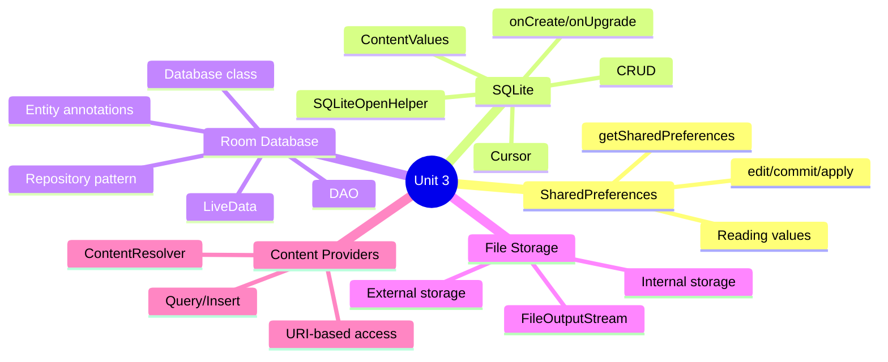
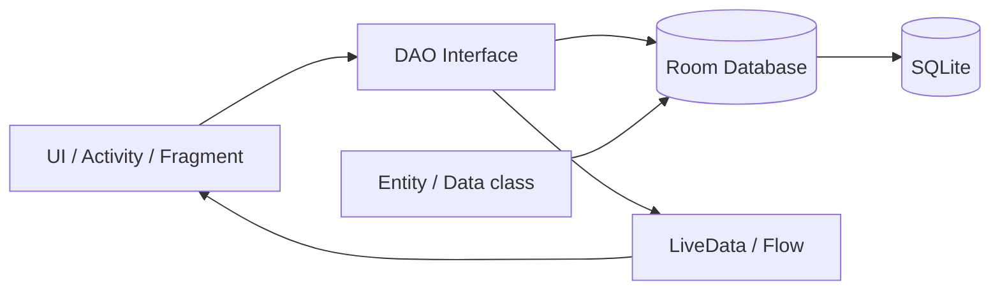

[[00-Dashboard/Home|Home]] | [[02-Semester-VI/Semester-VI-Dashboard|Semester VI]] | [[Overview]] | [[Syllabus]] | [[Unit-1]] | [[Unit-2]] | [[Unit-3]] | [[Unit-4]] | [[Unit-5]] | [[Important-Questions|Imp. Qs]] | [[Revision]] | [[Interview-Prep]]


# Unit 3: Data Storage

> [!important] Learning Objectives
> After this unit, you should be able to:
> - Read and write data using SharedPreferences
> - Create and perform CRUD operations with SQLite using SQLiteOpenHelper
> - Build a Room database with Entity, DAO, and Database classes
> - Use LiveData with Room for reactive UI updates
> - Store files in internal and external storage
> - Understand Content Providers and ContentResolver

---

## Topics at a Glance



---

## 3.1 SharedPreferences

### What is SharedPreferences?

==SharedPreferences== is an Android API for storing **small amounts of primitive data** as key-value pairs. Data persists across app sessions.

**Use cases:** User settings, login status, theme preference, last viewed item, small flags.

**Not suitable for:** Large datasets, complex objects, relational data.

---

### Writing to SharedPreferences

```kotlin
// Get SharedPreferences instance
val prefs = getSharedPreferences("MyAppPrefs", Context.MODE_PRIVATE)
// or: getPreferences(Context.MODE_PRIVATE) - activity-level prefs

val editor = prefs.edit()

// Write values
editor.putString("username", "Alice")
editor.putInt("user_id", 42)
editor.putBoolean("is_logged_in", true)
editor.putFloat("volume_level", 0.75f)
editor.putLong("last_login", System.currentTimeMillis())

// Commit changes
editor.apply()   // Asynchronous - preferred
// or: editor.commit()  // Synchronous - returns true/false

// Chaining (Kotlin)
prefs.edit()
    .putString("theme", "dark")
    .putBoolean("notifications_enabled", true)
    .apply()
```

### Reading from SharedPreferences

```kotlin
val prefs = getSharedPreferences("MyAppPrefs", Context.MODE_PRIVATE)

// Read values (with defaults)
val username = prefs.getString("username", "Guest")          // default: "Guest"
val userId = prefs.getInt("user_id", -1)                     // default: -1
val isLoggedIn = prefs.getBoolean("is_logged_in", false)     // default: false
val volume = prefs.getFloat("volume_level", 1.0f)
val lastLogin = prefs.getLong("last_login", 0L)

// Check if key exists
if (prefs.contains("username")) {
    val name = prefs.getString("username", "")
}

// Read all values
val allPrefs: Map<String, *> = prefs.all
```

### Deleting from SharedPreferences

```kotlin
val editor = prefs.edit()
editor.remove("username")  // Remove specific key
editor.clear()             // Remove ALL keys
editor.apply()
```

### Practical: Login State Management

```kotlin
// Save login state
fun saveLoginState(userId: Int, token: String) {
    getSharedPreferences("AuthPrefs", Context.MODE_PRIVATE).edit()
        .putBoolean("is_logged_in", true)
        .putInt("user_id", userId)
        .putString("auth_token", token)
        .apply()
}

// Check login state
fun isLoggedIn(): Boolean {
    return getSharedPreferences("AuthPrefs", Context.MODE_PRIVATE)
        .getBoolean("is_logged_in", false)
}

// Logout
fun logout() {
    getSharedPreferences("AuthPrefs", Context.MODE_PRIVATE).edit()
        .clear()
        .apply()
}
```

---

## 3.2 SQLite Database

### What is SQLite?

==SQLite== is a **lightweight, serverless relational database** built into Android. Every Android device has SQLite available.

**Database file location:** `/data/data/com.your.package/databases/your_db.db`

---

### SQLiteOpenHelper

```kotlin
// DatabaseHelper.kt
class DatabaseHelper(context: Context) : 
    SQLiteOpenHelper(context, DATABASE_NAME, null, DATABASE_VERSION) {
    
    companion object {
        const val DATABASE_NAME = "students.db"
        const val DATABASE_VERSION = 1
        const val TABLE_STUDENTS = "students"
        const val COL_ID = "id"
        const val COL_NAME = "name"
        const val COL_MARKS = "marks"
        const val COL_EMAIL = "email"
    }
    
    // Called when database is created for the FIRST time
    override fun onCreate(db: SQLiteDatabase) {
        val createTable = """
            CREATE TABLE $TABLE_STUDENTS (
                $COL_ID INTEGER PRIMARY KEY AUTOINCREMENT,
                $COL_NAME TEXT NOT NULL,
                $COL_MARKS REAL,
                $COL_EMAIL TEXT UNIQUE
            )
        """.trimIndent()
        db.execSQL(createTable)
    }
    
    // Called when DATABASE_VERSION increases (schema migration)
    override fun onUpgrade(db: SQLiteDatabase, oldVersion: Int, newVersion: Int) {
        db.execSQL("DROP TABLE IF EXISTS $TABLE_STUDENTS")
        onCreate(db)
        // Production: use ALTER TABLE instead of dropping!
    }
    
    // ======================== CRUD OPERATIONS ========================
    
    // CREATE - Insert a student
    fun insertStudent(name: String, marks: Float, email: String): Long {
        val db = writableDatabase
        val values = ContentValues().apply {
            put(COL_NAME, name)
            put(COL_MARKS, marks)
            put(COL_EMAIL, email)
        }
        return db.insert(TABLE_STUDENTS, null, values)
        // Returns: row ID (-1 if failed)
    }
    
    // READ - Get all students
    fun getAllStudents(): List<Student> {
        val students = mutableListOf<Student>()
        val db = readableDatabase
        val cursor = db.query(
            TABLE_STUDENTS,  // table
            null,            // columns (null = all)
            null,            // WHERE clause
            null,            // WHERE args
            null,            // GROUP BY
            null,            // HAVING
            "$COL_NAME ASC"  // ORDER BY
        )
        
        cursor.use {  // Auto-closes cursor
            while (it.moveToNext()) {
                val student = Student(
                    id = it.getInt(it.getColumnIndexOrThrow(COL_ID)),
                    name = it.getString(it.getColumnIndexOrThrow(COL_NAME)),
                    marks = it.getFloat(it.getColumnIndexOrThrow(COL_MARKS)),
                    email = it.getString(it.getColumnIndexOrThrow(COL_EMAIL))
                )
                students.add(student)
            }
        }
        return students
    }
    
    // READ ONE - Get student by ID
    fun getStudentById(id: Int): Student? {
        val db = readableDatabase
        val cursor = db.rawQuery(
            "SELECT * FROM $TABLE_STUDENTS WHERE $COL_ID = ?",
            arrayOf(id.toString())
        )
        return cursor.use {
            if (it.moveToFirst()) {
                Student(
                    id = it.getInt(it.getColumnIndexOrThrow(COL_ID)),
                    name = it.getString(it.getColumnIndexOrThrow(COL_NAME)),
                    marks = it.getFloat(it.getColumnIndexOrThrow(COL_MARKS)),
                    email = it.getString(it.getColumnIndexOrThrow(COL_EMAIL))
                )
            } else null
        }
    }
    
    // UPDATE - Update a student
    fun updateStudent(id: Int, name: String, marks: Float): Int {
        val db = writableDatabase
        val values = ContentValues().apply {
            put(COL_NAME, name)
            put(COL_MARKS, marks)
        }
        return db.update(
            TABLE_STUDENTS,
            values,
            "$COL_ID = ?",
            arrayOf(id.toString())
        )
        // Returns: number of rows affected
    }
    
    // DELETE - Delete a student
    fun deleteStudent(id: Int): Int {
        val db = writableDatabase
        return db.delete(
            TABLE_STUDENTS,
            "$COL_ID = ?",
            arrayOf(id.toString())
        )
    }
    
    // Search students by name
    fun searchStudents(nameQuery: String): List<Student> {
        val db = readableDatabase
        val cursor = db.rawQuery(
            "SELECT * FROM $TABLE_STUDENTS WHERE $COL_NAME LIKE ?",
            arrayOf("%$nameQuery%")
        )
        val results = mutableListOf<Student>()
        cursor.use {
            while (it.moveToNext()) {
                results.add(/* ... parse cursor ... */ )
            }
        }
        return results
    }
}

// Data class
data class Student(val id: Int, val name: String, val marks: Float, val email: String)
```

---

## 3.3 Room Database

==Room== is Android's **recommended database solution** - an abstraction layer over SQLite that generates boilerplate code at compile time and validates SQL queries.

**Room components:**


### Setup

```groovy
// build.gradle (Module)
plugins {
    id 'kotlin-kapt'  // For annotation processing
}

dependencies {
    def room_version = "2.6.1"
    implementation "androidx.room:room-runtime:$room_version"
    kapt "androidx.room:room-compiler:$room_version"
    implementation "androidx.room:room-ktx:$room_version"   // Coroutines support
}
```

### Step 1: Entity

```kotlin
// User.kt - Entity (maps to a table)
@Entity(tableName = "users")
data class User(
    @PrimaryKey(autoGenerate = true)
    val id: Int = 0,
    
    @ColumnInfo(name = "full_name")
    val name: String,
    
    @ColumnInfo(name = "email")
    val email: String,
    
    @ColumnInfo(name = "created_at")
    val createdAt: Long = System.currentTimeMillis()
)
```

### Step 2: DAO (Data Access Object)

```kotlin
// UserDao.kt - Database operations as interface
@Dao
interface UserDao {
    
    // Queries returning LiveData auto-update UI when data changes
    @Query("SELECT * FROM users ORDER BY full_name ASC")
    fun getAllUsers(): LiveData<List<User>>
    
    @Query("SELECT * FROM users WHERE id = :userId")
    suspend fun getUserById(userId: Int): User?
    
    @Query("SELECT * FROM users WHERE email = :email LIMIT 1")
    suspend fun getUserByEmail(email: String): User?
    
    @Query("SELECT * FROM users WHERE full_name LIKE :searchQuery")
    fun searchUsers(searchQuery: String): LiveData<List<User>>
    
    @Insert(onConflict = OnConflictStrategy.REPLACE)
    suspend fun insertUser(user: User): Long
    
    @Insert
    suspend fun insertAll(users: List<User>)
    
    @Update
    suspend fun updateUser(user: User)
    
    @Delete
    suspend fun deleteUser(user: User)
    
    @Query("DELETE FROM users WHERE id = :userId")
    suspend fun deleteUserById(userId: Int)
    
    @Query("SELECT COUNT(*) FROM users")
    suspend fun getUserCount(): Int
}
```

### Step 3: Database

```kotlin
// AppDatabase.kt - Singleton Room database
@Database(
    entities = [User::class, Product::class],  // All entities
    version = 1,
    exportSchema = false
)
abstract class AppDatabase : RoomDatabase() {
    
    abstract fun userDao(): UserDao
    abstract fun productDao(): ProductDao
    
    companion object {
        @Volatile
        private var INSTANCE: AppDatabase? = null
        
        fun getDatabase(context: Context): AppDatabase {
            return INSTANCE ?: synchronized(this) {
                val instance = Room.databaseBuilder(
                    context.applicationContext,
                    AppDatabase::class.java,
                    "app_database"
                )
                .fallbackToDestructiveMigration()  // Dev only!
                .build()
                INSTANCE = instance
                instance
            }
        }
    }
}
```

### Step 4: Using Room with LiveData

```kotlin
// ViewModel
class UserViewModel(application: Application) : AndroidViewModel(application) {
    
    private val db = AppDatabase.getDatabase(application)
    private val userDao = db.userDao()
    
    val allUsers: LiveData<List<User>> = userDao.getAllUsers()
    
    fun insertUser(name: String, email: String) {
        viewModelScope.launch {
            userDao.insertUser(User(name = name, email = email))
        }
    }
    
    fun deleteUser(user: User) {
        viewModelScope.launch {
            userDao.deleteUser(user)
        }
    }
}

// Activity
class MainActivity : AppCompatActivity() {
    private val viewModel: UserViewModel by viewModels()
    
    override fun onCreate(savedInstanceState: Bundle?) {
        super.onCreate(savedInstanceState)
        
        // Observe LiveData - auto-updates when data changes
        viewModel.allUsers.observe(this) { users ->
            // Update RecyclerView adapter
            adapter.submitList(users)
        }
        
        binding.addButton.setOnClickListener {
            viewModel.insertUser("Alice", "alice@example.com")
        }
    }
}
```

---

## 3.4 File Storage

### Internal Storage

Internal files are **private** to the app - deleted when app is uninstalled.

```kotlin
// Write to internal storage
fun writeToInternalFile(filename: String, content: String) {
    openFileOutput(filename, Context.MODE_PRIVATE).use { fos ->
        fos.write(content.toByteArray())
    }
}

// Read from internal storage
fun readFromInternalFile(filename: String): String {
    return openFileInput(filename).bufferedReader().use { it.readText() }
}

// Check if file exists
val file = File(filesDir, "my_file.txt")
if (file.exists()) { /* ... */ }

// Get internal files directory path
val internalDir = filesDir  // /data/data/com.package/files/
val cacheDir = cacheDir     // /data/data/com.package/cache/
```

### External Storage

```kotlin
// Check permission and availability first
fun isExternalStorageWritable(): Boolean {
    return Environment.getExternalStorageState() == Environment.MEDIA_MOUNTED
}

// Write to external storage (requires WRITE_EXTERNAL_STORAGE permission for API < 29)
fun writeToExternalFile(filename: String, content: String) {
    val file = File(getExternalFilesDir(Environment.DIRECTORY_DOCUMENTS), filename)
    file.writeText(content)
}

// Read from external storage
fun readFromExternalFile(filename: String): String {
    val file = File(getExternalFilesDir(Environment.DIRECTORY_DOCUMENTS), filename)
    return file.readText()
}
```

---

## 3.5 Content Providers (Basics)

==Content Providers== manage access to a central repository of data, sharing it across applications.

```kotlin
// ContentResolver - access other apps' data
val contentResolver = contentResolver

// Query contacts
val cursor = contentResolver.query(
    ContactsContract.Contacts.CONTENT_URI,  // URI
    null,     // Projection (columns)
    null,     // Selection (WHERE)
    null,     // Selection args
    ContactsContract.Contacts.DISPLAY_NAME + " ASC"  // Sort order
)

cursor?.use {
    while (it.moveToNext()) {
        val name = it.getString(
            it.getColumnIndexOrThrow(ContactsContract.Contacts.DISPLAY_NAME)
        )
        Log.d("Contacts", "Contact: $name")
    }
}
```

**Requires permission in Manifest:**
```xml
<uses-permission android:name="android.permission.READ_CONTACTS"/>
```

---

## Key Definitions

| Term | Definition |
|------|-----------|
| ==SharedPreferences== | Key-value storage for small primitive data |
| ==SQLiteOpenHelper== | Helper class for creating and managing SQLite databases |
| ==ContentValues== | Container for storing a set of values that ContentResolver can process |
| ==Cursor== | Result set interface for database queries |
| ==Room== | Abstraction layer over SQLite with compile-time SQL validation |
| ==Entity== | Data class annotated with `@Entity` that maps to a DB table |
| ==DAO== | Data Access Object - interface with database query methods |
| ==LiveData== | Observable, lifecycle-aware data holder |
| ==ContentProvider== | Component sharing data between applications via URIs |
| ==Internal Storage== | Private, app-specific storage deleted with app |
| ==External Storage== | Shared storage (SD card or emulated external) |

---

## Practice Questions

> [!question] Short Answer Questions
> 1. What is SharedPreferences? What types of data can it store?
> 2. Explain the `apply()` vs `commit()` difference in SharedPreferences.
> 3. What is `SQLiteOpenHelper`? Explain `onCreate()` and `onUpgrade()`.
> 4. How do you perform a SELECT query with SQLite using Cursor?
> 5. What are the three main components of Room database?
> 6. Explain `@Entity`, `@Dao`, `@Database` annotations with examples.
> 7. Why should Room database operations be run on a background thread?
> 8. How does LiveData with Room automatically update the UI?
> 9. Differentiate between internal and external storage.
> 10. Write a complete Room Entity, DAO, and Database class for a "Notes" app.

---

## Navigation

- [[Unit-2|← Unit 2: Activities and Intents]]
- [[Syllabus| Syllabus]]
- [[Unit-4|Unit 4: Networking & Web Services →]]
- [[Important-Questions| Important Questions]]
- [[Revision| Revision]]
