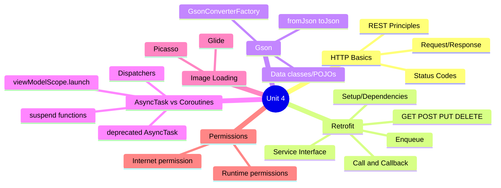
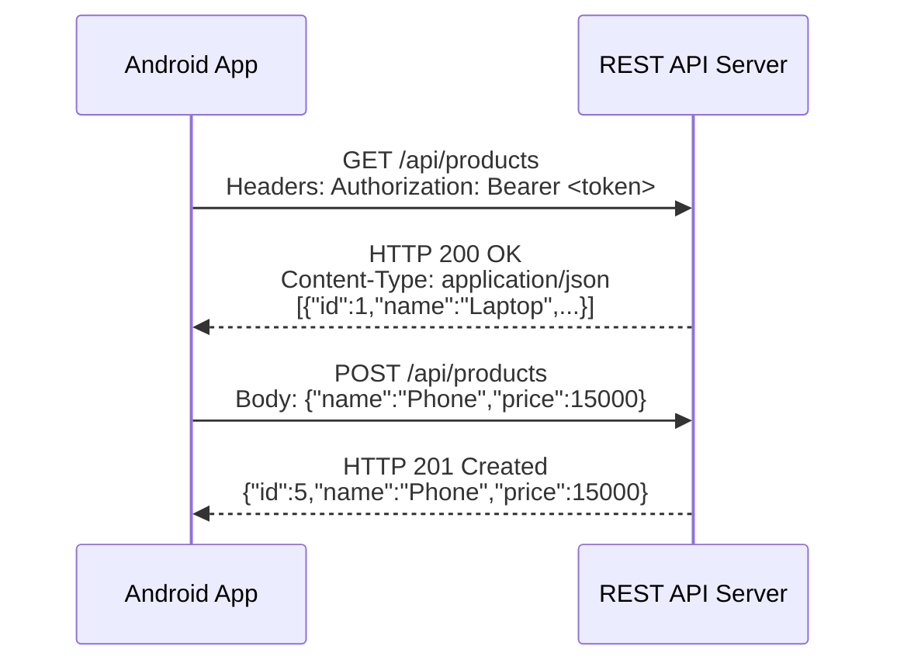

[[00-Dashboard/Home|Home]] | [[02-Semester-VI/Semester-VI-Dashboard|Semester VI]] | [[Overview]] | [[Syllabus]] | [[Unit-1]] | [[Unit-2]] | [[Unit-3]] | [[Unit-4]] | [[Unit-5]] | [[Important-Questions|Imp. Qs]] | [[Revision]] | [[Interview-Prep]]


# Unit 4: Networking and Web Services

> [!important] Learning Objectives
> After this unit, you should be able to:
> - Understand HTTP fundamentals and REST API consumption on Android
> - Implement API calls using the Retrofit library
> - Parse JSON responses using Gson
> - Use Kotlin Coroutines for background networking
> - Load images efficiently using Glide
> - Declare and handle runtime permissions

---

## Topics at a Glance



---

## 4.1 HTTP Basics

### HTTP Request/Response



**HTTP Request Components:**
- **Method**: GET, POST, PUT, PATCH, DELETE
- **URL**: `https://api.example.com/products`
- **Headers**: `Authorization`, `Content-Type`, `Accept`
- **Body**: JSON payload (for POST/PUT/PATCH)

---

## 4.2 Retrofit Library

==Retrofit== is a **type-safe HTTP client** for Android/Java by Square. It turns HTTP API calls into Java/Kotlin interface methods.

### Setup

```groovy
// build.gradle (Module)
dependencies {
    implementation 'com.squareup.retrofit2:retrofit:2.9.0'
    implementation 'com.squareup.retrofit2:converter-gson:2.9.0'
    implementation 'com.squareup.okhttp3:logging-interceptor:4.11.0'
    // Coroutines support
    implementation 'org.jetbrains.kotlinx:kotlinx-coroutines-android:1.7.1'
}
```

**Permission in Manifest:**
```xml
<uses-permission android:name="android.permission.INTERNET"/>
```

### Step 1: Data Classes (Models)

```kotlin
// Product.kt
data class Product(
    val id: Int,
    val name: String,
    val price: Double,
    val category: String,
    val description: String?
)

data class ApiResponse<T>(
    val success: Boolean,
    val data: T,
    val message: String?
)

data class CreateProductRequest(
    val name: String,
    val price: Double,
    val category: String
)
```

### Step 2: API Interface

```kotlin
// ApiService.kt
interface ApiService {
    
    // GET all products
    @GET("api/products")
    suspend fun getProducts(
        @Query("page") page: Int = 1,
        @Query("limit") limit: Int = 10,
        @Query("category") category: String? = null,
        @Query("search") search: String? = null
    ): Response<ApiResponse<List<Product>>>
    
    // GET single product
    @GET("api/products/{id}")
    suspend fun getProductById(@Path("id") id: Int): Response<ApiResponse<Product>>
    
    // POST create product
    @POST("api/products")
    suspend fun createProduct(@Body request: CreateProductRequest): Response<ApiResponse<Product>>
    
    // PUT update product
    @PUT("api/products/{id}")
    suspend fun updateProduct(
        @Path("id") id: Int,
        @Body request: CreateProductRequest
    ): Response<ApiResponse<Product>>
    
    // DELETE product
    @DELETE("api/products/{id}")
    suspend fun deleteProduct(@Path("id") id: Int): Response<Unit>
    
    // Login with headers
    @POST("auth/login")
    suspend fun login(@Body credentials: Map<String, String>): Response<Map<String, String>>
    
    // Authenticated request with dynamic header
    @GET("api/profile")
    suspend fun getProfile(@Header("Authorization") token: String): Response<ApiResponse<User>>
}
```

**Retrofit Annotations:**

| Annotation | Usage |
|-----------|-------|
| `@GET("path")` | HTTP GET request |
| `@POST("path")` | HTTP POST request |
| `@PUT("path")` | HTTP PUT request |
| `@DELETE("path")` | HTTP DELETE request |
| `@Path("name")` | URL path variable `/users/{id}` |
| `@Query("key")` | URL query parameter `?page=2` |
| `@Body` | Request body (JSON object) |
| `@Header("Name")` | Single request header |
| `@Headers(...)` | Multiple headers |

### Step 3: Retrofit Instance (Singleton)

```kotlin
// RetrofitClient.kt
object RetrofitClient {
    private const val BASE_URL = "https://api.example.com/"
    
    private val loggingInterceptor = HttpLoggingInterceptor().apply {
        level = if (BuildConfig.DEBUG) HttpLoggingInterceptor.Level.BODY
                else HttpLoggingInterceptor.Level.NONE
    }
    
    private val okHttpClient = OkHttpClient.Builder()
        .addInterceptor(loggingInterceptor)
        .connectTimeout(30, TimeUnit.SECONDS)
        .readTimeout(30, TimeUnit.SECONDS)
        .build()
    
    val instance: ApiService by lazy {
        Retrofit.Builder()
            .baseUrl(BASE_URL)
            .client(okHttpClient)
            .addConverterFactory(GsonConverterFactory.create())
            .build()
            .create(ApiService::class.java)
    }
}
```

### Step 4: Making API Calls with Coroutines

```kotlin
// ProductViewModel.kt
class ProductViewModel : ViewModel() {
    private val api = RetrofitClient.instance
    
    private val _products = MutableLiveData<List<Product>>()
    val products: LiveData<List<Product>> = _products
    
    private val _loading = MutableLiveData<Boolean>()
    val loading: LiveData<Boolean> = _loading
    
    private val _error = MutableLiveData<String?>()
    val error: LiveData<String?> = _error
    
    fun fetchProducts(page: Int = 1) {
        viewModelScope.launch {  // Coroutine on main thread
            _loading.value = true
            _error.value = null
            
            try {
                val response = withContext(Dispatchers.IO) {  // Network on IO thread
                    api.getProducts(page = page)
                }
                
                if (response.isSuccessful) {
                    _products.value = response.body()?.data ?: emptyList()
                } else {
                    _error.value = "Error ${response.code()}: ${response.message()}"
                }
            } catch (e: Exception) {
                _error.value = "Network error: ${e.message}"
            } finally {
                _loading.value = false
            }
        }
    }
    
    fun createProduct(name: String, price: Double, category: String) {
        viewModelScope.launch {
            try {
                val request = CreateProductRequest(name, price, category)
                val response = withContext(Dispatchers.IO) { api.createProduct(request) }
                
                if (response.isSuccessful) {
                    fetchProducts()  // Refresh list
                } else {
                    _error.value = "Failed to create product"
                }
            } catch (e: Exception) {
                _error.value = e.message
            }
        }
    }
}

// Activity/Fragment
class ProductsActivity : AppCompatActivity() {
    private val viewModel: ProductViewModel by viewModels()
    
    override fun onCreate(savedInstanceState: Bundle?) {
        super.onCreate(savedInstanceState)
        
        viewModel.products.observe(this) { products ->
            adapter.submitList(products)
        }
        
        viewModel.loading.observe(this) { isLoading ->
            binding.progressBar.visibility = if (isLoading) View.VISIBLE else View.GONE
        }
        
        viewModel.error.observe(this) { errorMsg ->
            errorMsg?.let { Toast.makeText(this, it, Toast.LENGTH_LONG).show() }
        }
        
        viewModel.fetchProducts()
    }
}
```

---

## 4.3 AsyncTask vs Coroutines

### AsyncTask (Deprecated - API 30)

```kotlin
// OLD way - AsyncTask (DEPRECATED, don't use in new code!)
class FetchDataTask : AsyncTask<Void, Void, String>() {
    
    override fun doInBackground(vararg params: Void?): String {
        // Runs on background thread
        return URL("https://api.example.com/data").readText()
    }
    
    override fun onPostExecute(result: String) {
        // Runs on main thread
        Log.d("Data", result)
    }
}

// Usage: FetchDataTask().execute()
```

**Problems with AsyncTask:**
- Memory leaks (holds reference to Activity)
- Can't easily cancel
- Deprecated in API 30 (Android 11)
- Callback hell for complex operations

### Kotlin Coroutines (Modern)

```kotlin
// MODERN way - Kotlin Coroutines
viewModelScope.launch {
    // Runs on main thread by default
    binding.progressBar.visibility = View.VISIBLE
    
    val result = withContext(Dispatchers.IO) {
        // Moves to IO thread for network/DB operation
        apiService.getProducts()
    }
    
    // Back on main thread automatically
    binding.progressBar.visibility = View.GONE
    adapter.submitList(result.body()?.data)
}
```

**Coroutine Dispatchers:**

| Dispatcher | Use For |
|-----------|---------|
| `Dispatchers.Main` | UI updates, LiveData updates |
| `Dispatchers.IO` | Network calls, file I/O, database |
| `Dispatchers.Default` | CPU-intensive work (parsing, sorting) |

---

## 4.4 JSON Parsing with Gson

==Gson== is Google's library for converting Java/Kotlin objects to JSON and back.

```kotlin
val gson = Gson()

// Object to JSON string
val product = Product(1, "Laptop", 50000.0, "Electronics", null)
val json = gson.toJson(product)
// → {"id":1,"name":"Laptop","price":50000.0,"category":"Electronics"}

// JSON string to object
val jsonStr = """{"id":1,"name":"Laptop","price":50000.0}"""
val parsedProduct = gson.fromJson(jsonStr, Product::class.java)

// JSON to List
val jsonArray = """[{"id":1,"name":"Laptop"},{"id":2,"name":"Phone"}]"""
val type = object : TypeToken<List<Product>>() {}.type
val products: List<Product> = gson.fromJson(jsonArray, type)
```

**Custom field naming:**
```kotlin
data class Product(
    @SerializedName("product_id") val id: Int,      // Maps "product_id" JSON → "id" Kotlin
    @SerializedName("product_name") val name: String,
    val price: Double  // Same name - no annotation needed
)
```

---

## 4.5 Image Loading (Glide / Picasso)

### Glide

==Glide== is the recommended image loading library for Android by Google.

```groovy
implementation 'com.github.bumptech.glide:glide:4.16.0'
```

```kotlin
// Basic image loading
Glide.with(context)
    .load("https://example.com/product-image.jpg")
    .into(imageView)

// With options
Glide.with(context)
    .load(imageUrl)
    .placeholder(R.drawable.ic_placeholder)    // While loading
    .error(R.drawable.ic_broken_image)         // On error
    .centerCrop()                              // Scale type
    .diskCacheStrategy(DiskCacheStrategy.ALL)  // Cache strategy
    .transition(DrawableTransitionOptions.withCrossFade())
    .into(binding.productImage)

// Circular image
Glide.with(context)
    .load(avatarUrl)
    .circleCrop()
    .into(binding.userAvatar)

// Load from drawable/resource
Glide.with(context)
    .load(R.drawable.my_image)
    .into(imageView)

// Clear/cancel loading
Glide.with(context).clear(imageView)
```

### Picasso (Alternative)

```kotlin
Picasso.get()
    .load("https://example.com/image.jpg")
    .placeholder(R.drawable.placeholder)
    .error(R.drawable.error)
    .into(imageView)
```

| Feature | Glide | Picasso |
|---------|-------|---------|
| Maintainer | Google | Square |
| GIF support |  Yes |  No |
| Memory usage | Lower | Slightly higher |
| Bitmap format | RGB_565 (default) | ARGB_8888 |
| Preferred for | Most Android apps | Simple image loading |

---

## 4.6 Permissions

### Types of Permissions

| Type | Declared in | Grant method | Examples |
|------|-------------|-------------|---------|
| Normal | Manifest only | Auto-granted at install | INTERNET, VIBRATE |
| Dangerous | Manifest + Runtime | User must approve | CAMERA, READ_CONTACTS, LOCATION |

### INTERNET Permission (Normal)

```xml
<!-- AndroidManifest.xml - required for all network calls -->
<uses-permission android:name="android.permission.INTERNET"/>
<uses-permission android:name="android.permission.ACCESS_NETWORK_STATE"/>
```

### Runtime Permissions (API 23+)

```kotlin
// Check and request permission
private val requestPermission = registerForActivityResult(
    ActivityResultContracts.RequestPermission()
) { isGranted ->
    if (isGranted) {
        // Permission granted - proceed with action
        openCamera()
    } else {
        Toast.makeText(this, "Camera permission denied", Toast.LENGTH_SHORT).show()
    }
}

// Check before using
fun checkCameraPermission() {
    when {
        ContextCompat.checkSelfPermission(this, Manifest.permission.CAMERA) 
            == PackageManager.PERMISSION_GRANTED -> {
            // Already granted
            openCamera()
        }
        shouldShowRequestPermissionRationale(Manifest.permission.CAMERA) -> {
            // Show rationale dialog, then request
            showPermissionRationaleDialog()
        }
        else -> {
            // Request permission
            requestPermission.launch(Manifest.permission.CAMERA)
        }
    }
}

// Request multiple permissions
private val requestMultiplePermissions = registerForActivityResult(
    ActivityResultContracts.RequestMultiplePermissions()
) { permissions ->
    permissions.forEach { (permission, granted) ->
        if (!granted) {
            Log.d("Permission", "$permission denied")
        }
    }
}

requestMultiplePermissions.launch(arrayOf(
    Manifest.permission.READ_EXTERNAL_STORAGE,
    Manifest.permission.CAMERA
))
```

---

## Key Definitions

| Term | Definition |
|------|-----------|
| ==Retrofit== | Type-safe HTTP client library for Android by Square |
| ==Gson== | Library for converting Java/Kotlin objects to/from JSON |
| ==GsonConverterFactory== | Retrofit converter that uses Gson for (de)serialization |
| ==Coroutine== | Kotlin's lightweight thread-like concurrency mechanism |
| ==suspend function== | Function that can be paused/resumed by coroutines |
| ==viewModelScope== | Coroutine scope tied to ViewModel lifecycle |
| ==Dispatchers.IO== | Coroutine dispatcher optimized for I/O operations |
| ==Glide== | Google's image loading and caching library for Android |
| ==@SerializedName== | Gson annotation mapping JSON field name to Kotlin property |
| ==Runtime Permission== | Permission requiring explicit user approval at runtime (API 23+) |

---

## Practice Questions

> [!question] Short Answer Questions
> 1. What is Retrofit? What are its advantages over `HttpURLConnection`?
> 2. Write a Retrofit interface with GET, POST, and DELETE endpoints.
> 3. What is the purpose of `GsonConverterFactory` in Retrofit?
> 4. Why is `AsyncTask` deprecated? What replaces it?
> 5. Explain `viewModelScope.launch` and `Dispatchers.IO` in coroutines.
> 6. Write code to load an image from a URL using Glide with placeholder.
> 7. What is the difference between normal and dangerous permissions?
> 8. How do you check and request runtime permissions using the modern API?
> 9. What is `@Path`, `@Query`, `@Body` in Retrofit? Give examples.
> 10. Write a complete ViewModel that fetches a list from an API using Retrofit + Coroutines.

---

## Navigation

- [[Unit-3|← Unit 3: Data Storage]]
- [[Syllabus| Syllabus]]
- [[Unit-5|Unit 5: Advanced Android →]]
- [[Important-Questions| Important Questions]]
- [[Revision| Revision]]
