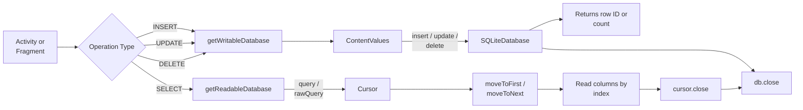
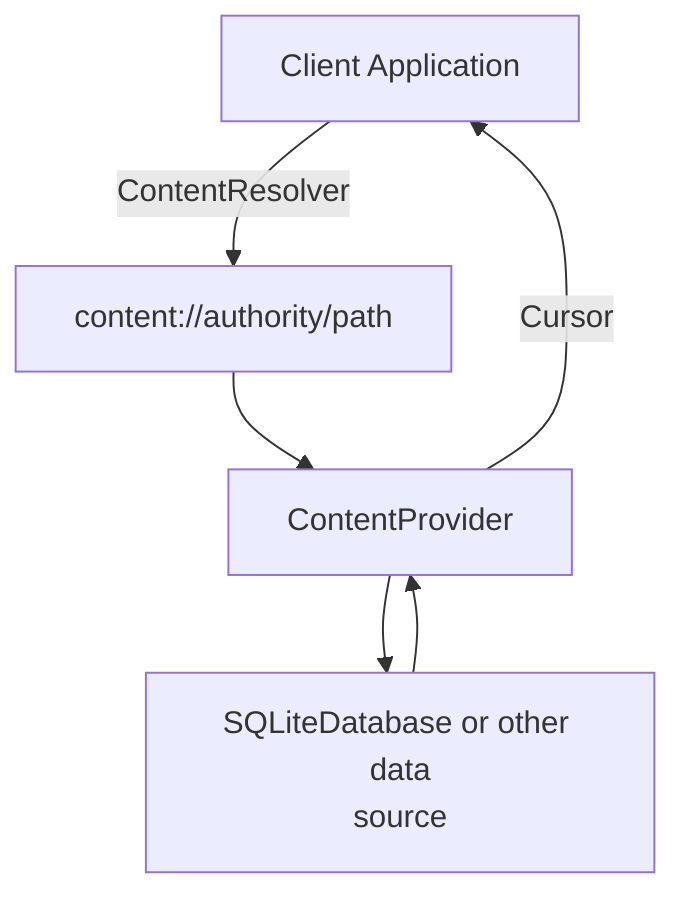
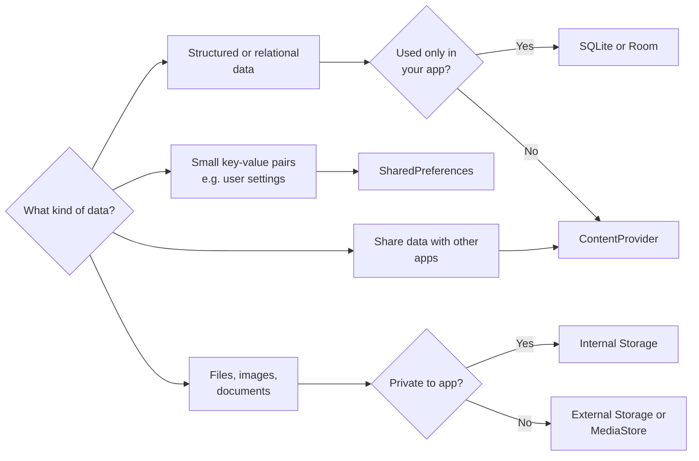

[[Overview]] | [[Syllabus]] | [[Unit-1]] | [[Unit-2]] | [[Unit-3]] | [[Unit-4]] | [[Unit-5]]

---

# Unit 5: Data Storage in Android

> [!important]
> This unit carries 8 hours of lecture content and is high-weightage for SPPU exams. Focus on SQLite CRUD with complete Java code and SharedPreferences usage patterns.

## Learning Objectives

By the end of this unit, you will be able to:

1. Store and retrieve primitive data using SharedPreferences.
2. Design and implement a SQLite database using `SQLiteOpenHelper`.
3. Perform all four CRUD operations on a SQLite database in Java.
4. Understand the role of ContentProviders and when to use them.
5. Select the appropriate storage mechanism for a given use case.

---

## 5.1 Overview of Android Storage Options

Android offers several mechanisms for data persistence. The choice depends on the data type, its size, and whether other apps need to access it.

| Storage Mechanism | Best For | Scope |
|---|---|---|
| SharedPreferences | Small key-value pairs (settings, flags) | App-private |
| Internal Storage | Private files (text, binary) | App-private |
| External Storage | Large files, media | Public or private |
| SQLite Database | Structured relational data | App-private |
| ContentProvider | Sharing data between applications | Cross-app |

> [!note]
> From API level 29 (Android 10) onwards, scoped storage restrictions apply to external storage. Apps should use `MediaStore` or `Storage Access Framework` for accessing shared media.

---

## 5.2 SharedPreferences

==SharedPreferences== is an Android API that allows an application to store and retrieve small amounts of primitive data as key-value pairs. The data is persisted in an XML file in the app's private directory (`/data/data/<package_name>/shared_prefs/`).

### 5.2.1 Data Types Supported

SharedPreferences supports the following data types:
- `String`
- `int`
- `float`
- `boolean`
- `long`
- `Set<String>`

### 5.2.2 Obtaining a SharedPreferences Instance

There are two ways to get a SharedPreferences object:

**Method 1: `getSharedPreferences()`** - Use when you need multiple named preference files.

```java
SharedPreferences prefs = getSharedPreferences("MyPrefs", Context.MODE_PRIVATE);
```

**Method 2: `getPreferences()`** - Use within an Activity for a single preference file (automatically named after the Activity).

```java
SharedPreferences prefs = getPreferences(Context.MODE_PRIVATE);
```

> [!warning]
> Never use `MODE_WORLD_READABLE` or `MODE_WORLD_WRITEABLE`. These modes are deprecated and present a security risk. Always use `Context.MODE_PRIVATE`.

### 5.2.3 Writing Data with SharedPreferences.Editor

To write data, you must obtain an `Editor` object, apply your changes, and then call `apply()` or `commit()`.

```java
SharedPreferences prefs = getSharedPreferences("UserSettings", Context.MODE_PRIVATE);
SharedPreferences.Editor editor = prefs.edit();

editor.putString("username", "amitdevx");
editor.putInt("age", 21);
editor.putBoolean("isLoggedIn", true);
editor.putFloat("score", 98.5f);

editor.apply(); // Asynchronous - preferred
// editor.commit(); // Synchronous - use only when return value is needed
```

> [!tip]
> Always prefer `apply()` over `commit()`. The `apply()` method writes to the in-memory cache immediately and schedules the disk write asynchronously, whereas `commit()` writes synchronously and blocks the calling thread, which can cause UI lag on the main thread.

### 5.2.4 Reading Data from SharedPreferences

```java
SharedPreferences prefs = getSharedPreferences("UserSettings", Context.MODE_PRIVATE);

String username  = prefs.getString("username", "Guest");      // default = "Guest"
int age          = prefs.getInt("age", 0);                    // default = 0
boolean loggedIn = prefs.getBoolean("isLoggedIn", false);     // default = false
float score      = prefs.getFloat("score", 0.0f);             // default = 0.0f

Log.d("Prefs", "Username: " + username + ", Age: " + age);
```

The second argument to each `get` method is the ==default value==, returned when the key does not exist.

### 5.2.5 Removing and Clearing Data

```java
SharedPreferences.Editor editor = prefs.edit();

editor.remove("username");  // Remove a specific key
editor.clear();             // Remove all keys
editor.apply();
```

### 5.2.6 Practical Example: Login State Persistence

```java
public class LoginActivity extends AppCompatActivity {

    private static final String PREF_FILE    = "LoginPrefs";
    private static final String KEY_LOGGED   = "isLoggedIn";
    private static final String KEY_USERNAME = "username";

    @Override
    protected void onCreate(Bundle savedInstanceState) {
        super.onCreate(savedInstanceState);
        setContentView(R.layout.activity_login);

        SharedPreferences prefs = getSharedPreferences(PREF_FILE, Context.MODE_PRIVATE);
        boolean isLoggedIn = prefs.getBoolean(KEY_LOGGED, false);

        if (isLoggedIn) {
            String username = prefs.getString(KEY_USERNAME, "");
            Toast.makeText(this, "Welcome back, " + username, Toast.LENGTH_SHORT).show();
            startActivity(new Intent(this, HomeActivity.class));
            finish();
        }
    }

    private void saveLoginState(String username) {
        SharedPreferences.Editor editor =
            getSharedPreferences(PREF_FILE, Context.MODE_PRIVATE).edit();
        editor.putBoolean(KEY_LOGGED, true);
        editor.putString(KEY_USERNAME, username);
        editor.apply();
    }
}
```

---

## 5.3 SQLite Database

==SQLite== is a lightweight, serverless, self-contained relational database engine that is embedded in every Android device. Android provides a rich API through the `android.database.sqlite` package to interact with SQLite databases.

### 5.3.1 Key Classes in the SQLite API

| Class / Interface | Role |
|---|---|
| `SQLiteOpenHelper` | Abstract class for managing database creation and version management |
| `SQLiteDatabase` | Provides methods for SQLite operations (`insert`, `query`, `update`, `delete`, `execSQL`) |
| `ContentValues` | Key-value pairs used for `insert` and `update` operations |
| `Cursor` | Result set from a `query` operation; provides row-by-row access |

### 5.3.2 SQLiteOpenHelper

`SQLiteOpenHelper` is the standard way to manage a SQLite database in Android. You subclass it and override `onCreate()` and `onUpgrade()`.

```java
public class DatabaseHelper extends SQLiteOpenHelper {

    // Database metadata
    private static final String DATABASE_NAME    = "students.db";
    private static final int    DATABASE_VERSION = 1;

    // Table and column constants
    public static final String TABLE_STUDENTS  = "students";
    public static final String COL_ID          = "_id";
    public static final String COL_NAME        = "name";
    public static final String COL_MARKS       = "marks";
    public static final String COL_DEPARTMENT  = "department";

    // CREATE TABLE SQL statement
    private static final String SQL_CREATE_TABLE =
        "CREATE TABLE " + TABLE_STUDENTS + " (" +
        COL_ID         + " INTEGER PRIMARY KEY AUTOINCREMENT, " +
        COL_NAME       + " TEXT NOT NULL, " +
        COL_MARKS      + " REAL, " +
        COL_DEPARTMENT + " TEXT" +
        ");";

    public DatabaseHelper(Context context) {
        super(context, DATABASE_NAME, null, DATABASE_VERSION);
    }

    @Override
    public void onCreate(SQLiteDatabase db) {
        // Called when the database is created for the first time
        db.execSQL(SQL_CREATE_TABLE);
    }

    @Override
    public void onUpgrade(SQLiteDatabase db, int oldVersion, int newVersion) {
        // Called when the database version is incremented
        db.execSQL("DROP TABLE IF EXISTS " + TABLE_STUDENTS);
        onCreate(db);
    }
}
```

> [!important]
> `onCreate()` is called only once - when the database file does not exist. `onUpgrade()` is called whenever `DATABASE_VERSION` is incremented. Incrementing the version number is the only way to trigger schema migrations.

### 5.3.3 CRUD Operations

==CRUD== stands for Create, Read, Update, and Delete. These are the four fundamental operations on any persistent data store.

#### C - Create (INSERT)

Use `SQLiteDatabase.insert()` with a `ContentValues` object.

```java
public long insertStudent(String name, float marks, String department) {
    SQLiteDatabase db = this.getWritableDatabase();
    ContentValues values = new ContentValues();
    values.put(COL_NAME,       name);
    values.put(COL_MARKS,      marks);
    values.put(COL_DEPARTMENT, department);

    // insert() returns the row ID of the newly inserted row, or -1 on error
    long rowId = db.insert(TABLE_STUDENTS, null, values);
    db.close();
    return rowId;
}
```

#### R - Read (SELECT)

Use `SQLiteDatabase.query()` or `rawQuery()` and iterate through a `Cursor`.

```java
public List<String> getAllStudents() {
    List<String> studentList = new ArrayList<>();
    SQLiteDatabase db = this.getReadableDatabase();

    // query(table, columns, selection, selectionArgs, groupBy, having, orderBy)
    Cursor cursor = db.query(
        TABLE_STUDENTS,
        new String[]{COL_ID, COL_NAME, COL_MARKS, COL_DEPARTMENT},
        null, null, null, null,
        COL_NAME + " ASC"  // ORDER BY name ASC
    );

    if (cursor.moveToFirst()) {
        do {
            int    id   = cursor.getInt(cursor.getColumnIndexOrThrow(COL_ID));
            String name = cursor.getString(cursor.getColumnIndexOrThrow(COL_NAME));
            float marks = cursor.getFloat(cursor.getColumnIndexOrThrow(COL_MARKS));
            studentList.add(id + " | " + name + " | " + marks);
        } while (cursor.moveToNext());
    }
    cursor.close();
    db.close();
    return studentList;
}
```

> [!warning]
> Always close the `Cursor` after use to release resources. Unclosed cursors cause memory leaks. Use `cursor.close()` in a `finally` block for safety.

**Reading a single record with a WHERE clause:**

```java
public String getStudentById(int studentId) {
    SQLiteDatabase db = this.getReadableDatabase();
    Cursor cursor = db.query(
        TABLE_STUDENTS,
        null,                                           // null = select all columns
        COL_ID + " = ?",                               // selection (WHERE clause)
        new String[]{String.valueOf(studentId)},        // selectionArgs
        null, null, null
    );

    String result = "Not found";
    if (cursor != null && cursor.moveToFirst()) {
        result = cursor.getString(cursor.getColumnIndexOrThrow(COL_NAME));
        cursor.close();
    }
    db.close();
    return result;
}
```

#### U - Update (UPDATE)

Use `SQLiteDatabase.update()`.

```java
public int updateStudent(int studentId, String newName, float newMarks) {
    SQLiteDatabase db = this.getWritableDatabase();
    ContentValues values = new ContentValues();
    values.put(COL_NAME,  newName);
    values.put(COL_MARKS, newMarks);

    // update() returns the number of rows affected
    int rowsAffected = db.update(
        TABLE_STUDENTS,
        values,
        COL_ID + " = ?",
        new String[]{String.valueOf(studentId)}
    );
    db.close();
    return rowsAffected;
}
```

#### D - Delete (DELETE)

Use `SQLiteDatabase.delete()`.

```java
public int deleteStudent(int studentId) {
    SQLiteDatabase db = this.getWritableDatabase();

    // delete() returns the number of rows deleted
    int rowsDeleted = db.delete(
        TABLE_STUDENTS,
        COL_ID + " = ?",
        new String[]{String.valueOf(studentId)}
    );
    db.close();
    return rowsDeleted;
}
```

### 5.3.4 Using rawQuery for Complex Queries

For complex SQL that cannot be easily expressed using the `query()` method, use `rawQuery()`.

```java
public Cursor searchByDepartment(String dept) {
    SQLiteDatabase db = this.getReadableDatabase();
    String sql = "SELECT * FROM " + TABLE_STUDENTS +
                 " WHERE " + COL_DEPARTMENT + " = ?" +
                 " ORDER BY " + COL_MARKS + " DESC";
    return db.rawQuery(sql, new String[]{dept});
}
```

### 5.3.5 CRUD Data Flow Diagram



### 5.3.6 Complete Activity Integration Example

```java
public class MainActivity extends AppCompatActivity {

    DatabaseHelper dbHelper;

    @Override
    protected void onCreate(Bundle savedInstanceState) {
        super.onCreate(savedInstanceState);
        setContentView(R.layout.activity_main);

        dbHelper = new DatabaseHelper(this);

        // INSERT
        long id = dbHelper.insertStudent("Amit Kumar", 89.5f, "Computer Science");
        Toast.makeText(this, "Inserted with ID: " + id, Toast.LENGTH_SHORT).show();

        // READ ALL
        List<String> students = dbHelper.getAllStudents();
        for (String s : students) {
            Log.d("DB_READ", s);
        }

        // UPDATE
        int updated = dbHelper.updateStudent((int) id, "Amit K. Sharma", 92.0f);
        Log.d("DB_UPDATE", "Rows updated: " + updated);

        // DELETE
        int deleted = dbHelper.deleteStudent((int) id);
        Log.d("DB_DELETE", "Rows deleted: " + deleted);
    }
}
```

---

## 5.4 ContentProviders

A ==ContentProvider== manages access to a central repository of data. It is one of the four fundamental Android application components (along with Activity, Service, and BroadcastReceiver). ContentProviders are the standard mechanism for sharing data between different applications.

### 5.4.1 When to Use a ContentProvider

> [!tip]
> Use a ContentProvider when:
> - You want to share your app's data with other applications.
> - You want to provide a search suggestion in the system search dialog.
> - You need to copy complex data or files from your app to another.
>
> For data used only within your own app, SQLiteDatabase directly (or Room) is simpler and sufficient.

### 5.4.2 ContentProvider Architecture



The client never directly accesses the ContentProvider. Instead, it uses a ==ContentResolver== object to interact with the provider through a ==content URI==.

### 5.4.3 Content URI Structure

```
content://com.example.app.provider/students/1
   |              |                    |     |
scheme       authority              path   ID
```

- `content://` - scheme (always this for ContentProviders)
- `authority` - unique identifier for the provider (typically the package name + `.provider`)
- `path` - the table or data type
- `id` - optional, specifies a single row

### 5.4.4 Abstract Methods to Override

When creating a ContentProvider, you must override six abstract methods:

| Method | Description |
|---|---|
| `onCreate()` | Initialize the provider. Return `true` if successful. |
| `query()` | Return a `Cursor` for the requested data. |
| `insert()` | Insert new data. Return the URI of the new row. |
| `update()` | Update existing data. Return the number of rows affected. |
| `delete()` | Delete data. Return the number of rows deleted. |
| `getType()` | Return the MIME type for the given URI. |

### 5.4.5 Declaring a ContentProvider in AndroidManifest.xml

```xml
<provider
    android:name=".StudentProvider"
    android:authorities="com.example.myapp.provider"
    android:exported="false" />
```

> [!note]
> Setting `android:exported="false"` ensures only your own app can access the provider. Set it to `true` only when you intentionally want to share data with other apps.

### 5.4.6 Accessing Built-in ContentProviders

Android ships with several built-in ContentProviders (Contacts, CallLog, Calendar, MediaStore). Here is an example of reading contacts:

```java
// Permission required in AndroidManifest.xml: android.permission.READ_CONTACTS
// Runtime permission also required on API 23+

ContentResolver resolver = getContentResolver();
Cursor cursor = resolver.query(
    ContactsContract.CommonDataKinds.Phone.CONTENT_URI,
    new String[]{
        ContactsContract.CommonDataKinds.Phone.DISPLAY_NAME,
        ContactsContract.CommonDataKinds.Phone.NUMBER
    },
    null, null,
    ContactsContract.CommonDataKinds.Phone.DISPLAY_NAME + " ASC"
);

if (cursor != null) {
    while (cursor.moveToNext()) {
        String name   = cursor.getString(0);
        String number = cursor.getString(1);
        Log.d("Contacts", name + ": " + number);
    }
    cursor.close();
}
```

---

## 5.5 Choosing the Right Storage Mechanism



---

## Interview Questions

> [!question] Q1. What is SharedPreferences and what types of data can it store?
> **Answer:** SharedPreferences is an Android API that provides a persistent storage mechanism for small amounts of primitive data in key-value pairs. It stores data as an XML file in the app's private directory. It supports the following types: `String`, `int`, `float`, `boolean`, `long`, and `Set<String>`. It is ideal for storing application settings, user preferences, login states, and similar lightweight data. It should not be used for large datasets or complex structured data.

> [!question] Q2. What is the difference between `apply()` and `commit()` in SharedPreferences.Editor?
> **Answer:**
> - `apply()` - Writes changes to the in-memory cache immediately and schedules the disk write asynchronously. It does not return a value. It is non-blocking and should be used on the main thread.
> - `commit()` - Writes changes synchronously to both the in-memory cache and the disk. It returns a `boolean` indicating success or failure. Since it is a blocking call, using it on the main thread can cause UI jank or ANR errors.
>
> Best practice: Use `apply()` unless you specifically need the success/failure return value.

> [!question] Q3. What is SQLiteOpenHelper? Explain its key methods.
> **Answer:** `SQLiteOpenHelper` is an abstract helper class in Android used to manage database creation and version management. You subclass it and provide implementations for:
> - **`onCreate(SQLiteDatabase db)`**: Called when the database is created for the first time. You execute your `CREATE TABLE` statements here.
> - **`onUpgrade(SQLiteDatabase db, int oldVersion, int newVersion)`**: Called when the database version number is incremented. You handle schema migrations here.
> - **`getReadableDatabase()`**: Opens the database for reading. Returns a `SQLiteDatabase` object.
> - **`getWritableDatabase()`**: Opens the database for reading and writing.

> [!question] Q4. What is a Cursor in Android SQLite? How do you iterate over query results?
> **Answer:** A `Cursor` is an interface that provides random read-write access to the result set returned by a database query. It acts as a pointer into the result set of rows. Key methods: `moveToFirst()`, `moveToNext()`, `getInt()`, `getString()`, `getColumnIndexOrThrow()`, `close()`. Always call `cursor.close()` after use to prevent memory leaks.

> [!question] Q5. What is a ContentProvider? When would you use one instead of SQLite directly?
> **Answer:** A ContentProvider is an Android application component that manages access to a central repository of data and provides a standard interface for sharing that data across application boundaries. Use ContentProvider when you need to share data with other apps or integrate with Android system features. Use SQLite directly (or Room) when the data is consumed only within your own application, as ContentProviders add significant boilerplate overhead.

---

## Revision Summary

> [!summary]
> **Unit 5 Key Points:**
>
> **SharedPreferences:**
> - Stores key-value pairs as an XML file in app-private storage.
> - Use `getSharedPreferences(name, MODE_PRIVATE)` to obtain an instance.
> - Write with `Editor.put*()` then `apply()` (async) or `commit()` (sync).
> - Read with `prefs.get*(key, defaultValue)`.
>
> **SQLite with SQLiteOpenHelper:**
> - Subclass `SQLiteOpenHelper`; override `onCreate()` and `onUpgrade()`.
> - `onCreate()` runs once on first launch; `onUpgrade()` runs on version bump.
> - Use `ContentValues` for INSERT and UPDATE.
> - Use `Cursor` to read query results; always call `cursor.close()`.
> - Return values: `insert()` returns row ID, `update()` and `delete()` return rows affected.
>
> **ContentProvider:**
> - Used to share data across applications.
> - Client uses `ContentResolver` with a content URI.
> - Must declare in `AndroidManifest.xml` with an `authority`.
> - Override six abstract methods: `onCreate`, `query`, `insert`, `update`, `delete`, `getType`.

---

[[Unit-4]] | [[Revision]] | [[Important-Questions]]
