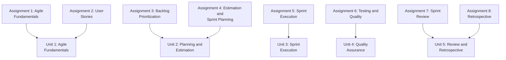
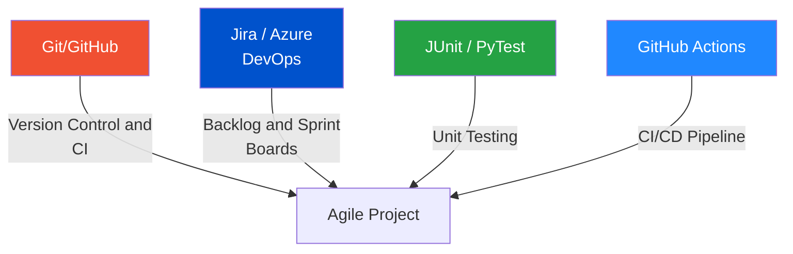

[[00-Dashboard/Home|Home]] | [[02-Semester-VI/Semester-VI-Dashboard|Semester VI]] | [[Overview]] | [[Syllabus]] | [[Unit-1]] | [[Unit-2]] | [[Unit-3]] | [[Unit-4]] | [[Unit-5]] | [[Important-Questions|Imp. Qs]] | [[Revision]] | [[Interview-Prep]]

# CS-371 Agile Processes - Overview

> [!important] Subject at a Glance
> **Code:** CS-371-VSC-P | **Type:** Vocational/Skill Course (Practical) | **Semester:** VI
> **Credits:** 2 | **Assignments:** 8 (mapped to 5 units)
> This course teaches **Agile/Scrum methodology**, from the Manifesto and principles through sprint planning, execution, testing, review, and retrospectives - using real tools like Git, Jira, and GitHub Actions.

---

## Quick Navigation

| File | Description |
|------|-------------|
| [[Syllabus]] | Full syllabus, all 8 assignments, reference books |
| [[Unit-1]] | Agile Fundamentals - Manifesto, Principles, Git, Agile Boards |
| [[Unit-2]] | Planning and Estimation - Backlog, MoSCoW, Story Points, Planning Poker |
| [[Unit-3]] | Sprint Execution - Daily Scrum, Burndown Charts, Velocity |
| [[Unit-4]] | Quality Assurance - Unit Testing, CI/CD, Code Reviews |
| [[Unit-5]] | Review, Retrospective and CI - Sprint Demo, Feedback, Retrospective formats |
| [[Important-Questions]] | Topic-wise important questions for exam |
| [[Revision]] | Quick revision notes and cheat sheets |
| [[Interview-Prep]] | 30+ Agile/Scrum interview Q&A |

---

## Learning Objectives

By the end of this course, you will be able to:

- [x] Explain the **Agile Manifesto** and all **12 Agile Principles**
- [x] Write **User Stories** with acceptance criteria (Given-When-Then)
- [x] Prioritize a backlog using **MoSCoW** and **WSJF** techniques
- [x] Estimate effort using **Story Points** and **Planning Poker**
- [x] Facilitate **Daily Scrum**, track **Burndown Charts**, and measure **velocity**
- [x] Write **unit tests** and set up a basic **CI/CD pipeline** with GitHub Actions
- [x] Conduct an effective **Sprint Review** and **Sprint Retrospective**
- [x] Apply **Start-Stop-Continue** and **4Ls** retrospective formats
- [x] Use tools: **Git/GitHub**, **Jira/Azure DevOps**, **JUnit/PyTest**

---

## Assignment - Unit Mapping

---

## Unit Summary

| # | Unit | Assignments | Key Topics |
|---|------|-------------|------------|
| 1 | Agile Fundamentals | 1, 2 | Manifesto, 12 Principles, Git, User Stories, DoR/DoD |
| 2 | Planning and Estimation | 3, 4 | MoSCoW, WSJF, Story Points, Planning Poker, Sprint Planning |
| 3 | Sprint Execution | 5 | Daily Scrum, Burndown Charts, Velocity, Sprint Backlog |
| 4 | Quality Assurance | 6 | Unit Tests, CI/CD, GitHub Actions, Code Review |
| 5 | Review, Retro and CI | 7, 8 | Sprint Review, Demo, Backlog Refinement, Retrospective formats |

---

## Tools Used

---

## Key Terms Glossary

| Term | Definition |
|------|-----------|
| ==Agile== | Iterative, incremental software development methodology |
| ==Scrum== | Framework implementing Agile with sprints, roles, and ceremonies |
| ==Sprint== | Time-boxed iteration (typically 1-4 weeks) |
| ==Product Backlog== | Prioritized list of all desired features/work |
| ==User Story== | Short description of a feature from the user's perspective |
| ==Story Points== | Relative measure of effort/complexity |
| ==Velocity== | Average story points completed per sprint |
| ==Burndown Chart== | Graph tracking remaining work vs. time in a sprint |
| ==DoR== | Definition of Ready - criteria for a story to enter a sprint |
| ==DoD== | Definition of Done - criteria for a story to be considered complete |
| ==MoSCoW== | Must have, Should have, Could have, Won't have - prioritization |
| ==CI/CD== | Continuous Integration/Continuous Deployment |
| ==Retrospective== | Sprint ceremony for process improvement |

---

## Reference Books

| # | Title | Author |
|---|-------|--------|
| 1 | Agile Estimating and Planning | Mike Cohn |
| 2 | Scrum: The Art of Doing Twice the Work in Half the Time | Jeff Sutherland |
| 3 | Succeeding with Agile | Mike Cohn |
| 4 | Agile Testing | Lisa Crispin and Janet Gregory |

---

> [!tip] Exam Focus
> This is a **practical course** - focus on understanding **how** each ceremony/tool works in practice. Expect questions on Scrum roles, ceremonies, artifacts, and estimation techniques.

---

## Backlinks

- [[00-Dashboard/Home|Semester VI Home]]
- [[Important-Questions]]
- [[Revision]]
- [[Interview-Prep]]
