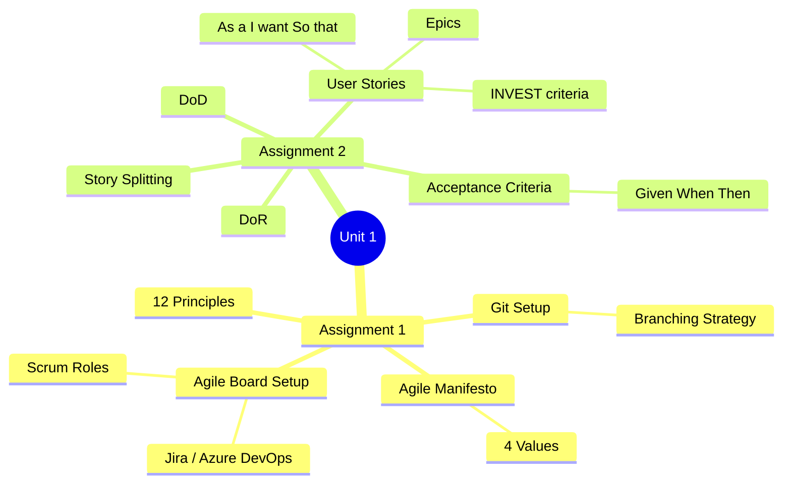
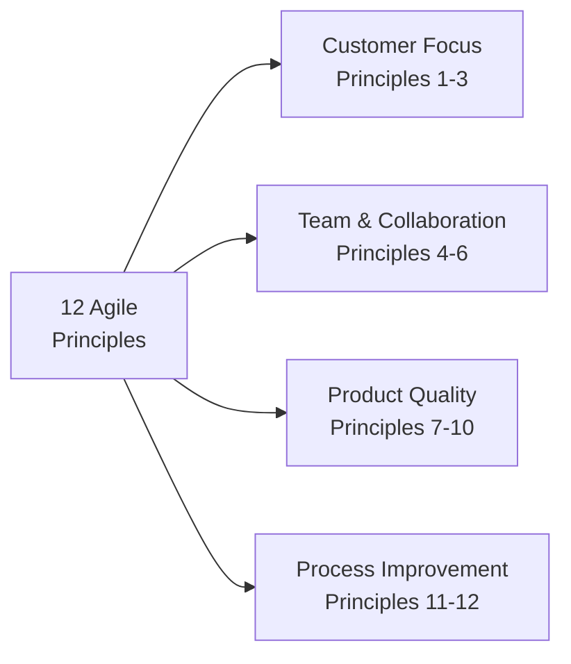
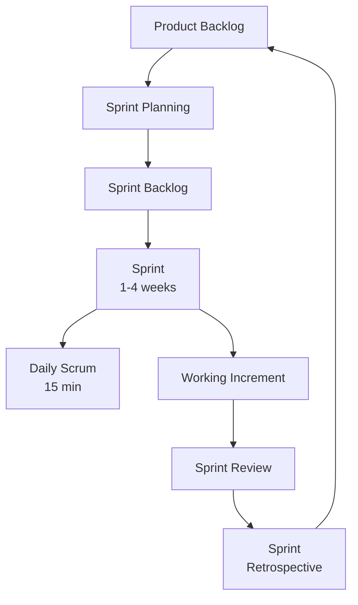
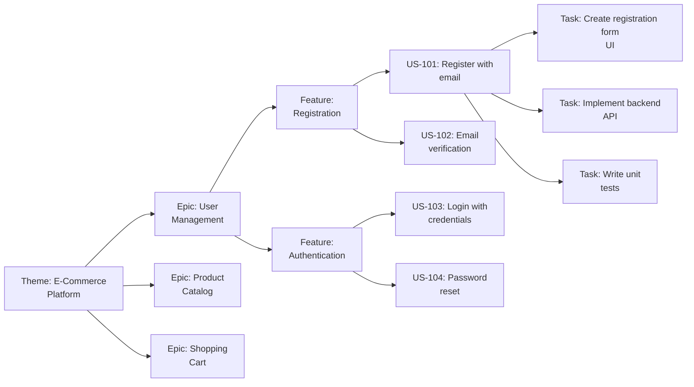

[[00-Dashboard/Home|Home]] | [[02-Semester-VI/Semester-VI-Dashboard|Semester VI]] | [[Overview]] | [[Syllabus]] | [[Unit-1]] | [[Unit-2]] | [[Unit-3]] | [[Unit-4]] | [[Unit-5]] | [[Important-Questions|Imp. Qs]] | [[Revision]] | [[Interview-Prep]]


# Unit 1: Agile Fundamentals *(Assignments 1 & 2)*

> [!important] Learning Objectives
> After this unit, you should be able to:
> - Recite and explain the 4 Agile Manifesto values
> - List and explain all 12 Agile Principles
> - Set up a Git repository with a proper branching strategy
> - Create and configure an Agile board in Jira/Azure DevOps
> - Write proper User Stories using the "As a/I want/So that" format
> - Write acceptance criteria using Given-When-Then (Gherkin) syntax
> - Define DoR (Definition of Ready) and DoD (Definition of Done)

---

## Topics at a Glance



---

## Assignment 1: Agile Fundamentals & Team Setup

## 1.1 The Agile Manifesto

The ==Agile Manifesto== was created in **February 2001** by 17 software practitioners (the "Agile Alliance") in Snowbird, Utah.

> [!important] The 4 Values of the Agile Manifesto
> We are uncovering better ways of developing software by doing it and helping others do it. Through this work we have come to value:
>
> **1. Individuals and interactions** over processes and tools
> **2. Working software** over comprehensive documentation
> **3. Customer collaboration** over contract negotiation
> **4. Responding to change** over following a plan
>
> *That is, while there is value in the items on the right, we value the items on the left more.*

### Explaining the 4 Values

| Value (Left Side) | Over (Right Side) | Meaning |
|-------------------|-------------------|---------|
| ==Individuals & Interactions== | Processes & Tools | People and communication drive success more than rigid workflows |
| ==Working Software== | Comprehensive Documentation | Delivering functional software is the primary measure of progress |
| ==Customer Collaboration== | Contract Negotiation | Work closely with the customer rather than rigidly following a contract |
| ==Responding to Change== | Following a Plan | Embrace changing requirements even late in development |

> [!note] Key Insight
> The Agile Manifesto doesn't say the right side has no value - it says the **left side is valued more**. Documentation is still important; working software is more important.

---

## 1.2 The 12 Agile Principles

The 12 principles behind the Agile Manifesto:

| # | Principle | Key Idea |
|---|-----------|---------|
| 1 | ==Customer satisfaction== through early & continuous delivery | Deliver valuable software frequently |
| 2 | ==Welcome changing requirements== even late in development | Agility is a competitive advantage |
| 3 | ==Deliver working software frequently== (weeks, not months) | Shorter timescales preferred |
| 4 | ==Business and developers work together== daily | Close collaboration required |
| 5 | Build projects around ==motivated individuals== | Trust them to get the job done |
| 6 | ==Face-to-face conversation== is the most efficient method | Direct communication is best |
| 7 | ==Working software== is the primary measure of progress | Not documents, not plans |
| 8 | ==Sustainable pace== - indefinitely | Avoid burnout, maintain a constant pace |
| 9 | Continuous attention to ==technical excellence and good design== | Quality enables agility |
| 10 | ==Simplicity== - art of maximizing work NOT done | Less is more |
| 11 | ==Self-organizing teams== produce the best architectures | Team autonomy matters |
| 12 | ==Regularly reflect and adjust== behavior | Continuous improvement |



---

## 1.3 Agile vs Traditional (Waterfall)

| Aspect | Waterfall | Agile |
|--------|-----------|-------|
| Approach | Sequential, phase-based | Iterative, incremental |
| Requirements | Fixed upfront | Evolve through collaboration |
| Delivery | Single release at end | Frequent small releases |
| Customer involvement | Mostly at start and end | Continuous throughout |
| Change management | Expensive, discouraged | Welcomed and managed |
| Risk | High (discovered late) | Low (discovered early) |
| Documentation | Heavy | Minimal but sufficient |

---

## 1.4 Scrum Framework Overview

==Scrum== is the most popular Agile framework.



### Scrum Roles

| Role | Responsibilities |
|------|-----------------|
| ==Product Owner (PO)== | Manages product backlog, prioritizes features, represents stakeholders |
| ==Scrum Master (SM)== | Facilitates Scrum ceremonies, removes impediments, coaches team |
| ==Development Team== | Self-organizing, cross-functional, builds the product (3-9 people) |

### Scrum Ceremonies

| Ceremony | Duration (2-week sprint) | Purpose |
|----------|--------------------------|---------|
| Sprint Planning | ≤4 hours | Select backlog items, create sprint backlog |
| Daily Scrum | 15 minutes | Synchronize, identify blockers |
| Sprint Review | ≤2 hours | Demo working increment to stakeholders |
| Sprint Retrospective | ≤1.5 hours | Reflect on process, improve |
| Backlog Refinement | Ongoing (~10% of sprint) | Clarify, estimate, and split stories |

### Scrum Artifacts

| Artifact | Description |
|----------|-------------|
| ==Product Backlog== | Ordered list of everything needed in the product |
| ==Sprint Backlog== | Set of backlog items selected for the sprint + task plan |
| ==Increment== | Sum of all completed product backlog items during a sprint |

---

## 1.5 Git Setup for Agile Teams

### Initial Repository Setup

```bash
# Initialize a new repository
git init my-project
cd my-project

# Set up user identity
git config --global user.name "Your Name"
git config --global user.email "your@email.com"

# Create initial commit
echo "# My Agile Project" > README.md
git add README.md
git commit -m "Initial commit"

# Connect to remote (GitHub)
git remote add origin https://github.com/username/my-project.git
git push -u origin main
```

### Branching Strategy (Git Flow for Agile)

```
main          ──●──────────────────────────────●── (production releases)
                 \                            /
develop       ───●──●────────────────●────●──── (integration branch)
                    \              /    \
feature/US-101  ────●──●──●──●───/      \
                                         \
feature/US-102  ──────────────────────●──●──
```

```bash
# Standard Agile branching workflow
# main - production-ready code
# develop - integration branch
# feature/US-XXX - one branch per user story

# Create feature branch
git checkout develop
git checkout -b feature/US-101-user-login

# Work on feature...
git add .
git commit -m "feat(auth): add login form UI [US-101]"
git commit -m "feat(auth): implement login API integration [US-101]"

# Push and create Pull Request
git push origin feature/US-101-user-login
# → Create PR on GitHub: feature/US-101-user-login → develop
```

### Commit Message Convention

```bash
# Format: type(scope): message [story-id]
git commit -m "feat(auth): add JWT token validation [US-101]"
git commit -m "fix(cart): resolve total calculation bug [US-205]"
git commit -m "docs(api): update Swagger documentation [US-301]"
git commit -m "test(user): add unit tests for registration [US-102]"
git commit -m "refactor(db): optimize user query performance [US-204]"
```

**Types:** `feat`, `fix`, `docs`, `style`, `refactor`, `test`, `chore`

---

## 1.6 Agile Board Setup

### Jira Board Configuration

**Standard Scrum Board Columns:**

```
┌──────────────┬─────────────┬──────────────┬──────────────┬──────────────┐
│   BACKLOG    │    TO DO    │ IN PROGRESS  │    REVIEW    │     DONE     │
│              │             │              │              │              │
│ (Epic 1)     │ [US-101] ○  │ [US-102] ●  │ [US-100] ●  │ [US-099]   │
│  [US-101]    │ [US-103] ○  │              │              │              │
│  [US-102]    │             │              │              │              │
│  [US-103]    │             │              │              │              │
│   ...        │             │              │              │              │
└──────────────┴─────────────┴──────────────┴──────────────┴──────────────┘
```

**Setup steps in Jira:**
1. Create a new Scrum project
2. Configure board columns (Backlog, To Do, In Progress, Review, Done)
3. Create Epics for major features
4. Add team members and assign roles
5. Configure Sprint settings (duration, start day)

---

## Assignment 2: User Stories & Acceptance Criteria

## 2.1 User Stories

### What is a User Story?

A ==User Story== is a short, simple description of a feature from the perspective of the person who desires the new capability - usually a user or customer of the system.

**Format:**
```
As a [role/persona],
I want [goal/desire],
So that [benefit/reason].
```

**Examples:**
```
As a registered customer,
I want to add products to my shopping cart,
So that I can purchase multiple items in one transaction.

As an administrator,
I want to view all user accounts with their roles,
So that I can manage system access efficiently.

As a first-time visitor,
I want to register with my email and password,
So that I can access personalized features.
```

---

### INVEST Criteria

Good user stories satisfy the ==INVEST== criteria:

| Letter | Criteria | Meaning |
|--------|----------|---------|
| **I** | ==Independent== | Can be developed in any order; no dependencies on other stories |
| **N** | ==Negotiable== | Details are negotiable; not a rigid contract |
| **V** | ==Valuable== | Delivers value to end users or business |
| **E** | ==Estimable== | Team can estimate the effort required |
| **S** | ==Small== | Can be completed in one sprint |
| **T** | ==Testable== | Clear criteria for knowing when it's done |

> [!tip] Checking INVEST
> If a story fails INVEST, it needs to be refined. A story that's too large to complete in a sprint is called an **Epic** and should be broken down.

---

### Story Hierarchy



---

## 2.2 Acceptance Criteria (Given-When-Then)

### What are Acceptance Criteria?

==Acceptance Criteria== define the specific conditions that a user story must satisfy to be accepted by the Product Owner. They answer: *"How do we know this story is done correctly?"*

### Given-When-Then Format (Gherkin)

```gherkin
Given [initial context/precondition]
When  [action/trigger]
Then  [expected outcome]

# Optional:
And   [additional condition]
But   [exception/negative case]
```

**Example for "User Login" story:**
```gherkin
Story: As a registered user, I want to log in with my email and password,
       so that I can access my personalized dashboard.

Scenario 1: Successful login
  Given I am on the login page
  And I have a valid registered account
  When I enter my correct email and password
  And I click the "Login" button
  Then I should be redirected to my dashboard
  And I should see my name in the navigation bar

Scenario 2: Invalid password
  Given I am on the login page
  When I enter my email with an incorrect password
  And I click the "Login" button
  Then I should see an error message "Invalid email or password"
  And I should remain on the login page
  And my password field should be cleared

Scenario 3: Account lockout
  Given I have entered the wrong password 5 times
  When I try to log in again
  Then I should see a message "Account locked. Try again after 15 minutes"
```

---

## 2.3 Definition of Ready (DoR)

==Definition of Ready (DoR)== is a set of criteria that a user story must meet **before** it can be pulled into a sprint.

> [!tip] DoR Checklist
> A story is "Ready" when:
> - [ ] Story is written in "As a/I want/So that" format
> - [ ] Acceptance criteria are defined (Given-When-Then)
> - [ ] Story is estimated (story points assigned)
> - [ ] Story fits within a single sprint
> - [ ] Dependencies are identified and resolved
> - [ ] Design mockups/wireframes are available (if needed)
> - [ ] Team has a shared understanding (no open questions)
> - [ ] Story satisfies INVEST criteria

---

## 2.4 Definition of Done (DoD)

==Definition of Done (DoD)== is a shared understanding of what it means for a story to be **complete**.

> [!important] DoD Checklist
> A story is "Done" when:
> - [ ] All acceptance criteria are met
> - [ ] Code is written and committed to the repository
> - [ ] Unit tests written and passing
> - [ ] Code reviewed and approved (PR merged)
> - [ ] Integration tests pass
> - [ ] Feature tested in staging environment
> - [ ] No known bugs introduced
> - [ ] Documentation updated (if applicable)
> - [ ] Product Owner has accepted the story

> [!note] DoR vs DoD
> - **DoR** = Ready to be pulled **INTO** a sprint (entry criteria)
> - **DoD** = Ready to be marked **DONE** (exit criteria)

---

## 2.5 Story Splitting Techniques

When a story is too large (an epic), split it:

| Technique | Description | Example |
|-----------|-------------|---------|
| By workflow steps | Split along process steps | Login: enter credentials / validate / redirect |
| By user roles | Different users need different experiences | Admin login / Regular user login |
| By data variations | Different data types | Upload image / Upload PDF / Upload video |
| By platform | Web / Mobile / API separately | Web form / Mobile form |
| By CRUD | Create / Read / Update / Delete | Add product / View product / Edit product / Delete product |
| Happy/Sad path | Success scenario / Error scenarios | Successful payment / Failed payment |

---

## Key Definitions

| Term | Definition |
|------|-----------|
| ==Agile== | Iterative, incremental approach to software development |
| ==Scrum== | Agile framework with sprints, roles (PO, SM, Dev Team), ceremonies |
| ==Sprint== | Time-boxed iteration (1-4 weeks) for delivering working software |
| ==User Story== | "As a [role], I want [goal], so that [benefit]" - feature description |
| ==Acceptance Criteria== | Conditions a story must meet to be accepted |
| ==Given-When-Then== | Gherkin syntax for acceptance criteria / BDD |
| ==INVEST== | Independent, Negotiable, Valuable, Estimable, Small, Testable |
| ==DoR== | Definition of Ready - criteria for entering a sprint |
| ==DoD== | Definition of Done - criteria for completing a story |
| ==Epic== | Large user story that must be broken down into smaller stories |
| ==Backlog== | Prioritized list of all desired work for the product |

---

## Practice Questions

> [!question] Short Answer Questions
> 1. State and explain the 4 values of the Agile Manifesto.
> 2. List any 6 of the 12 Agile Principles.
> 3. What is the difference between Agile and Waterfall?
> 4. Write a user story for a "Forgot Password" feature.
> 5. Write acceptance criteria using Given-When-Then for a shopping cart feature.
> 6. What are the INVEST criteria for user stories?
> 7. What is the difference between DoR and DoD?
> 8. What are the three Scrum roles and their responsibilities?
> 9. What is the difference between a User Story and an Epic?
> 10. Explain the branching strategy used in Agile teams with Git.

---

## Navigation

- [[Overview|← Overview]]
- [[Syllabus| Syllabus]]
- [[Unit-2|Unit 2: Planning & Estimation →]]
- [[Important-Questions| Important Questions]]
- [[Revision| Revision]]
