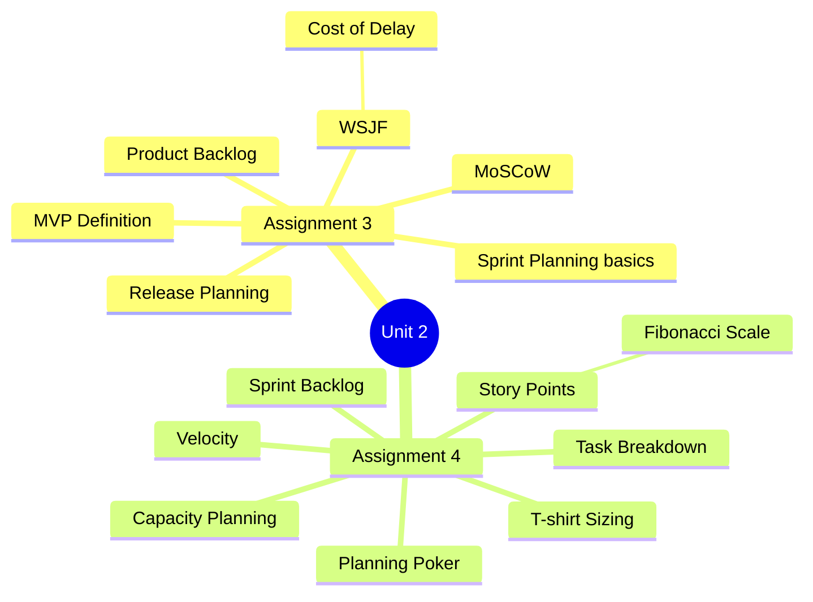
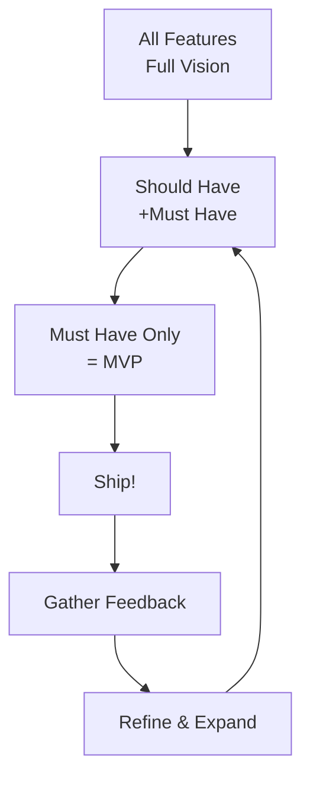
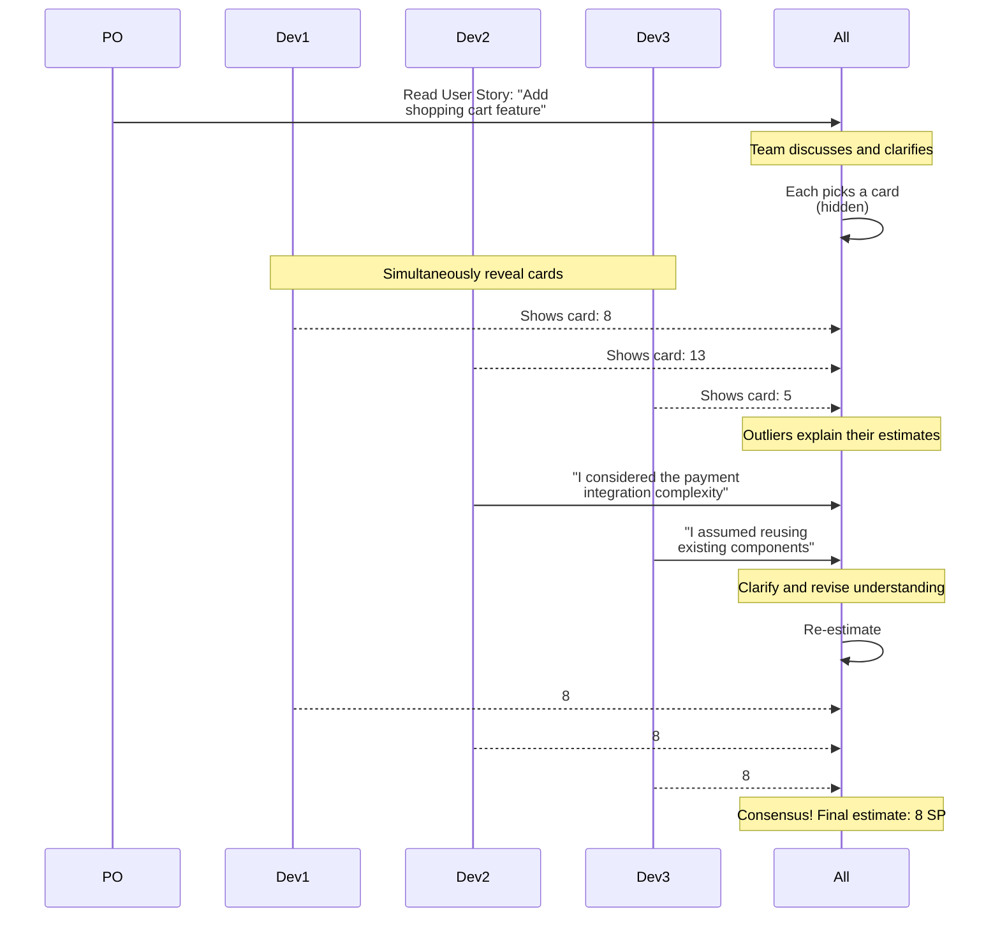

[[00-Dashboard/Home|Home]] | [[02-Semester-VI/Semester-VI-Dashboard|Semester VI]] | [[Overview]] | [[Syllabus]] | [[Unit-1]] | [[Unit-2]] | [[Unit-3]] | [[Unit-4]] | [[Unit-5]] | [[Important-Questions|Imp. Qs]] | [[Revision]] | [[Interview-Prep]]


# Unit 2: Planning & Estimation *(Assignments 3 & 4)*

> [!important] Learning Objectives
> After this unit, you should be able to:
> - Prioritize a product backlog using MoSCoW and WSJF techniques
> - Define an MVP for a product
> - Create a release plan and sprint plan
> - Estimate user stories using Story Points and Planning Poker
> - Apply T-shirt sizing for rough estimation
> - Calculate team velocity and sprint capacity
> - Create a Sprint Backlog with task breakdown

---

## Topics at a Glance



---

## Assignment 3: Backlog Prioritization & Release Planning

## 3.1 Product Backlog

### What is a Product Backlog?

The ==Product Backlog== is an **ordered, prioritized list** of everything that might be needed in the product - features, bug fixes, technical improvements, and knowledge acquisition.

**Characteristics:**
- Owned and managed by the **Product Owner**
- Never complete - evolves as the product evolves
- Higher items are more detailed and estimated
- Lower items may be vague (refined as they move up)

```
Product Backlog (ordered by priority):
┌─────────────────────────────────────────┬──────┬──────────┐
│ User Story                              │ SP   │ Priority │
├─────────────────────────────────────────┼──────┼──────────┤
│ US-101: User login with email/password  │  5   │ MUST     │
│ US-102: User registration               │  8   │ MUST     │
│ US-103: Password reset via email        │  5   │ MUST     │
│ US-104: Social login (Google)           │ 13   │ SHOULD   │
│ US-105: Two-factor authentication       │ 13   │ COULD    │
│ US-106: Biometric login                 │ 21   │ WON'T    │
└─────────────────────────────────────────┴──────┴──────────┘
SP = Story Points
```

---

## 3.2 MoSCoW Prioritization

==MoSCoW== is a prioritization technique for classifying requirements:

| Priority | Label | Meaning | Typical % |
|----------|-------|---------|-----------|
| **M** | ==Must Have== | Non-negotiable. Product fails without it | ~60% |
| **S** | ==Should Have== | Important but not vital. Can be worked around | ~20% |
| **C** | ==Could Have== | Nice to have. Small impact if left out | ~15% |
| **W** | ==Won't Have== | Not in this release. Future consideration | ~5% |

**Example - E-commerce App:**
```
MUST HAVE:
   User registration and login
   Product catalog with search
   Shopping cart
   Checkout and payment

SHOULD HAVE:
   Product reviews and ratings
   Order history
   Email notifications

COULD HAVE:
  ○ Wishlist
  ○ Product comparison
  ○ Loyalty points

WON'T HAVE (this release):
   AI-powered recommendations
   AR product preview
```

> [!tip] MoSCoW Rule
> The **Must Have** items alone should form a potentially shippable product. If all Must Haves together exceed capacity, some need to be re-classified.

---

## 3.3 WSJF - Weighted Shortest Job First

==WSJF (Weighted Shortest Job First)== is a prioritization model from **SAFe (Scaled Agile Framework)** that maximizes economic value.

**Formula:**
```
WSJF = Cost of Delay (CoD) / Duration (Job Size)
```

**Cost of Delay (CoD) = Sum of:**
```
CoD = User Business Value + Time Criticality + Risk Reduction/Opportunity Enablement
```

**Example:**

| Story | Business Value | Time Criticality | Risk Reduction | CoD Total | Duration | WSJF |
|-------|---------------|-----------------|----------------|-----------|----------|------|
| US-101 | 8 | 5 | 3 | 16 | 4 | **4.0** |
| US-102 | 5 | 8 | 2 | 15 | 8 | **1.875** |
| US-103 | 3 | 3 | 8 | 14 | 3 | **4.67** ← Highest priority |
| US-104 | 2 | 1 | 1 | 4  | 2 | **2.0** |

> [!note] WSJF vs MoSCoW
> - **MoSCoW**: Categorical, quick, subjective - good for initial prioritization
> - **WSJF**: Quantitative, economic focus - good for SAFe/large teams

---

## 3.4 MVP Definition

==MVP (Minimum Viable Product)== is the version of a product with just enough features to:
1. Satisfy early adopters
2. Provide feedback for future development
3. Demonstrate core value proposition



**MVP Criteria:**
- Covers all Must Have features (MoSCoW)
- Delivers core user value
- Can be built and shipped quickly
- Has clear success metrics

---

## 3.5 Release Planning

A ==Release Plan== maps out which features will be delivered in which sprint, based on velocity and priorities.

```
Release 1.0 (12 weeks / 6 sprints × 2 weeks each)
Team Velocity: ~30 SP/sprint | Total Capacity: 180 SP

Sprint 1-2:  Must Haves (Auth, User Mgmt)  ~60 SP
Sprint 3-4:  Must Haves (Product, Cart)    ~60 SP
Sprint 5:    Should Haves                  ~30 SP
Sprint 6:    Bug fixes, polish, release    ~30 SP
```

---

## Assignment 4: Agile Estimation & Sprint Planning

## 4.1 Story Points

### What are Story Points?

==Story Points== are a **relative unit of measure** for the effort, complexity, and risk of a user story. They are NOT hours - they express effort relative to other stories.

**Key characteristics:**
- Relative, not absolute (a 5-point story is roughly twice the effort of a 2-point story)
- Consider complexity, effort, and uncertainty
- Team-specific (a team's "5" may differ from another team's "5")
- Tracked as velocity over time

### Fibonacci Scale

Stories are estimated using the ==Fibonacci sequence== because the gaps naturally represent uncertainty - larger stories have proportionally larger uncertainty.

```
Fibonacci: 1, 2, 3, 5, 8, 13, 21, 34, 55, 89
Modified:  0, 0.5, 1, 2, 3, 5, 8, 13, 20, 40, 100, ∞, ?
```

**Estimation guidelines:**

| Points | Effort Level | Example |
|--------|-------------|---------|
| 1 | Trivial - a few minutes to hours | Fix a typo in UI text |
| 2 | Simple - straightforward change | Change button color and label |
| 3 | Small - some complexity | Add form validation for email |
| 5 | Medium - moderate work | Implement user login with JWT |
| 8 | Large - significant work | Build product search with filters |
| 13 | Very Large - complex, consider splitting | MVVM refactor of entire module |
| 21+ | Epic - must be split | Complete e-commerce checkout flow |

---

## 4.2 Planning Poker

==Planning Poker== is a consensus-based estimation technique for Agile teams.

### How Planning Poker Works



### Planning Poker Rules

1. Product Owner reads and explains a user story
2. Team members ask clarifying questions
3. Each member privately selects a card
4. All cards revealed **simultaneously** (prevents anchoring bias)
5. Largest and smallest estimators explain their reasoning
6. Discuss and repeat until consensus
7. Highest count card value (or average) becomes the estimate

**Deck cards:** 0, ½, 1, 2, 3, 5, 8, 13, 20, 40, 100, ∞ (too large), ? (unclear)

> [!tip] Tools for Remote Planning Poker
> - **PlanningPoker.com** - free online tool
> - **Scrum Poker Online**
> - **Jira** - built-in story point estimation
> - **Azure DevOps** - effort/story points field

---

## 4.3 T-shirt Sizing

==T-shirt Sizing== is a quick, rough estimation technique using clothing sizes.

| Size | Story Points Equivalent | When to Use |
|------|------------------------|-------------|
| XS | 1 | Trivial changes |
| S | 2-3 | Simple features |
| M | 5-8 | Medium complexity |
| L | 13 | Complex features |
| XL | 21-40 | Very complex (needs splitting) |

**When to use T-shirt sizing:**
- Early in the project (rough planning)
- When stories are not fully defined
- Quick portfolio-level estimation

---

## 4.4 Velocity

### What is Velocity?

==Velocity== is the **average story points completed per sprint**, measured over the last 3-5 sprints.

```
Sprint 1: Completed 22 SP
Sprint 2: Completed 28 SP
Sprint 3: Completed 31 SP
Sprint 4: Completed 25 SP
Sprint 5: Completed 30 SP

Average Velocity = (22 + 28 + 31 + 25 + 30) / 5 = 27.2 SP/sprint
```

**Using velocity for forecasting:**
```
Remaining backlog: 200 SP
Average velocity: 27 SP/sprint
Estimated sprints remaining: 200 / 27 ≈ 7-8 sprints
Estimated completion: 7-8 sprints × 2 weeks = 14-16 weeks
```

> [!warning] Velocity Pitfalls
> - Velocity is a **planning tool**, not a performance metric
> - Never compare velocities between teams
> - New teams have low initial velocity (ramp-up period)
> - Adding team members temporarily reduces velocity

---

## 4.5 Sprint Planning

### Sprint Planning Meeting

==Sprint Planning== is a time-boxed event (≤8 hours for a 4-week sprint) where the team selects backlog items and plans how to deliver them.

**Two parts:**
1. **What**: Product Owner presents top backlog items; team selects stories for the sprint
2. **How**: Team breaks selected stories into tasks

### Sprint Capacity

```
Team: 4 developers × 2 weeks
Days available: 10 working days per person
Minus: meetings (~1 hr/day), review, retro = ~1 day overhead

Capacity = 4 devs × 9 effective days = 36 person-days

If average velocity = 30 SP/sprint:
→ Commit to ~30 SP for this sprint
```

### Sprint Backlog

The ==Sprint Backlog== is the set of **selected Product Backlog items** + a plan for delivering them (tasks).

```
Sprint 3 Backlog:
┌────────────────────────────────────────────────────┬────┬──────────────────────────┐
│ User Story                                         │ SP │ Tasks                    │
├────────────────────────────────────────────────────┼────┼──────────────────────────┤
│ US-201: User can add product to cart               │  5 │ - Create Cart model      │
│                                                    │    │ - POST /api/cart endpoint│
│                                                    │    │ - Cart UI component      │
│                                                    │    │ - Unit tests             │
├────────────────────────────────────────────────────┼────┼──────────────────────────┤
│ US-202: User can view cart with total              │  3 │ - GET /api/cart endpoint │
│                                                    │    │ - Cart page UI           │
│                                                    │    │ - Total calculation      │
├────────────────────────────────────────────────────┼────┼──────────────────────────┤
│ US-203: User can remove item from cart             │  2 │ - DELETE /api/cart/:id   │
│                                                    │    │ - Remove button UI       │
│                                                    │    │ - Unit tests             │
├────────────────────────────────────────────────────┼────┼──────────────────────────┤
│ US-101 (bug): Fix login redirect loop              │  2 │ - Investigate            │
│                                                    │    │ - Fix redirect logic     │
│                                                    │    │ - Test fix               │
├────────────────────────────────────────────────────┼────┼──────────────────────────┤
│                                            TOTAL   │ 12 │                          │
└────────────────────────────────────────────────────┴────┴──────────────────────────┘
```

### Sprint Goal

The ==Sprint Goal== is a single objective for the sprint. Example:
> *"By end of this sprint, users can add and manage items in their shopping cart."*

---

## Key Definitions

| Term | Definition |
|------|-----------|
| ==Product Backlog== | Ordered list of all work needed for the product, owned by PO |
| ==MoSCoW== | Must/Should/Could/Won't - prioritization framework |
| ==WSJF== | Weighted Shortest Job First - economic prioritization formula |
| ==MVP== | Minimum Viable Product - minimal feature set delivering core value |
| ==Story Points== | Relative measure of effort/complexity/risk for user stories |
| ==Fibonacci Scale== | 1,2,3,5,8,13,21... used for story point estimation |
| ==Planning Poker== | Consensus-based estimation with simultaneous card reveal |
| ==Velocity== | Average story points completed per sprint (last 3-5 sprints) |
| ==Sprint Capacity== | How much work a team can take in a sprint (in SP) |
| ==Sprint Backlog== | Stories + tasks selected for the current sprint |
| ==Sprint Goal== | Single objective for the sprint |
| ==T-shirt Sizing== | XS/S/M/L/XL rough estimation for early planning |

---

## Practice Questions

> [!question] Short Answer Questions
> 1. What is MoSCoW prioritization? Give an example for each category.
> 2. Explain WSJF and how to calculate it. What is Cost of Delay?
> 3. What are Story Points? Why are they preferred over hours?
> 4. Explain the Planning Poker process step by step.
> 5. What is velocity and how is it calculated?
> 6. Why is velocity not a performance metric?
> 7. What is the difference between Product Backlog and Sprint Backlog?
> 8. What is a Sprint Goal and why is it important?
> 9. What is an MVP? How does MoSCoW help define it?
> 10. If a team's velocity is 25 SP/sprint and backlog has 175 SP, when will it complete?

---

## Navigation

- [[Unit-1|← Unit 1: Agile Fundamentals]]
- [[Syllabus| Syllabus]]
- [[Unit-3|Unit 3: Sprint Execution →]]
- [[Important-Questions| Important Questions]]
- [[Revision| Revision]]
