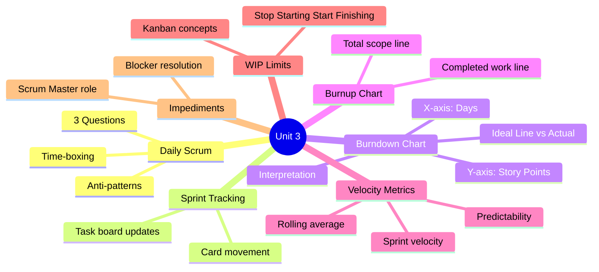
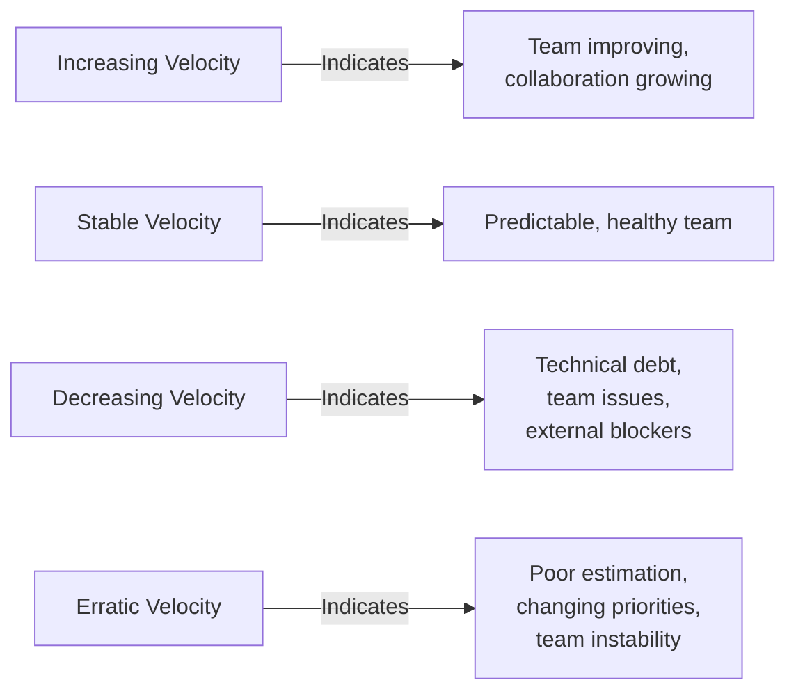
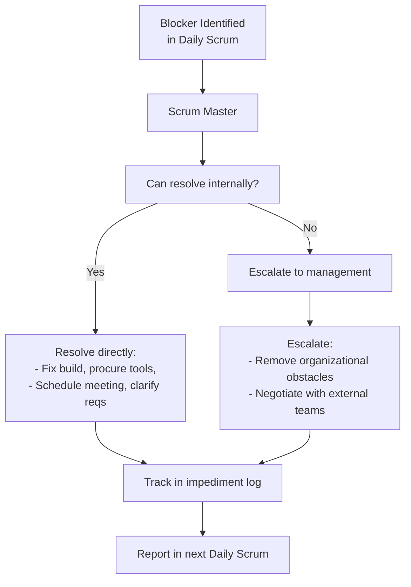

#  Unit 3: Sprint Execution *(Assignment 5)*

> [!important] Learning Objectives
> After this unit, you should be able to:
> - Facilitate an effective Daily Scrum (standup)
> - Track sprint progress using a Burndown Chart
> - Read and interpret a Burnup Chart
> - Calculate and use velocity metrics for forecasting
> - Manage WIP (Work In Progress) limits on Kanban boards
> - Identify and handle blockers (impediments)

---

##  Topics at a Glance



---

## Assignment 5: Sprint Execution

## 5.1 Daily Scrum (Daily Standup)

###  What is Daily Scrum?

The ==Daily Scrum== is a **15-minute time-boxed** event for the Development Team. It is held at the **same time and place** every day to reduce complexity.

> [!important] The 3 Questions
> Each team member answers:
> 1. **What did I do yesterday** that helped the Development Team meet the Sprint Goal?
> 2. **What will I do today** to help the Development Team meet the Sprint Goal?
> 3. **Are there any impediments** that block me or the team?

###  Rules and Format

| Rule | Description |
|------|-------------|
| **Time-boxed** | Strictly 15 minutes - no exceptions |
| **Same time, same place** | Reduces coordination overhead |
| **Dev Team only** | PO and SM may attend but don't speak (SM facilitates) |
| **Stand up** | Standing encourages brevity |
| **Not a status meeting** | For the Dev Team, not management |
| **Problems discussed offline** | "Take it offline" after standup |

###  Good vs Bad Standup

```
 GOOD Daily Scrum:
"Yesterday I completed the login API endpoint (US-101 task 2).
Today I'll write unit tests for it and start the JWT middleware.
No blockers."

 BAD Daily Scrum (anti-patterns):
- Status report to Scrum Master: "Yesterday I worked 8 hours..."
- Problem-solving during standup: "Let me show you the code..."
- Missing the standup
- Going over 15 minutes
- Only one person talking
- Not mentioning impediments
```

###  Sample Daily Scrum Dialogue

```
Scrum Master: "It's time for our daily standup. Let's go around the room."

Dev 1 (Alice): "Yesterday I completed the user registration form UI.
               Today I'm working on the form validation logic.
               I'm blocked on the API contract - I need Bob to finalize the request format."

Dev 2 (Bob):   "Yesterday I drafted the registration API spec.
               Today I'll finalize and share it with Alice, then start the backend implementation.
               No blockers."

Dev 3 (Carol): "Yesterday I wrote unit tests for the login feature.
               Today I'll finish integration testing and create the PR.
               No blockers, but I'm concerned about the sprint goal - we might be behind schedule."

SM:            "Thanks everyone. Alice, let's connect Bob and you right after this meeting to resolve the API contract. Carol, let's review the burndown chart together. That's our standup - 14 minutes, well done!"
```

---

## 5.2 Sprint Tracking

###  Task Board Management

The sprint task board shows the status of every task:

```
Sprint 3 Board:
┌──────────────┬──────────────┬──────────────┬──────────────┐
│    TO DO     │ IN PROGRESS  │    REVIEW    │     DONE     │
│  (Backlog)   │   (Doing)    │   (Testing)  │  (Complete)  │
├──────────────┼──────────────┼──────────────┼──────────────┤
│ [Task 4] ○   │ [Task 2] ●   │ [Task 1] ●  │ [Task 0]   │
│ [Task 5] ○   │   (Alice)    │   (Carol)    │             │
│ [Task 6] ○   │ [Task 3] ●   │              │             │
│              │   (Bob)      │              │             │
└──────────────┴──────────────┴──────────────┴──────────────┘
WIP Limit:     Max 2 per column
```

**Daily practice:**
- Update task cards at/before daily standup
- Move cards when status changes
- Add new tasks discovered during development
- Mark estimates vs actuals

---

## 5.3 Burndown Chart

###  What is a Burndown Chart?

A ==Burndown Chart== tracks the amount of **work remaining** (Y-axis) over **time** (X-axis) during a sprint.

```
Sprint Burndown (2-week sprint, 30 SP committed)

SP   30 |●
Remaining|  \  ← Ideal line
         |   \
      20 |    \__●
         |         \  ← Actual line
      10 |          ●___●
         |                \
       0 |_________________●
         D1 D2 D3 D4 D5 D6 D7 D8 D9 D10
                      Days
```

###  Reading the Burndown Chart

| Chart Pattern | Interpretation |
|--------------|----------------|
| Actual below ideal line | Team is ahead of schedule  |
| Actual above ideal line | Team is behind schedule ️ |
| Flat line (no burn) | No work being completed - investigate |
| Steep drop | Batch completion - work completed at end |
| Line goes UP | Scope added to sprint mid-sprint |

**Ideal vs Actual:**
- ==Ideal Burndown Line==: Straight diagonal from total SP on Day 0 to 0 on last day
- ==Actual Burndown Line==: Actual remaining SP updated each day

###  Burndown Data Example

| Day | Ideal Remaining (SP) | Actual Remaining (SP) | Status |
|-----|---------------------|-----------------------|--------|
| Day 0 | 30 | 30 | Start |
| Day 2 | 24 | 28 | Behind ️ |
| Day 4 | 18 | 22 | Behind ️ |
| Day 6 | 12 | 18 | Behind ️ |
| Day 8 | 6 | 10 | Behind ️ |
| Day 10 | 0 | 5 | Not done!  |

**Response to being behind:**
1. Identify blockers in Daily Scrum
2. Scrum Master removes impediments
3. Team re-prioritizes - what's essential for the Sprint Goal?
4. PO may agree to remove lower-priority stories from sprint

---

## 5.4 Burnup Chart

###  What is a Burnup Chart?

A ==Burnup Chart== tracks **work completed** (Y-axis) against **total scope** (Y-axis, second line) over time.

```
Sprint Burnup (30 SP scope):

SP  30 |──────────────────── Total Scope (30 SP)
Done   |                 ____●
    20 |          ______/
       |     ____/
    10 |____/
       |
     0 |_______________________________
       D1 D2 D3 D4 D5 D6 D7 D8 D9 D10
```

**Burndown vs Burnup:**

| Feature | Burndown | Burnup |
|---------|---------|--------|
| Y-axis | Remaining work | Completed work |
| Shows scope changes | Not clearly | Clearly (scope line moves) |
| Goal indicator | Reach zero | Reach total scope line |
| Good for | Sprint tracking | Release tracking with scope changes |

---

## 5.5 Velocity Metrics

###  Calculating and Using Velocity

```
Historical velocity data:
Sprint 1: 18 SP (new team, ramping up)
Sprint 2: 22 SP
Sprint 3: 26 SP
Sprint 4: 25 SP
Sprint 5: 27 SP
Sprint 6: 28 SP

Rolling average (last 3): (25 + 27 + 28) / 3 = 26.7 SP ≈ 27 SP

Use 27 SP for next sprint planning
```

**Velocity Trend Analysis:**



###  Predictability Metric

```
Predictability = (Actual Velocity / Committed Velocity) × 100%

Example:
Sprint committed: 30 SP
Sprint delivered: 27 SP
Predictability = 27/30 × 100 = 90%

Target: 80-100% (consistently)
<70% → Team is over-committing
>100% → Team is under-committing (conservative estimates)
```

---

## 5.6 WIP Limits (Kanban)

###  What are WIP Limits?

==WIP (Work In Progress) Limits== restrict the number of items that can be in any one stage of the workflow at a time.

**Why WIP limits?**
- Exposes bottlenecks in the process
- Encourages finishing work before starting new work
- Reduces context switching
- Improves flow and reduces cycle time

```
Kanban Board with WIP Limits:
┌──────────────────┬────────────────────┬─────────────────┐
│    TO DO         │   IN PROGRESS(2)   │    DONE         │
│  (No limit)      │   ── WIP: MAX 2 ── │  (No limit)     │
├──────────────────┼────────────────────┼─────────────────┤
│ [Story A] ○      │ [Story C] ●        │ [Story F]     │
│ [Story B] ○      │ [Story D] ●        │ [Story G]     │
│ [Story E] ○      │ ← FULL! Cannot     │                 │
│                  │ add more until one │                 │
│                  │ moves to Done      │                 │
└──────────────────┴────────────────────┴─────────────────┘

Mantra: "Stop Starting, Start Finishing"
```

---

## 5.7 Impediment Management

###  Types of Impediments

| Type | Examples |
|------|---------|
| Technical | Build server broken, missing tools, performance issues |
| Process | Unclear requirements, waiting for decisions |
| External | Dependency on another team, waiting for hardware |
| Organizational | Policy conflicts, budget approval needed |

###  Scrum Master's Role



**Impediment Log:**

| # | Impediment | Owner | Raised | Resolved | Status |
|---|-----------|-------|--------|----------|--------|
| 1 | API contract unclear | Alice | Day 2 | Day 3 |  Resolved |
| 2 | CI pipeline broken | DevOps | Day 4 | - |  Open |
| 3 | Waiting for PO feedback | Bob | Day 5 | Day 5 |  Resolved |

---

##  Key Definitions

| Term | Definition |
|------|-----------|
| ==Daily Scrum== | 15-minute daily event for Dev Team to synchronize and plan next 24 hours |
| ==Burndown Chart== | Graph tracking remaining work (SP) over sprint days |
| ==Burnup Chart== | Graph tracking completed work vs total scope over time |
| ==Velocity== | Average story points completed per sprint |
| ==WIP Limit== | Maximum number of items allowed in a workflow stage |
| ==Impediment== | Anything blocking the team from completing work |
| ==Sprint Goal== | Single objective the team commits to achieving in the sprint |
| ==Ideal Burndown Line== | Straight diagonal from initial SP to zero on the last day |
| ==Predictability== | (Actual SP / Committed SP) × 100% |

---

##  Practice Questions

> [!question] Short Answer Questions
> 1. What are the three questions answered in a Daily Scrum?
> 2. Who should and should not speak during the Daily Scrum?
> 3. Draw a burndown chart for a 2-week sprint with 30 SP. Explain the ideal vs actual lines.
> 4. What does it mean if the burndown chart line goes UP?
> 5. What is the difference between burndown and burnup charts?
> 6. How is velocity calculated? How is it used for forecasting?
> 7. What are WIP limits and why are they important?
> 8. What is the Scrum Master's role when a team member reports a blocker?
> 9. If a team has velocity 25 SP and needs to deliver 100 SP, how many sprints are needed?
> 10. What are the anti-patterns (things to avoid) in a Daily Scrum?

---

##  Navigation

- [[Unit-2|← Unit 2: Planning & Estimation]]
- [[Syllabus| Syllabus]]
- [[Unit-4|Unit 4: Quality Assurance →]]
- [[Important-Questions| Important Questions]]
- [[Revision| Revision]]
