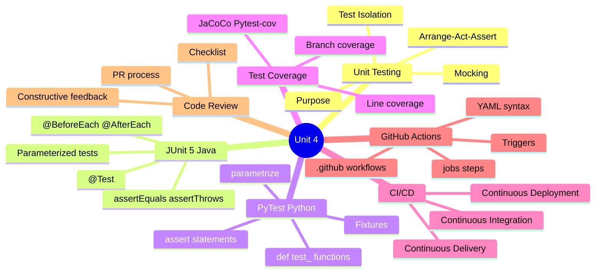
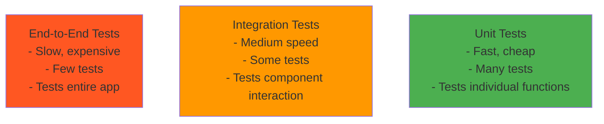
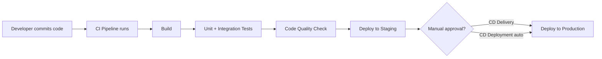

[[00-Dashboard/Home|Home]] | [[02-Semester-VI/Semester-VI-Dashboard|Semester VI]] | [[Overview]] | [[Syllabus]] | [[Unit-1]] | [[Unit-2]] | [[Unit-3]] | [[Unit-4]] | [[Unit-5]] | [[Important-Questions|Imp. Qs]] | [[Revision]] | [[Interview-Prep]]


# Unit 4: Quality Assurance *(Assignment 6)*

> [!important] Learning Objectives
> After this unit, you should be able to:
> - Write unit tests using JUnit 5 (Java) or PyTest (Python)
> - Understand the Arrange-Act-Assert pattern
> - Explain CI/CD concepts and why they matter in Agile
> - Create a basic GitHub Actions workflow (YAML)
> - Conduct and receive effective code reviews
> - Measure test coverage

---

## Topics at a Glance



---

## Assignment 6: Testing & Quality

## 6.1 Unit Testing Fundamentals

### What is Unit Testing?

A ==unit test== verifies that an **individual, isolated unit** of code (function, method, class) behaves as expected under specific conditions.

**Testing Pyramid:**


> [!tip] Rule of Thumb
> Aim for: 70% unit tests, 20% integration tests, 10% E2E tests

---

### Arrange-Act-Assert (AAA) Pattern

```
// Structure of every unit test:
void testMethod() {
    // ARRANGE - Set up test data and preconditions
    ...
    
    // ACT - Call the method being tested
    ...
    
    // ASSERT - Verify the result
    ...
}
```

### F.I.R.S.T Principles for Good Tests

| Letter | Principle | Meaning |
|--------|-----------|---------|
| **F** | ==Fast== | Run in milliseconds, not seconds |
| **I** | ==Independent== | No dependency on other tests or external state |
| **R** | ==Repeatable== | Same result every time, regardless of environment |
| **S** | ==Self-validating== | Clear pass/fail - no manual inspection needed |
| **T** | ==Timely== | Written before or with the code (not after) |

---

## 6.2 JUnit 5 (Java)

### Setup

```xml
<!-- Maven pom.xml -->
<dependency>
    <groupId>org.junit.jupiter</groupId>
    <artifactId>junit-jupiter</artifactId>
    <version>5.10.0</version>
    <scope>test</scope>
</dependency>
```

### Basic JUnit 5 Tests

```java
import org.junit.jupiter.api.*;
import static org.junit.jupiter.api.Assertions.*;

class CalculatorTest {
    private Calculator calculator;
    
    @BeforeEach    // Runs before EACH test method
    void setUp() {
        calculator = new Calculator();
    }
    
    @AfterEach     // Runs after EACH test method
    void tearDown() {
        calculator = null;
    }
    
    @BeforeAll     // Runs ONCE before all tests (must be static)
    static void setUpAll() {
        System.out.println("Starting Calculator tests");
    }
    
    @AfterAll      // Runs ONCE after all tests (must be static)
    static void tearDownAll() {
        System.out.println("Finished Calculator tests");
    }
    
    @Test
    @DisplayName("Addition of two positive numbers")
    void testAddPositiveNumbers() {
        // ARRANGE
        int a = 5, b = 3;
        
        // ACT
        int result = calculator.add(a, b);
        
        // ASSERT
        assertEquals(8, result, "5 + 3 should equal 8");
    }
    
    @Test
    void testDivisionByZero() {
        // assertThrows - expects an exception
        assertThrows(ArithmeticException.class, () -> {
            calculator.divide(10, 0);
        });
    }
    
    @Test
    void testMultipleAssertions() {
        // assertAll - runs ALL assertions even if one fails
        assertAll("Calculator tests",
            () -> assertEquals(8, calculator.add(5, 3)),
            () -> assertEquals(2, calculator.subtract(5, 3)),
            () -> assertEquals(15, calculator.multiply(5, 3)),
            () -> assertEquals(2, calculator.divide(6, 3))
        );
    }
    
    @Test
    @Disabled("Not implemented yet")  // Skip test
    void testSquareRoot() { }
}
```

### Common JUnit 5 Assertions

```java
assertEquals(expected, actual);
assertEquals(expected, actual, "Message on failure");
assertNotEquals(unexpected, actual);

assertTrue(condition);
assertFalse(condition);

assertNull(object);
assertNotNull(object);

assertSame(expected, actual);          // Same object reference
assertThrows(Exception.class, () -> methodThatThrows());
assertDoesNotThrow(() -> normalMethod());

assertArrayEquals(expectedArray, actualArray);
assertIterableEquals(expectedList, actualList);
```

### Parameterized Tests

```java
import org.junit.jupiter.params.ParameterizedTest;
import org.junit.jupiter.params.provider.*;

class MathTest {
    
    @ParameterizedTest
    @ValueSource(ints = {1, 2, 4, 8, 16})
    void testIsPowerOfTwo(int number) {
        assertTrue(MathUtils.isPowerOfTwo(number));
    }
    
    @ParameterizedTest
    @CsvSource({
        "2, 3, 5",     // add(2, 3) == 5
        "0, 0, 0",     // add(0, 0) == 0
        "-1, 1, 0",    // add(-1, 1) == 0
        "100, 200, 300"
    })
    void testAddition(int a, int b, int expected) {
        assertEquals(expected, calculator.add(a, b));
    }
    
    @ParameterizedTest
    @MethodSource("provideStrings")
    void testIsEmpty(String input, boolean expected) {
        assertEquals(expected, input.isEmpty());
    }
    
    static Stream<Arguments> provideStrings() {
        return Stream.of(
            Arguments.of("", true),
            Arguments.of("hello", false),
            Arguments.of("  ", false)
        );
    }
}
```

---

## 6.3 PyTest (Python)

### Setup

```bash
pip install pytest pytest-cov
```

### Basic PyTest Tests

```python
# test_calculator.py
import pytest
from calculator import Calculator

# All test files: test_*.py or *_test.py
# All test functions: test_*
# All test classes: Test*

class TestCalculator:
    
    def setup_method(self):  # Runs before EACH test (like @BeforeEach)
        self.calc = Calculator()
    
    def test_add_positive_numbers(self):
        # ARRANGE
        a, b = 5, 3
        
        # ACT
        result = self.calc.add(a, b)
        
        # ASSERT
        assert result == 8, f"Expected 8, got {result}"
    
    def test_subtract(self):
        assert self.calc.subtract(10, 3) == 7
    
    def test_multiply(self):
        assert self.calc.multiply(4, 5) == 20
    
    def test_divide(self):
        assert self.calc.divide(10, 2) == 5.0
    
    def test_divide_by_zero(self):
        with pytest.raises(ZeroDivisionError):
            self.calc.divide(10, 0)
    
    def test_add_negative(self):
        assert self.calc.add(-5, 3) == -2


# Fixtures
@pytest.fixture
def sample_data():
    """Provides test data (like @BeforeAll)"""
    return {"users": ["Alice", "Bob", "Carol"], "count": 3}

def test_user_count(sample_data):
    assert sample_data["count"] == len(sample_data["users"])


# Parameterized tests
@pytest.mark.parametrize("a, b, expected", [
    (2, 3, 5),
    (0, 0, 0),
    (-1, 1, 0),
    (100, 200, 300),
])
def test_addition_parametrized(a, b, expected):
    calc = Calculator()
    assert calc.add(a, b) == expected


# Marks
@pytest.mark.skip(reason="Not implemented yet")
def test_square_root():
    pass

@pytest.mark.xfail  # Expected to fail
def test_known_bug():
    assert 1 == 2
```

### Running PyTest

```bash
pytest                          # Run all tests
pytest test_calculator.py       # Specific file
pytest -v                       # Verbose output
pytest -k "add"                 # Run tests with "add" in name
pytest --cov=src --cov-report=html  # With coverage report
pytest -x                       # Stop after first failure
```

---

## 6.4 Test Coverage

### Types of Coverage

| Type | Description | Example |
|------|-------------|---------|
| ==Line Coverage== | % of executable lines executed | `if (x > 0) { ... }` - at least one branch |
| ==Branch Coverage== | % of branches executed | Both `if (x > 0)` true AND false paths |
| ==Statement Coverage== | % of statements executed | Individual statements |
| ==Function Coverage== | % of functions called | All functions called at least once |

**Target:** ≥80% line coverage for production code

### Generating Coverage Reports

**Python (pytest-cov):**
```bash
# Install
pip install pytest-cov

# Run with coverage
pytest --cov=src --cov-report=html

# View: open htmlcov/index.html in browser
```

**Java (JaCoCo):**
```xml
<!-- pom.xml -->
<plugin>
    <groupId>org.jacoco</groupId>
    <artifactId>jacoco-maven-plugin</artifactId>
    <version>0.8.10</version>
    <executions>
        <execution>
            <goals>
                <goal>prepare-agent</goal>
            </goals>
        </execution>
        <execution>
            <id>report</id>
            <phase>test</phase>
            <goals>
                <goal>report</goal>
            </goals>
        </execution>
    </executions>
</plugin>
```

---

## 6.5 CI/CD Basics

### What is CI/CD?

| Term | Stands For | Meaning |
|------|-----------|---------|
| ==CI== | Continuous Integration | Frequently merge code; auto-build and test every commit |
| ==CD== | Continuous Delivery | Auto-deploy to staging; manual approval for production |
| ==CD== | Continuous Deployment | Fully automated deployment to production on every passing commit |



**Why CI/CD in Agile?**
- Detects integration bugs early (fail fast)
- Enables frequent, confident releases
- Reduces manual deployment errors
- Supports sprint delivery cadence

---

## 6.6 GitHub Actions

### What is GitHub Actions?

==GitHub Actions== is a CI/CD platform built into GitHub that automates workflows triggered by events.

**Key concepts:**
- **Workflow**: Automated process defined in YAML
- **Event**: Trigger (push, pull_request, schedule)
- **Job**: Set of steps running on a runner
- **Step**: Individual task (run command, use action)
- **Runner**: Machine that runs the job (ubuntu-latest, windows-latest)

### Basic CI Workflow

```yaml
# .github/workflows/ci.yml

name: CI Pipeline  # Workflow name

on:                # Triggers
  push:
    branches: [ main, develop ]
  pull_request:
    branches: [ main, develop ]

jobs:
  test:            # Job name
    runs-on: ubuntu-latest  # Runner
    
    steps:
      - name: Checkout code
        uses: actions/checkout@v4
      
      - name: Set up Python
        uses: actions/setup-python@v4
        with:
          python-version: '3.11'
      
      - name: Install dependencies
        run: |
          python -m pip install --upgrade pip
          pip install -r requirements.txt
          pip install pytest pytest-cov
      
      - name: Run tests with coverage
        run: pytest --cov=src --cov-report=xml
      
      - name: Upload coverage report
        uses: codecov/codecov-action@v3
        with:
          file: ./coverage.xml
```

### Node.js / Express CI Workflow

```yaml
# .github/workflows/node-ci.yml

name: Node.js CI

on:
  push:
    branches: [ main ]
  pull_request:
    branches: [ main ]

jobs:
  test:
    runs-on: ubuntu-latest
    
    services:
      postgres:  # PostgreSQL service container for integration tests
        image: postgres:15
        env:
          POSTGRES_USER: testuser
          POSTGRES_PASSWORD: testpass
          POSTGRES_DB: testdb
        ports:
          - 5432:5432
        options: >-
          --health-cmd pg_isready
          --health-interval 10s
          --health-timeout 5s
          --health-retries 5
    
    steps:
      - uses: actions/checkout@v4
      
      - name: Use Node.js 20
        uses: actions/setup-node@v4
        with:
          node-version: '20'
          cache: 'npm'
      
      - name: Install dependencies
        run: npm ci
      
      - name: Run linter
        run: npm run lint
      
      - name: Run tests
        run: npm test
        env:
          NODE_ENV: test
          DB_HOST: localhost
          DB_PORT: 5432
          DB_NAME: testdb
          DB_USER: testuser
          DB_PASSWORD: testpass
          JWT_SECRET: test-secret-key
      
      - name: Build
        run: npm run build
```

---

## 6.7 Code Review

### Why Code Review?

Code review improves code quality, spreads knowledge, catches bugs early, and enforces coding standards.

### Pull Request Process

```
Feature Branch → [PR created] → Code Review → [Approved] → Merge to develop
                                     ↓
                              [Changes requested] → Author fixes → Re-review
```

### Code Review Checklist

> [!tip] Reviewer Checklist
> - [ ] **Correctness**: Does the code do what it's supposed to?
> - [ ] **Tests**: Are unit tests included and passing?
> - [ ] **Edge cases**: Are boundary conditions handled?
> - [ ] **Security**: Any SQL injection, XSS, or other vulnerabilities?
> - [ ] **Performance**: Any obvious N+1 queries or inefficient loops?
> - [ ] **Readability**: Is the code easy to understand?
> - [ ] **DRY**: Is code unnecessarily duplicated?
> - [ ] **SOLID**: Does it follow design principles?
> - [ ] **Documentation**: Are complex parts commented/documented?
> - [ ] **Dependencies**: Are new dependencies justified?

### Constructive Feedback

```
 BAD: "This is wrong"
 GOOD: "This query could cause an N+1 problem. Consider eager loading with JOIN instead."

 BAD: "Why would you do this??"
 GOOD: "I think using a Set here would improve lookup time from O(n) to O(1). What do you think?"

 BAD: "Fix this"
 GOOD: "This function is handling both validation and business logic. 
          Could we separate concerns here by extracting validation into a helper?"
```

---

## Key Definitions

| Term | Definition |
|------|-----------|
| ==Unit Test== | Test verifying a single, isolated unit of code |
| ==AAA Pattern== | Arrange-Act-Assert - structure for writing tests |
| ==JUnit== | Java testing framework for unit tests |
| ==PyTest== | Python testing framework |
| ==Test Coverage== | % of code executed by tests |
| ==CI== | Continuous Integration - auto-build and test on every commit |
| ==CD== | Continuous Delivery/Deployment - auto-deploy after passing CI |
| ==GitHub Actions== | CI/CD platform built into GitHub using YAML workflows |
| ==Fixture== | PyTest mechanism to provide reusable test setup/teardown |
| ==Parameterized Test== | Single test method run with multiple inputs |
| ==Pull Request== | Request to merge code changes into another branch |
| ==Code Review== | Peer examination of code before merging |

---

## Practice Questions

> [!question] Short Answer Questions
> 1. What is unit testing? What is the AAA pattern?
> 2. List and explain the F.I.R.S.T principles of good unit tests.
> 3. Write a JUnit 5 test class with `@BeforeEach`, `@Test`, and `@ParameterizedTest`.
> 4. Write equivalent PyTest tests for a Python function.
> 5. What is the difference between line coverage and branch coverage?
> 6. Explain CI/CD. What is the difference between Continuous Delivery and Continuous Deployment?
> 7. Write a GitHub Actions YAML workflow that runs Python tests on every push.
> 8. What are the key items to check during a code review?
> 9. What happens in a typical Pull Request workflow?
> 10. Why is testing important in Agile/Scrum development?

---

## Navigation

- [[Unit-3|← Unit 3: Sprint Execution]]
- [[Syllabus| Syllabus]]
- [[Unit-5|Unit 5: Review & Retrospective →]]
- [[Important-Questions| Important Questions]]
- [[Revision| Revision]]
