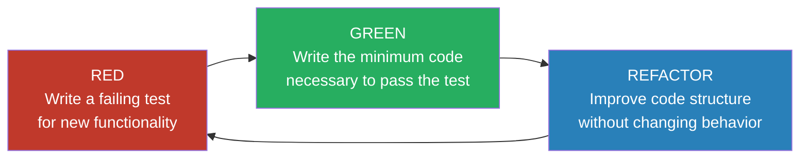
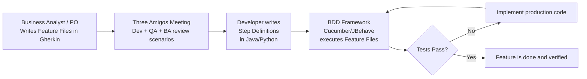
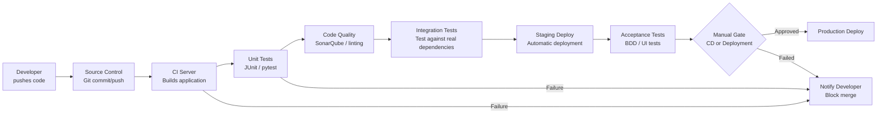
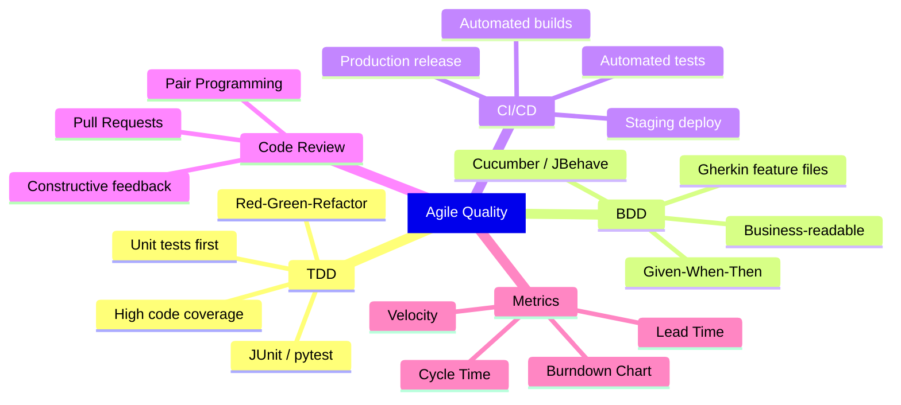

[[Overview]] | [[Syllabus]] | [[Unit-1]] | [[Unit-2]] | [[Unit-3]] | [[Unit-4]] | [[Unit-5]]

---

# Unit 5: Agile Quality and DevOps

> [!important]
> This unit is high-weightage for SPPU exams. Focus on the TDD Red-Green-Refactor cycle, BDD Given-When-Then syntax, CI/CD pipeline stages, and Agile metrics (velocity, burndown chart).

## Learning Objectives

By the end of this unit, you will be able to:

1. Explain the TDD cycle and write tests before code.
2. Distinguish between TDD and BDD and describe their respective tools.
3. Describe the stages of a CI/CD pipeline.
4. Define and compute key Agile metrics: velocity, burndown, and cycle time.
5. Explain the principles of code review in an Agile team.

---

## 5.1 Test-Driven Development (TDD)

==Test-Driven Development (TDD)== is a software development practice in which tests are written before the production code. It was formalized by Kent Beck as part of Extreme Programming (XP).

### 5.1.1 The Red-Green-Refactor Cycle

The entire TDD discipline is driven by a short, repeating three-phase cycle:



| Phase | Action | Goal |
|---|---|---|
| RED | Write a unit test for a small piece of new functionality | The test must fail because the feature does not exist yet |
| GREEN | Write the simplest possible code to make the test pass | Pass the test without worrying about code quality |
| REFACTOR | Improve the code (remove duplication, improve naming, extract methods) | Maintain all passing tests while improving design |

> [!important]
> The key principle: never write production code unless there is a failing test that demands it. This is what distinguishes TDD from "testing after development."

### 5.1.2 Benefits of TDD

1. **Acts as living documentation** - Tests describe the expected behavior of each unit.
2. **Catches regressions immediately** - Any change that breaks existing behavior is detected instantly.
3. **Drives better design** - Code written to be testable tends to be modular, loosely coupled, and follows Single Responsibility Principle.
4. **Confidence to refactor** - Developers can improve code structure fearlessly, knowing tests will catch regressions.
5. **Reduces debugging time** - Failures are identified at the unit level before integration.

### 5.1.3 TDD Example in Java (JUnit)

Suppose we want to write a method that calculates the factorial of a number.

**Step 1 - RED: Write the failing test first**

```java
import org.junit.Test;
import static org.junit.Assert.*;

public class MathUtilsTest {

    @Test
    public void testFactorialOfZero() {
        assertEquals(1, MathUtils.factorial(0));
    }

    @Test
    public void testFactorialOfFive() {
        assertEquals(120, MathUtils.factorial(5));
    }

    @Test(expected = IllegalArgumentException.class)
    public void testFactorialOfNegative() {
        MathUtils.factorial(-1);
    }
}
// These tests will FAIL because MathUtils.factorial() does not yet exist.
```

**Step 2 - GREEN: Write minimum code to pass tests**

```java
public class MathUtils {

    public static long factorial(int n) {
        if (n < 0) throw new IllegalArgumentException("Negative input not allowed");
        if (n == 0) return 1;
        long result = 1;
        for (int i = 1; i <= n; i++) {
            result *= i;
        }
        return result;
    }
}
// All three tests now PASS.
```

**Step 3 - REFACTOR: Improve if needed**

In this case the code is already clean. In a more complex scenario, you might extract constants, improve variable names, or convert the loop to a recursive approach - then re-run tests to confirm they still pass.

### 5.1.4 TDD vs Traditional Testing

| Aspect | Traditional (Test-After) | TDD (Test-First) |
|---|---|---|
| When tests are written | After production code | Before production code |
| Code coverage | Often incomplete | High by design |
| Design influence | None | Tests drive design decisions |
| Regression detection | Manual test runs | Continuous automated detection |
| Debugging effort | High (bug found late) | Low (bug found immediately) |
| Time investment | Less upfront, more debugging later | More upfront, less debugging later |

---

## 5.2 Behavior-Driven Development (BDD)

==Behavior-Driven Development (BDD)== is an extension of TDD that shifts focus from testing individual units of code to specifying and verifying the behavior of a system from the perspective of the end user and business stakeholders.

BDD was introduced by Dan North as a refinement of TDD to address the "what should we test?" question.

### 5.2.1 BDD vs TDD

| Aspect | TDD | BDD |
|---|---|---|
| Focus | Individual code units (methods, classes) | System behavior as experienced by users |
| Language | Technical (developer-centric) | Plain English (Given-When-Then) |
| Audience | Developers | Developers, QA, Product Owners, Business Analysts |
| Tools | JUnit, NUnit, pytest | Cucumber, JBehave, SpecFlow, Behave |
| Artifacts | Unit tests | Feature files (Gherkin scenarios) |
| Goal | Verify correctness of units | Verify the system does what the business expects |

### 5.2.2 Gherkin Syntax: Given-When-Then

BDD scenarios are written in ==Gherkin==, a structured English-like language that is both human-readable and parseable by BDD frameworks.

```gherkin
Feature: User Login
  As a registered user
  I want to log in with my credentials
  So that I can access my account

  Scenario: Successful login with valid credentials
    Given the user is on the login page
    And the user has a valid registered account
    When the user enters username "amit@example.com" and password "SecurePass123"
    And the user clicks the "Login" button
    Then the user should be redirected to the dashboard
    And a welcome message "Hello, Amit!" should be displayed

  Scenario: Login fails with incorrect password
    Given the user is on the login page
    When the user enters username "amit@example.com" and password "wrongpassword"
    And the user clicks the "Login" button
    Then an error message "Invalid credentials" should be displayed
    And the user should remain on the login page
```

| Keyword | Role |
|---|---|
| `Feature` | High-level description of the functionality being tested |
| `Scenario` | A specific example of behavior (one test case) |
| `Given` | Preconditions and initial context |
| `When` | The action or event that occurs |
| `Then` | The expected outcome or assertion |
| `And` / `But` | Continuation of the previous step type |

### 5.2.3 BDD Workflow



---

## 5.3 Continuous Integration and Continuous Delivery (CI/CD)

### 5.3.1 Definitions

| Term | Definition |
|---|---|
| ==Continuous Integration (CI)== | Practice of frequently merging code changes into a shared repository (multiple times per day), with each merge triggering an automated build and test suite |
| ==Continuous Delivery (CD)== | Extension of CI where every successful build is automatically deployed to a staging/pre-production environment, ready for production release at any time |
| ==Continuous Deployment== | The most advanced form: every passing build is automatically deployed to production without human intervention |

> [!note]
> The difference between Continuous Delivery and Continuous Deployment is a single manual gate. In Continuous Delivery, a human approves the production deployment. In Continuous Deployment, this gate is removed and deployment is fully automated.

### 5.3.2 CI/CD Pipeline Stages



**Stage-by-stage description:**

1. **Source Control Trigger** - Developer commits and pushes to a Git repository (GitHub, GitLab, Bitbucket). The push triggers the pipeline.
2. **Build** - The CI server (Jenkins, GitHub Actions, GitLab CI) compiles the code and packages the application (JAR, WAR, Docker image).
3. **Unit Tests** - Automated unit tests (JUnit, pytest, NUnit) are executed. A single failure blocks the pipeline.
4. **Static Code Analysis** - Tools like SonarQube, ESLint, or Checkstyle analyze code for quality issues, security vulnerabilities, and code coverage.
5. **Integration Tests** - Tests that verify the interaction between multiple components (database, external APIs, message queues).
6. **Staging Deployment** - The built artifact is deployed to a staging environment that mirrors production.
7. **Acceptance Tests** - End-to-end tests (Selenium, Cypress, Cucumber) verify the system from the user's perspective.
8. **Production Deployment** - With Continuous Delivery, a manual approval step triggers production deployment. With Continuous Deployment, this is automatic.

### 5.3.3 Key CI/CD Tools

| Category | Tools |
|---|---|
| CI/CD Platforms | Jenkins, GitHub Actions, GitLab CI/CD, CircleCI, Travis CI |
| Build Tools | Maven, Gradle, Make, npm |
| Containerization | Docker, Kubernetes |
| Code Quality | SonarQube, Checkstyle, ESLint, PMD |
| Testing | JUnit, Selenium, Cypress, Postman/Newman |
| Artifact Repositories | Nexus, JFrog Artifactory, Docker Hub |

### 5.3.4 Benefits of CI/CD in Agile

| Benefit | Description |
|---|---|
| Faster feedback loops | Developers know within minutes whether their change broke something |
| Reduced integration risk | Small, frequent merges are easier to debug than large, infrequent ones |
| Reliable releases | The release process is automated and repeatable |
| Increased confidence | Teams release more frequently with less fear |
| Supports Agile cadence | Aligns with the sprint delivery model - potentially shippable every sprint |

---

## 5.4 Code Review Practices in Agile

==Code review== is the systematic examination of source code by one or more developers other than the original author, with the goal of finding defects, improving code quality, and sharing knowledge.

### 5.4.1 Code Review Types

| Type | Description |
|---|---|
| Pull Request (PR) Review | Standard in Git-based workflows; reviewers inspect changes before merging to main branch |
| Pair Programming | Two developers work simultaneously on the same code; real-time review |
| Over-the-shoulder Review | Informal; one developer walks another through their changes |
| Formal Inspection (Fagan) | Structured, formal process with defined roles and entry/exit criteria |

### 5.4.2 What to Look for in a Code Review

1. **Correctness** - Does the code do what the requirements specify? Are edge cases handled?
2. **Tests** - Are unit tests included? Is coverage adequate?
3. **Readability** - Are names descriptive? Is logic clear and easy to follow?
4. **Design** - Does the code follow SOLID principles? Is it modular?
5. **Security** - Any SQL injection, hardcoded credentials, or input validation issues?
6. **Performance** - Any obvious bottlenecks, N+1 queries, or memory leaks?
7. **Documentation** - Are complex sections commented? Are public APIs documented?

### 5.4.3 Code Review Best Practices

> [!tip]
> - Keep pull requests small (under 400 lines of changed code).
> - Review code, not the person. Use objective, constructive language.
> - Respond to review comments within 24 hours.
> - Use checklists to ensure consistent review quality.
> - Automated tools (linters, formatters) should handle style issues so reviewers can focus on logic.

---

## 5.5 Agile Metrics

==Agile metrics== are quantitative measures used to track the performance, progress, and health of an Agile team and its delivery process.

### 5.5.1 Velocity

==Velocity== is the amount of work a team completes in a single sprint, measured in ==story points==. It is calculated by summing the story points of all fully completed user stories at the end of a sprint.

**Formula:**
$$\text{Velocity} = \sum \text{Story Points of Completed Stories per Sprint}$$

**Example:**

| Sprint | Story Points Planned | Story Points Completed | Velocity |
|---|---|---|---|
| Sprint 1 | 30 | 24 | 24 |
| Sprint 2 | 28 | 27 | 27 |
| Sprint 3 | 30 | 29 | 29 |
| **Average Velocity** | | | **26.7** |

**Using Velocity for Release Planning:**

If the remaining product backlog has 80 story points and the team's average velocity is 25 points/sprint:

$$\text{Sprints Required} = \frac{80}{25} = 3.2 \approx 4 \text{ sprints}$$

> [!warning]
> Velocity is a planning tool for the team's own use, not a performance benchmark for management. Comparing velocities across different teams is invalid because story point scales are relative and team-specific.

### 5.5.2 Burndown Chart

A ==Burndown Chart== is a visual representation of work remaining versus time. It shows how quickly the team is completing work relative to the sprint goal.

**Sprint Burndown Chart:**
- X-axis: Sprint days (e.g., Day 1 to Day 10)
- Y-axis: Story points remaining
- Ideal line: Straight diagonal from total points at Day 1 to zero at the last day
- Actual line: Plotted daily based on remaining incomplete work

```
Story
Points
30 |*
   | *
25 |  * .
   |   *.
20 |   . *
   |  .   *
15 | .     *
   |.       *
10 |         *
 5 |          *
 0 |___________*___
   1  2  3  4  5  6  7  8  9  10
                               Days
   . = ideal line  * = actual line
```

| Burndown Pattern | Interpretation |
|---|---|
| Actual line above ideal line | Team is behind schedule; scope may need reduction |
| Actual line below ideal line | Team is ahead of schedule; may pull in more stories |
| Flat actual line | Work is not being updated, or there is a blocker |
| Upward spike in actual line | New scope was added mid-sprint (scope creep) |

### 5.5.3 Release Burndown Chart

Similar to sprint burndown but tracks remaining product backlog across multiple sprints for a given release.

### 5.5.4 Cycle Time

==Cycle Time== is the total elapsed time from when a team begins working on a user story to when it is delivered to the customer. It measures the efficiency of the delivery process.

$$\text{Cycle Time} = \text{Delivery Date} - \text{Work Start Date}$$

Shorter cycle times indicate a more efficient, less-blocked workflow.

### 5.5.5 Lead Time

==Lead Time== is the total elapsed time from when a request is made (story added to backlog) to when it is delivered.

$$\text{Lead Time} = \text{Delivery Date} - \text{Request Date}$$

### 5.5.6 Sprint Metrics Summary

| Metric | Measures | Unit |
|---|---|---|
| Velocity | Work completed per sprint | Story Points / Sprint |
| Burndown | Work remaining over time | Story Points vs. Days |
| Cycle Time | Time to complete a work item once started | Days |
| Lead Time | Time from request to delivery | Days |
| Defect Rate | Number of bugs found per sprint | Bugs / Sprint |
| Code Coverage | Percentage of code exercised by tests | Percentage |

---

## 5.6 Summary: Quality in Agile



---

## Interview Questions

> [!question] Q1. Explain TDD with the Red-Green-Refactor cycle.
> **Answer:** TDD (Test-Driven Development) is a development practice where tests are written before the implementation code. The cycle has three phases:
> 1. **RED** - Write a unit test for a small piece of functionality. Run it. It must fail because the code doesn't exist yet. This verifies the test is valid.
> 2. **GREEN** - Write the minimum production code needed to make the failing test pass. Do not worry about elegance at this stage.
> 3. **REFACTOR** - Improve the code structure (remove duplication, rename variables, extract methods) while ensuring all tests continue to pass.
>
> This short cycle repeats for every new piece of functionality. Benefits include high test coverage, better modular design, and fast regression detection.

> [!question] Q2. What is the difference between TDD and BDD?
> **Answer:** TDD focuses on testing individual code units from a developer's perspective using technical assertions. BDD extends TDD to focus on the overall behavior of the system from the end user's perspective, using plain English (Given-When-Then) scenarios written in Gherkin. BDD scenarios are understandable by non-technical stakeholders (Product Owners, Business Analysts), while TDD tests are code-only. BDD tools (Cucumber, JBehave) parse Gherkin feature files and match them to code step definitions.

> [!question] Q3. What is CI/CD? What are the stages of a CI/CD pipeline?
> **Answer:** CI (Continuous Integration) is the practice of frequently merging code changes to a shared repository, with each merge triggering automated build and test. CD (Continuous Delivery) extends CI so that every successful build is deployable to production on demand. Continuous Deployment removes the manual gate, deploying every passing build automatically.
>
> Typical pipeline stages: Code commit -> Build -> Unit tests -> Static analysis -> Integration tests -> Staging deployment -> Acceptance tests -> Production deployment (manual gate in CD, automatic in Continuous Deployment).

> [!question] Q4. What is Velocity in Agile? How is it used for release planning?
> **Answer:** Velocity is the number of story points completed by the team in a single sprint. It is measured by summing story points of all fully finished user stories at sprint end. It is used for release planning by dividing the total story points in the release backlog by the team's average velocity to estimate the number of sprints (and therefore calendar time) required to complete the release. For example, if 100 story points remain and average velocity is 25 points/sprint, the team needs approximately 4 sprints.

> [!question] Q5. What does a Burndown Chart show? How do you interpret deviations?
> **Answer:** A Burndown Chart shows the remaining work (story points) on the Y-axis versus time (sprint days) on the X-axis. An ideal burndown is a straight diagonal line from total points at day 1 to zero at the last day.
>
> Interpretation of deviations:
> - Actual line above ideal: Team is behind; may need to remove scope or address blockers.
> - Actual line below ideal: Team is ahead; can pull additional stories.
> - Flat line: Work is blocked or not being tracked.
> - Upward spike: New scope was added mid-sprint (scope creep).

---

## Revision Summary

> [!summary]
> **Unit 5 Key Points:**
>
> **TDD:**
> - Tests are written BEFORE production code.
> - Cycle: RED (write failing test) -> GREEN (write minimum code) -> REFACTOR (improve code).
> - Tools: JUnit (Java), pytest (Python), NUnit (.NET).
>
> **BDD:**
> - Focus on behavior from user's perspective.
> - Uses Gherkin syntax: Feature, Scenario, Given, When, Then.
> - Tools: Cucumber, JBehave, SpecFlow.
>
> **CI/CD:**
> - CI: Frequent code integration + automated build + automated tests.
> - CD: Every build is deployable; production release on demand.
> - Continuous Deployment: Fully automatic production release.
> - Tools: Jenkins, GitHub Actions, GitLab CI, Docker.
>
> **Agile Metrics:**
> - Velocity: Story points completed per sprint; used for release planning.
> - Burndown Chart: Remaining work vs. time; visualizes sprint progress.
> - Cycle Time: Time from work start to delivery.
> - Lead Time: Time from request to delivery.

---

[[Unit-4]] | [[Revision]] | [[Important-Questions]]
