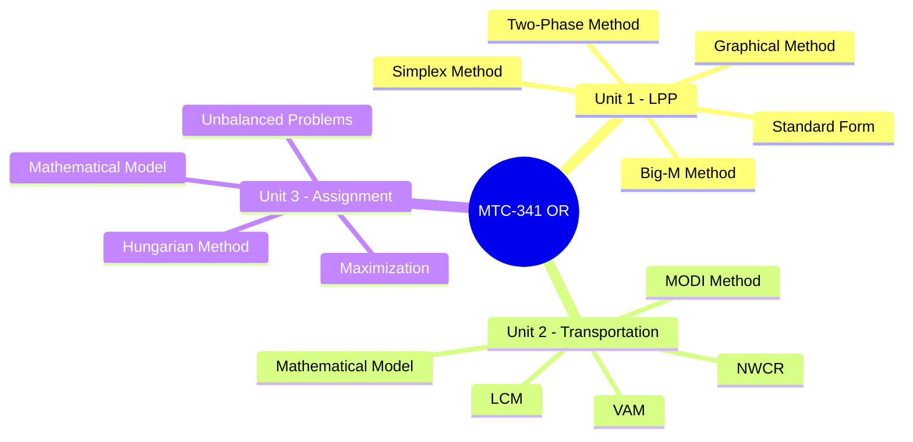

#  Mathematics Dashboard - TY B.Sc. CS

> [!important] Subject Info
> **Code:** MTC-341 MN: B | **Type:** Minor (Elective) | **Credits:** 2 | **Semester:** V
> **Focus:** Operations Research - Optimization techniques applied to real-world CS problems

---

## ️ Navigation Hub

| Section | Link | Status |
|---------|------|--------|
|  Formula Sheet | [[Formula-Sheet]] |  Ready |
|  Solved Problems | [[Solved-Problems]] |  Ready |
|  Unit 1 - LPP | [[Unit-1]] |  Ready |
|  Unit 2 - Transportation | [[Unit-2]] |  Ready |
|  Unit 3 - Assignment | [[Unit-3]] |  Ready |
|  Revision Notes | [[Revision]] |  Ready |
|  Past Year Questions | [[PYQ]] |  Ready |

---

##  Course Overview

> [!note] What is Operations Research?
> Operations Research (OR) is a discipline that uses advanced analytical methods to improve decision-making. It applies mathematical modeling, statistical analysis, and optimization to find the best possible solutions.

### Syllabus Breakdown

---

##  Unit-wise Topic Summary

### Unit 1: Linear Programming Problem (12 Hours)

| Topic | Key Concepts | Status |
|-------|-------------|--------|
| 1.1 Introduction to LPP | Decision variables, objective function, constraints | ⬜ |
| 1.2 Formulation | Converting word problems to LPP | ⬜ |
| 1.3 Graphical Method | Feasible region, corner points | ⬜ |
| 1.4 Simplex Method | Tableau, pivot operations, optimality | ⬜ |
| 1.5 Big-M / Two-Phase | Artificial variables, M penalty | ⬜ |

### Unit 2: Transportation Problem (10 Hours)

| Topic | Key Concepts | Status |
|-------|-------------|--------|
| 2.1 Mathematical Model | Sources, destinations, cost matrix | ⬜ |
| 2.2 North West Corner | Starting basic feasible solution | ⬜ |
| 2.3 Least Cost Method | Min cost allocation | ⬜ |
| 2.4 VAM | Vogel's Approximation Method | ⬜ |
| 2.5 MODI Method | Optimality test, stepping stone | ⬜ |

### Unit 3: Assignment Problem (8 Hours)

| Topic | Key Concepts | Status |
|-------|-------------|--------|
| 3.1 Mathematical Model | n×n cost matrix, 0-1 assignment | ⬜ |
| 3.2 Hungarian Method | Row/col reduction, augmenting paths | ⬜ |
| 3.3 Unbalanced & Restricted | Dummy rows/cols, forbidden cells | ⬜ |
| 3.4 Maximization | Convert to minimization via max - cij | ⬜ |

---

##  Embedded Formula Sheet

![[Formula-Sheet]]

---

##  Exam Strategy

> [!tip] High-Weightage Topics
> 1. **Simplex Method** - Always appears (8–10 marks)
> 2. **VAM + MODI** - Complete transportation solution (10–12 marks)
> 3. **Hungarian Method** - Assignment (8–10 marks)
> 4. **Big-M Method** - Often asked (6–8 marks)

### Expected Paper Pattern

| Question Type | Marks | Topics |
|--------------|-------|--------|
| Q1 - Compulsory | 20 | All units short answers |
| Q2 or Q3 - LPP | 15 | Simplex / Big-M |
| Q4 or Q5 - Transportation | 15 | VAM + MODI |
| Q6 or Q7 - Assignment | 15 | Hungarian |

---

##  Progress Tracker

### Study Progress
- [ ] Unit 1 - Read once
- [ ] Unit 1 - Solved 3 problems
- [ ] Unit 2 - Read once
- [ ] Unit 2 - Solved 3 problems
- [ ] Unit 3 - Read once
- [ ] Unit 3 - Solved 3 problems
- [ ] Formula Sheet - Memorized
- [ ] PYQ - Completed
- [ ] Mock Test - Done

### Revision Checklist
- [ ] Simplex Tableau - Can do without reference
- [ ] Big-M setup - Know when to use M
- [ ] Transportation NWCR → VAM → MODI full flow
- [ ] Hungarian Method - All steps memorized

---

##  Quick Reference

> [!note] Key Definitions to Know
> - **Feasible Solution:** Satisfies all constraints
> - **Basic Feasible Solution (BFS):** m+n-1 allocations in transportation
> - **Optimal Solution:** Best value of objective function
> - **Degenerate Solution:** Less than m+n-1 basic variables
> - **Unbounded Solution:** Objective function increases indefinitely

---

##  Study Schedule

| Week | Focus | Target |
|------|-------|--------|
| Week 1 | Unit 1 Theory + 3 Simplex problems | Understand tableau |
| Week 2 | Unit 1 Big-M + 2 Two-phase problems | Master artificial vars |
| Week 3 | Unit 2 All 3 initial methods | BFS proficiency |
| Week 4 | Unit 2 MODI + Unit 3 Hungarian | Optimality checks |
| Week 5 | PYQ + Mock tests | Speed + accuracy |

---

##  Backlinks & Related

- [[../01-Core-Subjects/Semester-V/CS-301-Core-Java/Dashboard|CS-301 Dashboard]]
- [[../07-Exams/Semester-V/Last-Minute-Revision|Last Minute Revision]]
- [[Formula-Sheet|Mathematics Formula Sheet]]

---

*Last Updated: 2026-06-16 | Semester V | MTC-341 MN:B*
