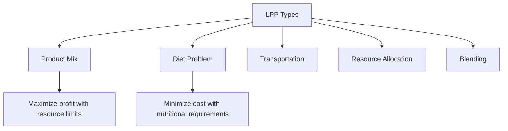

[[00-Dashboard/Home|Home]] | [[03-Mathematics/Mathematics-Dashboard|Mathematics]] | [[Unit-1]] | [[Unit-2]] | [[Unit-3]] | [[Formula-Sheet]] | [[PYQ]]


# Unit 1 - Linear Programming Problem (LPP)

> [!important] Unit Overview
> **Hours:** 12 | **Weightage:** ~35% of exam
> **Topics:** Introduction, Formulation, Graphical Method, Simplex Method, Big-M Method, Two-Phase Method

---

## Learning Objectives

By the end of this unit, you should be able to:
- [ ] Formulate real-world problems as LPP
- [ ] Solve LPP graphically (2-variable problems)
- [ ] Apply Simplex method with tableau
- [ ] Use Big-M method for artificial variables
- [ ] Apply Two-Phase method
- [ ] Identify special cases (unbounded, infeasible, degenerate)

---

## 1.1 Introduction to Linear Programming

### What is LPP?

==Linear Programming Problem (LPP)== is a mathematical technique for ==optimizing== (maximizing or minimizing) a **linear objective function** subject to a set of **linear constraints**.

> [!note] Key Components of LPP
> 1. **Decision Variables** ($x_1, x_2, \ldots, x_n$): Unknown quantities to determine
> 2. **Objective Function** ($Z$): Linear function to maximize/minimize
> 3. **Constraints**: Linear inequalities/equalities that restrict variables
> 4. **Non-negativity Restriction**: $x_i \geq 0$

### Historical Context

- Developed by **George Dantzig** in 1947 (Simplex method)
- Widely used in: resource allocation, production planning, transportation, diet problems

### Assumptions of LPP

| Assumption | Meaning |
|-----------|---------|
| **Linearity** | Objective and constraints are linear |
| **Certainty** | All parameters known with certainty |
| **Divisibility** | Variables can take fractional values |
| **Non-negativity** | Variables $\geq 0$ |
| **Additivity** | Total effect = sum of individual effects |

---

## 1.2 Formulation of LPP

### General Steps for Formulation

1. **Identify Decision Variables**: What quantities to determine?
2. **Formulate Objective Function**: What to optimize?
3. **Identify Constraints**: What are the limitations?
4. **Add non-negativity restrictions**

### Example - Product Mix Problem

**Problem:** A factory produces two products A and B.
- Product A: Profit ₹5, requires 2 hours machine time, 1 hour labor
- Product B: Profit ₹4, requires 1 hour machine time, 3 hours labor
- Available: 40 hours machine time, 60 hours labor

**Formulation:**

Let $x_1$ = units of A, $x_2$ = units of B

$$\text{Maximize } Z = 5x_1 + 4x_2$$

Subject to:
$$2x_1 + x_2 \leq 40 \quad (\text{Machine time})$$
$$x_1 + 3x_2 \leq 60 \quad (\text{Labor})$$
$$x_1, x_2 \geq 0$$

### Common Problem Types



---

## 1.3 Graphical Method

> [!note] Applicable only for 2-variable LPP

### Steps

1. **Convert inequalities to equalities** and plot each constraint as a line
2. **Determine feasible region**: intersection of all constraint half-planes (+ non-negativity)
3. **Identify corner points** (vertices) of feasible region
4. **Evaluate** $Z$ at each corner point
5. **Select optimal**: Maximum $Z$ for maximization, minimum $Z$ for minimization

### Solved Example (Graphical)

Using the product mix problem above:

| Corner Point | $x_1$ | $x_2$ | $Z = 5x_1 + 4x_2$ |
|-------------|--------|--------|-------------------|
| $O(0, 0)$ | 0 | 0 | **0** |
| $A(20, 0)$ | 20 | 0 | **100** |
| $B(12, 16)$ | 12 | 16 | **124** ← Maximum |
| $C(0, 20)$ | 0 | 20 | **80** |

**Optimal:** $x_1 = 12, x_2 = 16, Z = 124$

### Convex Set and Extreme Points

> [!note] Fundamental Theorem of LPP
> If an optimal solution exists, it occurs at an **extreme point** (corner point) of the feasible region.

---

## 1.4 Simplex Method

### Overview

The ==Simplex Method== is an iterative algebraic procedure that moves from one **basic feasible solution** (BFS) to an adjacent BFS, improving the objective function at each step.

### Key Terminology

| Term | Definition |
|------|-----------|
| **Slack Variable** ($s_i$) | Added to $\leq$ constraint to convert to $=$ |
| **Surplus Variable** ($s_i$) | Subtracted from $\geq$ constraint |
| **Basic Variable** | Variable in the current basis (value $\geq 0$) |
| **Non-basic Variable** | Variable set to zero |
| **Basis** | Set of $m$ basic variables |
| **BFS** | Basic feasible solution (all basic vars $\geq 0$) |
| **Pivot Element** | Element at intersection of pivot row and column |

### Converting to Standard Form

For **$\leq$ constraints**: Add slack variable $s_i$
$$3x_1 + 2x_2 \leq 12 \implies 3x_1 + 2x_2 + s_1 = 12$$

For **$\geq$ constraints**: Subtract surplus, add artificial
$$2x_1 + x_2 \geq 6 \implies 2x_1 + x_2 - s_2 + A_1 = 6$$

For **$=$ constraints**: Add artificial variable only
$$x_1 + x_2 = 4 \implies x_1 + x_2 + A_1 = 4$$

### Simplex Tableau Structure

$$\begin{array}{c|ccccc|c}
\text{Basis} & c_B & x_1 & x_2 & s_1 & s_2 & b \\
\hline
s_1 & 0 & 2 & 1 & 1 & 0 & 40 \\
s_2 & 0 & 1 & 3 & 0 & 1 & 60 \\
\hline
z_j & & 0 & 0 & 0 & 0 & 0 \\
c_j - z_j & & 5 & 4 & 0 & 0 & \\
\end{array}$$

### Complete Simplex Algorithm

```
1. Set up initial BFS with slack variables as basis
2. Compute z_j = Σ c_Bi * a_ij for each column j
3. Compute c_j - z_j (net evaluation row)
4. OPTIMALITY CHECK:
   - If all c_j - z_j ≤ 0 → OPTIMAL (stop)
   - Else: most positive c_j - z_j → entering variable (pivot column k)
5. RATIO TEST (find leaving variable):
   - Compute θ_i = b_i / a_ik for all a_ik > 0
   - min(θ_i) → leaving variable (pivot row r)
   - If no a_ik > 0 → UNBOUNDED (stop)
6. PIVOT OPERATION:
   - Divide pivot row by pivot element
   - Eliminate pivot column in all other rows
   - Update basis: leaving var → entering var
7. Go to step 2
```

### Iteration Example (Product Mix)

**Objective:** Maximize $Z = 5x_1 + 4x_2$

$c_j$: 5 4 0 0

**Initial Tableau:**

| Basis | $c_B$ | $x_1$ | $x_2$ | $s_1$ | $s_2$ | $b$ | Ratio |
|-------|--------|--------|--------|--------|--------|------|-------|
| $s_1$ | 0 | **2** | 1 | 1 | 0 | 40 | 40/2=20 |
| $s_2$ | 0 | 1 | 3 | 0 | 1 | 60 | 60/1=60 |
| $z_j$ | | 0 | 0 | 0 | 0 | 0 | |
| $c_j-z_j$ | | **5** | 4 | 0 | 0 | | |

Most positive $c_j - z_j = 5$ → $x_1$ enters. Min ratio = 20 → $s_1$ leaves.
Pivot element = 2.

**After Iteration 1** ($x_1$ enters, pivot element = 2):
- New R1 = R1 ÷ 2
- New R2 = R2 - 1×(new R1)

| Basis | $c_B$ | $x_1$ | $x_2$ | $s_1$ | $s_2$ | $b$ | Ratio |
|-------|--------|--------|--------|--------|--------|------|-------|
| $x_1$ | 5 | 1 | 1/2 | 1/2 | 0 | 20 | 20/(1/2)=40 |
| $s_2$ | 0 | 0 | **5/2** | -1/2 | 1 | 40 | 40/(5/2)=**16** |
| $z_j$ | | 5 | 5/2 | 5/2 | 0 | 100 | |
| $c_j-z_j$ | | 0 | **3/2** | -5/2 | 0 | | |

Still positive $c_j - z_j = 3/2$ → $x_2$ enters. $s_2$ leaves.

**After Iteration 2** (optimal):

| Basis | $c_B$ | $x_1$ | $x_2$ | $s_1$ | $s_2$ | $b$ |
|-------|--------|--------|--------|--------|--------|------|
| $x_1$ | 5 | 1 | 0 | 3/5 | -1/5 | 12 |
| $x_2$ | 4 | 0 | 1 | -1/5 | 2/5 | 16 |
| $z_j$ | | 5 | 4 | 11/5 | 3/5 | 124 |
| $c_j-z_j$ | | 0 | 0 | -11/5 | -3/5 | |

All $c_j - z_j \leq 0$ → **Optimal!**
$x_1 = 12, x_2 = 16, Z = 124$

---

## 1.5 Big-M Method

### When to Use

Use when constraints contain **$\geq$** or **$=$** (need artificial variables for initial BFS).

### The Penalty M

- For **maximization**: Assign $-M$ (very large negative) to artificial variable cost
- For **minimization**: Assign $+M$ (very large positive) to artificial variable cost
- $M$ is chosen as a number much larger than any coefficient

### Example: Big-M Method

**Problem:** Minimize $Z = 3x_1 + 2x_2$

Subject to:
$$x_1 + x_2 = 4 \quad \text{...(1)}$$
$$2x_1 + x_2 \geq 6 \quad \text{...(2)}$$
$$x_1, x_2 \geq 0$$

**Standard form** (add surplus $s_1$, artificials $A_1, A_2$):
$$x_1 + x_2 + A_1 = 4 \quad (A_1 \geq 0)$$
$$2x_1 + x_2 - s_1 + A_2 = 6 \quad (s_1, A_2 \geq 0)$$

**Objective (Minimize):**
$$Z = 3x_1 + 2x_2 + 0 \cdot s_1 + MA_1 + MA_2$$

**Initial Tableau** with Basis = {$A_1, A_2$}:

| Basis | $c_B$ | $x_1$ | $x_2$ | $s_1$ | $A_1$ | $A_2$ | $b$ |
|-------|--------|--------|--------|--------|--------|--------|------|
| $A_1$ | M | 1 | 1 | 0 | 1 | 0 | 4 |
| $A_2$ | M | 2 | 1 | -1 | 0 | 1 | 6 |

**Proceed with Simplex** (minimize: choose most negative $c_j - z_j$):
- $z_j$ for $x_1 = M(1) + M(2) = 3M$, so $c_j - z_j = 3 - 3M$
- $z_j$ for $x_2 = M(1) + M(1) = 2M$, so $c_j - z_j = 2 - 2M$

Since $M$ is very large, $3 - 3M$ is most negative → $x_1$ enters.

> [!note] Big-M Termination
> - If all artificial variables = 0 in optimal solution → **feasible optimal found**
> - If any artificial variable > 0 in optimal → **problem is infeasible**

---

## 1.6 Two-Phase Method

### Phase I: Find Initial BFS

$$\text{Minimize } w = \sum A_i \quad \text{(sum of artificial variables)}$$
Subject to original constraints.

- If $w^* = 0$: feasible solution exists → proceed to Phase II
- If $w^* > 0$: original problem is infeasible

### Phase II: Optimize Original

Use Phase I's optimal tableau, replace objective with original $Z$, remove artificial variable columns, continue Simplex.

---

## 1.7 Special Cases in LPP

### 1. Unbounded Solution

> [!warning] Unbounded
> During ratio test, if **all ratios are negative or undefined** (no positive element in pivot column), the problem is **unbounded** - objective can be increased indefinitely.

### 2. Infeasible Solution

> [!warning] Infeasible
> No feasible region exists - constraints are contradictory. In Big-M: artificial variable remains in basis at optimum with positive value.

### 3. Degenerate Solution

When **minimum ratio = 0** or multiple equal minimum ratios → **degeneracy**.
- Degenerate BFS has at least one basic variable = 0
- May cause **cycling** in Simplex (use Bland's rule to avoid)

**Bland's Rule:** Always choose the smallest index entering/leaving variable.

### 4. Multiple Optimal Solutions

> [!tip] Multiple Optimal
> If at optimum, $c_j - z_j = 0$ for a **non-basic variable**, then an **alternate optimal solution** exists (any point on the optimal edge is optimal).

### 5. Summary Table

| Case | Indication | What It Means |
|------|-----------|--------------|
| **Unbounded** | No finite optimum | Model needs additional constraints |
| **Infeasible** | No feasible region | Constraints contradictory |
| **Degenerate** | Zero basic variable | May cause cycling |
| **Multiple Optimal** | Zero $c_j-z_j$ for non-basic | Many optimal solutions |

---

## Interview / Viva Questions

> [!note] Common Questions
> 1. What is the difference between Big-M and Two-Phase method?
> 2. When does an LPP have no solution?
> 3. What is degeneracy in Simplex? How is it resolved?
> 4. Explain the significance of $c_j - z_j$.
> 5. What is the fundamental theorem of linear programming?
> 6. Why are slack variables added? What do they represent?
> 7. How do you convert a maximization to minimization?
> 8. What is meant by basic and non-basic variables?

---

## Key Definitions ^key-definitions

| Term | Definition |
|------|-----------|
| ==Feasible Region== | Set of all points satisfying all constraints |
| ==Objective Function== | Linear function to be optimized |
| ==Slack Variable== | Variable added to convert $\leq$ to $=$ |
| ==Artificial Variable== | Variable added for initial BFS in $\geq$ or $=$ |
| ==Pivot== | Process of changing basis variables in Simplex |
| ==BFS== | Basic Feasible Solution |
| ==Degenerate BFS== | BFS with at least one basic variable = 0 |

---

## Revision Summary

> [!tip] Unit 1 Summary
> - **LPP** = optimize linear objective subject to linear constraints
> - **Graphical**: only for 2 variables; evaluate $Z$ at corner points
> - **Simplex**: most positive $c_j-z_j$ enters; minimum ratio leaves
> - **Big-M**: add artificials with penalty M; if artificial remains at end → infeasible
> - **Two-Phase**: Phase I minimize artificials; Phase II optimize original
> - **Special Cases**: Unbounded (no ratio), Infeasible (contradictory), Degenerate (zero ratio), Multiple optimal ($c_j-z_j = 0$ non-basic)

---

## References

- [[Formula-Sheet#A.1 Linear Programming Problem (LPP)|Formula Sheet - LPP Section]]
- [[Solved-Problems|Solved Problems - Unit 1]]
- [[PYQ|Past Year Questions]]

---

*Unit 1 | MTC-341 MN:B | Semester V | 12 Hours | Last Updated: 2026-06-16*
