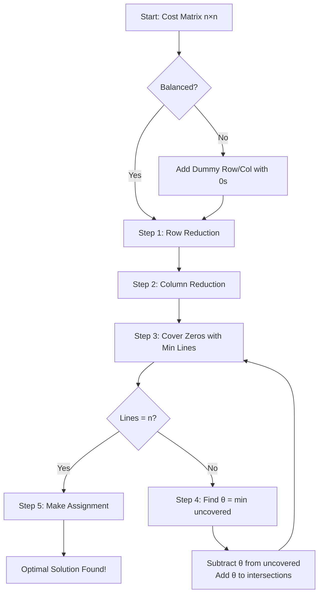

# Unit 3 - Assignment Problem

> [!important] Unit Overview
> **Hours:** 8 | **Weightage:** ~30% of exam
> **Topics:** Mathematical Model, Hungarian Method, Unbalanced & Restricted, Maximization

---

## Learning Objectives

- [ ] Model assignment problems mathematically
- [ ] Apply Hungarian method systematically
- [ ] Handle unbalanced assignment problems (add dummy)
- [ ] Solve maximization assignment problems
- [ ] Handle restricted/forbidden assignments

---

## 3.1 Introduction and Mathematical Model

### What is the Assignment Problem?

The ==Assignment Problem== is a special case of transportation problem where:
- **$m$ persons** (resources) are to be assigned to **$n$ jobs** (tasks)
- Each person is assigned to **exactly one** job
- Each job is assigned to **exactly one** person
- Goal: ==minimize total cost== (or maximize total profit)

> [!note] Special Structure
> Assignment problem is a **0-1 programming** problem - $x_{ij} \in \{0,1\}$
> It is a special transportation problem with all supply = 1 and all demand = 1.

### Mathematical Model

$$\text{Minimize } Z = \sum_{i=1}^{n}\sum_{j=1}^{n} c_{ij} x_{ij}$$

Subject to:
$$\sum_{j=1}^{n} x_{ij} = 1 \quad \forall i = 1, 2, \ldots, n \quad (\text{Each person assigned once})$$
$$\sum_{i=1}^{n} x_{ij} = 1 \quad \forall j = 1, 2, \ldots, n \quad (\text{Each job assigned once})$$
$$x_{ij} \in \{0, 1\}$$

where $c_{ij}$ = cost of assigning person $i$ to job $j$.

### Comparison: TP vs AP

| Feature | Transportation | Assignment |
|---------|---------------|-----------|
| Supply per source | $a_i$ (any value) | 1 |
| Demand per destination | $b_j$ (any value) | 1 |
| Variables | $x_{ij} \geq 0$ | $x_{ij} \in \{0,1\}$ |
| Matrix size | $m \times n$ | $n \times n$ |
| Solution method | MODI | Hungarian |

### Cost Matrix Example

| | Job 1 | Job 2 | Job 3 | Job 4 |
|-|-------|-------|-------|-------|
| **Person A** | 9 | 2 | 7 | 8 |
| **Person B** | 6 | 4 | 3 | 7 |
| **Person C** | 5 | 8 | 1 | 8 |
| **Person D** | 7 | 6 | 9 | 4 |

---

## 3.2 Hungarian Method (Kuhn-Tucker Algorithm)

### History

Developed by **Harold Kuhn** in 1955, based on earlier work by Hungarian mathematicians **Egerváry** and **König**. Also called the **Kuhn-Munkres algorithm**.

> [!tip] Key Insight
> The optimal assignment is found by working with **reduced cost matrix** - subtracting row/column minima preserves relative costs and creates zeros that correspond to potential assignments.

###  Complete Hungarian Method - Step by Step

#### Step 1: Row Reduction
For each row, subtract the **row minimum** from all elements in that row:
$$c_{ij}' = c_{ij} - \min_k(c_{ik})$$

#### Step 2: Column Reduction  
For each column of the reduced matrix, subtract the **column minimum**:
$$c_{ij}'' = c_{ij}' - \min_k(c_{kj}')$$

#### Step 3: Cover All Zeros
Draw the **minimum number of horizontal and vertical lines** to cover all zeros.

> [!important] Key Rule
> Minimum number of lines to cover all zeros = **maximum matching** in bipartite graph = optimal assignment size
> - If lines $= n$ → **Go to Step 5** (find assignment)
> - If lines $< n$ → **Go to Step 4**

#### Step 4: Revise the Matrix

$$\theta = \min(\text{all uncovered elements})$$

- **Uncovered elements**: subtract $\theta$
- **Elements covered by 1 line**: unchanged
- **Elements covered by 2 lines** (intersection): add $\theta$
- **Return to Step 3**

#### Step 5: Make Optimal Assignment

1. Find row with **exactly one zero** → assign (mark with □)
2. Cross out all zeros in that column (×)
3. Repeat for columns with exactly one remaining zero
4. If ties, try different combinations
5. Repeat until all $n$ assignments made

###  Complete Worked Example

**Problem:** Minimize cost using Hungarian method:

| | J1 | J2 | J3 | J4 |
|-|----|----|----|-----|
| **P1** | 9 | 2 | 7 | 8 |
| **P2** | 6 | 4 | 3 | 7 |
| **P3** | 5 | 8 | 1 | 8 |
| **P4** | 7 | 6 | 9 | 4 |

#### Step 1: Row Reduction

Row minima: R1→2, R2→3, R3→1, R4→4

| | J1 | J2 | J3 | J4 |
|-|----|----|----|-----|
| **P1** | 7 | **0** | 5 | 6 |
| **P2** | 3 | 1 | **0** | 4 |
| **P3** | 4 | 7 | **0** | 7 |
| **P4** | 3 | 2 | 5 | **0** |

#### Step 2: Column Reduction

Column minima: C1→3, C2→0, C3→0, C4→0

| | J1 | J2 | J3 | J4 |
|-|----|----|----|-----|
| **P1** | 4 | **0** | 5 | 6 |
| **P2** | **0** | 1 | **0** | 4 |
| **P3** | 1 | 7 | **0** | 7 |
| **P4** | **0** | 2 | 5 | **0** |

#### Step 3: Cover All Zeros

Zeros at: (1,2), (2,1), (2,3), (3,3), (4,1), (4,4)

Minimum lines to cover all zeros:
- Line through Column 1 (covers (2,1), (4,1))
- Line through Column 3 (covers (2,3), (3,3))
- Line through Row 1 (covers (1,2))
- Line through Row 4 (covers (4,4))

4 lines for $n = 4$ → **Proceed to Step 5**

#### Step 5: Make Assignment

Looking at zero positions:
- Row 1 → J2 (only zero in R1 at (1,2))
- Row 3 → J3 (only zero in R3 at (3,3))
- Row 4 → J4 (only zero left in R4)
- Row 2 → J1 (only remaining)

**Optimal Assignment:**
| Person | Job | Cost |
|--------|-----|------|
| P1 | J2 | 2 |
| P2 | J1 | 6 |
| P3 | J3 | 1 |
| P4 | J4 | 4 |
| **Total** | | **13** |

$$Z^* = 2 + 6 + 1 + 4 = \mathbf{13}$$

### When Step 4 is Needed (Example)

If after row and column reduction, we need fewer than $n$ lines:

Suppose uncovered minimum $\theta = 2$:
- All uncovered elements: subtract 2
- Elements at line intersections: add 2  
- Elements on exactly one line: unchanged

---

## 3.3 Unbalanced and Restricted Assignment

### 3.3.1 Unbalanced Assignment Problem

When number of persons $\neq$ number of jobs:

**Case 1: More Jobs than Persons** ($n_{jobs} > n_{persons}$)
- Add **dummy person(s)** with all costs = 0
- The job assigned to dummy will NOT be done (or done by someone else)

**Case 2: More Persons than Jobs** ($n_{persons} > n_{jobs}$)  
- Add **dummy job(s)** with all costs = 0
- The person assigned dummy job will be **idle**

> [!note] Making it Square
> Always pad to make $n \times n$ matrix before applying Hungarian method.
> Dummy assignments have zero cost and represent "not assigned."

### Example: Unbalanced (3 persons, 4 jobs)

| | J1 | J2 | J3 | J4 |
|-|----|----|----|-----|
| P1 | 3 | 4 | 2 | 5 |
| P2 | 6 | 2 | 7 | 4 |
| P3 | 5 | 3 | 1 | 6 |
| **Dummy** | **0** | **0** | **0** | **0** |

Add dummy row, then apply Hungarian method on $4 \times 4$ matrix.

---

### 3.3.2 Restricted Assignment Problem

Some assignments may be **impossible** or **forbidden** (e.g., person lacks skills for job).

**Method:** Assign a very large cost $M$ (or $\infty$) to the forbidden cell.

| | J1 | J2 | J3 |
|-|----|----|----|
| P1 | 5 | **M** | 6 |
| P2 | 3 | 4 | 2 |
| P3 | 7 | 3 | **M** |

- Cell (P1, J2): P1 cannot do J2
- Cell (P3, J3): P3 cannot do J3

Apply Hungarian method normally; the $M$ cells will never be assigned.

---

## 3.4 Maximization Assignment Problem

### Converting to Minimization

For profit/efficiency matrices, the goal is to **maximize** total profit.

**Method:**
$$c_{ij}^* = \max(C) - c_{ij}$$

where $\max(C)$ = maximum element in the entire matrix.

Or alternatively: $c_{ij}^* = -c_{ij}$ (negate all elements).

Apply Hungarian method to $c_{ij}^*$ for minimization.

### Example: Maximize Profit

**Profit Matrix:**

| | J1 | J2 | J3 |
|-|----|----|----|
| P1 | 7 | 5 | 9 |
| P2 | 3 | 6 | 8 |
| P3 | 4 | 7 | 5 |

Max element = 9. Loss matrix: $9 - c_{ij}$

**Loss Matrix:**

| | J1 | J2 | J3 |
|-|----|----|----|
| P1 | 2 | 4 | **0** |
| P2 | 6 | 3 | **1** |
| P3 | 5 | 2 | 4 |

Apply Hungarian method to loss matrix:

**Row Reduction** (subtract row min: 0, 1, 2):

| | J1 | J2 | J3 |
|-|----|----|----|
| P1 | 2 | 4 | **0** |
| P2 | 5 | 2 | **0** |
| P3 | 3 | **0** | 2 |

**Column Reduction** (subtract col min: 2, 0, 0):

| | J1 | J2 | J3 |
|-|----|----|----|
| P1 | **0** | 4 | **0** |
| P2 | 3 | 2 | **0** |
| P3 | 1 | **0** | 2 |

Zeros at: (1,1), (1,3), (2,3), (3,2)

Lines: Row 1, Column 3, Row 3 → 3 lines for $n=3$ 

Assignment:
- P3 → J2 (only zero in R3)
- P1 → J1 (J3 used by P2)
- P2 → J3

**Optimal Profit:** $c_{11} + c_{32} + c_{23} = 7 + 7 + 8 = 22$

---

## 3.5 Summary Flowchart

---

## Interview / Viva Questions

> [!note] Common Viva Questions
> 1. Why is it called the "Hungarian" method?
> 2. What is the difference between assignment and transportation problems?
> 3. How do you handle a maximization assignment problem?
> 4. What is a "dummy" row/column? When is it added?
> 5. How many lines are needed to cover all zeros in an optimal solution?
> 6. Can an assignment problem have multiple optimal solutions?
> 7. What is a restricted assignment problem?
> 8. Why do row and column reductions preserve optimality?

---

## Key Definitions

| Term | Definition |
|------|-----------|
| ==Assignment Problem== | 0-1 programming: assign $n$ persons to $n$ jobs, one-to-one |
| ==Hungarian Method== | Optimal algorithm for solving assignment problems |
| ==Reduced Cost Matrix== | Matrix after row/column reduction with zeros |
| ==Optimal Assignment== | Assignment where sum of costs is minimum |
| ==Dummy Row/Column== | Added to balance unequal-size assignment problems |
| ==Restricted Cell== | Forbidden assignment, given cost $M$ (infinity) |

---

## Revision Summary

> [!tip] Unit 3 Summary
> 1. **AP** = special TP with all supply/demand = 1; 0-1 variables
> 2. **Hungarian Steps**: Row reduce → Col reduce → Cover zeros → Revise (if needed) → Assign
> 3. **Optimality**: Lines to cover zeros = $n$
> 4. **Step 4** ($\theta$ operation): subtract $\theta$ from uncovered, add $\theta$ to doubly-covered
> 5. **Unbalanced**: Add dummy rows/cols with 0 costs
> 6. **Maximization**: Convert using $\max(C) - c_{ij}$, then minimize
> 7. **Restricted**: Set forbidden cell cost to $M$ (very large)

---

## References

- [[Formula-Sheet#A.3 Assignment Problem|Formula Sheet - Assignment]]
- [[Solved-Problems|Solved Problems - Unit 3]]
- [[Unit-2|Unit 2 - Transportation]] (related)

---

*Unit 3 | MTC-341 MN:B | Semester V | 8 Hours | Last Updated: 2026-06-16*
