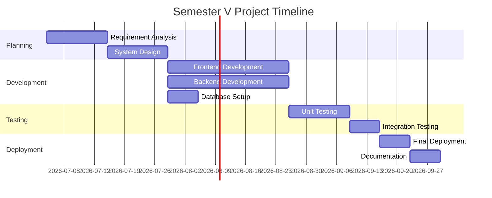

#  Semester V Project - Overview

> [!important] Project Status
> **Status:**  Planning Phase | **Semester:** V | **Academic Year:** 2026–27

---

##  Problem Statement

> *Define the core problem your project aims to solve.*

```
[Write your problem statement here]
Example: "Existing student record management systems lack real-time analytics
and mobile accessibility, leading to inefficiencies in academic tracking."
```

---

##  Project Objectives

- [ ] **Primary Objective:** _________________________
- [ ] **Secondary Objective 1:** _________________________
- [ ] **Secondary Objective 2:** _________________________
- [ ] **Secondary Objective 3:** _________________________

> [!tip] SMART Objectives
> Make objectives **S**pecific, **M**easurable, **A**chievable, **R**elevant, **T**ime-bound.

---

## ️ Tech Stack

| Layer | Technology | Version | Purpose |
|-------|-----------|---------|---------|
| **Frontend** | | | |
| **Backend** | | | |
| **Database** | | | |
| **Framework** | | | |
| **Tools** | | | |
| **Deployment** | | | |

---

##  Team Details

| Role | Name | Roll No | Responsibilities |
|------|------|---------|-----------------|
| Team Leader | | | Overall coordination, Backend |
| Member 2 | | | Frontend, UI/UX |
| Member 3 | | | Database, Testing |
| Member 4 | | | Documentation, Deployment |

- **Guide/Mentor:** _________________________
- **Department:** B.Sc. Computer Science
- **Institution:** _________________________

---

##  Requirements

###  Functional Requirements

1. **FR-01:** The system shall allow users to _______________
2. **FR-02:** The system shall provide _______________
3. **FR-03:** Users shall be able to _______________
4. **FR-04:** The system shall generate _______________
5. **FR-05:** Admin shall be able to _______________

### ️ Non-Functional Requirements

| Category | Requirement |
|----------|------------|
| **Performance** | System response time < 2 seconds |
| **Security** | Role-based access control (RBAC) |
| **Scalability** | Support up to ___ concurrent users |
| **Usability** | Intuitive UI, minimal training needed |
| **Reliability** | 99% uptime during working hours |
| **Portability** | Cross-platform / mobile-responsive |

---

##  Timeline & Milestones



###  Milestones Table

| # | Milestone | Target Date | Status |
|---|-----------|-------------|--------|
| M1 | Requirement Document Complete | | ⬜ Pending |
| M2 | System Design Document Ready | | ⬜ Pending |
| M3 | Database Schema Finalized | | ⬜ Pending |
| M4 | Frontend Prototype (50%) | | ⬜ Pending |
| M5 | Backend API Ready | | ⬜ Pending |
| M6 | Alpha Version Demo | | ⬜ Pending |
| M7 | Testing Complete | | ⬜ Pending |
| M8 | Final Submission | | ⬜ Pending |

---

##  Deliverables Checklist

### Documentation
- [ ] Project Proposal / Synopsis
- [ ] SRS (Software Requirements Specification)
- [ ] System Design Document (HLD + LLD)
- [ ] ER Diagram / Database Schema
- [ ] User Manual
- [ ] Technical Manual
- [ ] Final Project Report

### Development
- [ ] Source Code (GitHub Repository)
- [ ] Database Scripts
- [ ] Test Cases Document
- [ ] Deployment Instructions

### Presentations
- [ ] Mid-Semester Presentation
- [ ] Final Viva/Demo
- [ ] Poster (if required)

---

##  Learning Notes

> [!note] Key Concepts Learned During This Project
> Add new learnings here as the project progresses.

### Week-by-Week Learnings

| Week | Key Learning | Resource Used |
|------|-------------|---------------|
| 1 | | |
| 2 | | |
| 3 | | |

---

##  Related Notes

- [[Progress-Tracker]] - Project progress tracking
- [[01-Semester-V/Overview]] - Semester V overview
- [[06-Revision/Final-Revision/Semester-V-Final]] - Semester V final revision

---

##  References

1. _________________________
2. _________________________
3. _________________________

---

*Last updated: 2026-06-16 | Semester V TY B.Sc. CS*
