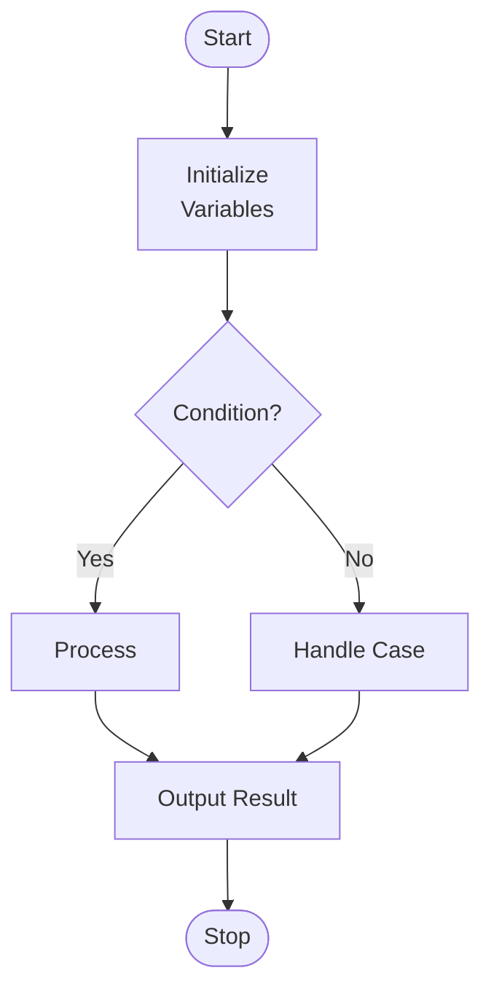

[[00-Dashboard/Home|Home]] | [[09-Templates/Templates-Dashboard|Templates Dashboard]]


# Experiment {{experiment_no}}: {{title}}

> [!note]  Experiment Info
> **Lab Course:** {{lab_course}} | **Code:** {{subject_code}}
> **Date:** {{date}} | **Roll No:** {{roll_number}} | **Batch:** {{batch}}
> **Status:** `{{status}}` | **Submission Date:** {{submission_date}}

---

## Aim

> State the aim of the experiment clearly in one or two sentences.

**To** 

---

## Objectives

After completing this experiment, you will be able to:

1. 
2. 
3. 

---

## Theory

> [!important] Theoretical Background
> Write the theory relevant to this experiment. Include definitions, concepts, and background knowledge needed to understand the experiment.

### Background

### Concepts Used

| Concept | Description |
|---|---|
|  |  |
|  |  |
|  |  |

### Relevant Definitions

- ==**Term 1:**== 
- ==**Term 2:**== 
- ==**Term 3:**== 

---

## Algorithm / Flowchart

### Algorithm

```
Step 1: 
Step 2: 
Step 3: 
Step 4: 
Step 5: 
Step 6: Stop
```

### Flowchart



---

## Program / Code

> [!tip] Source Code
> Write your complete, well-commented program below.

```java
// Experiment {{experiment_no}}: {{title}}
// Subject: {{subject_code}} | Date: {{date}}
// Roll No: {{roll_number}} | Batch: {{batch}}

// === Your code here ===


```

---

## Expected Output

```
[Write expected output here]
```

---

## Actual Output

```
[Paste actual output / screenshot description here]
```

> [!note] Output Observation
> **Does actual output match expected?** Yes / No
> **Reason for discrepancy (if any):**

---

## Viva Questions

> [!warning] Prepare these questions before viva!

**Q1:**
**A1:**

---

**Q2:**
**A2:**

---

**Q3:**
**A3:**

---

**Q4:**
**A4:**

---

**Q5:**
**A5:**

---

## Result / Conclusion

> [!tip]  Conclusion
> The experiment **"{{title}}"** was successfully / unsuccessfully completed.
>
> **Outcome:** 
>
> **Learning:** 

---

## Marks

| Component | Max Marks | Marks Obtained |
|---|---|---|
| Journal / Write-up | - | - |
| Program Execution | - | - |
| Viva | - | - |
| **Total** | - | - |

**Checked by:** {{professor}}
**Date of Checking:** 
**Remarks:** 

---

## Navigation

| | Link |
|---|---|
| ⬅ Previous Experiment | [[Experiment {{experiment_no - 1}}]] |
|  Next Experiment | [[Experiment {{experiment_no + 1}}]] |
|  Lab Overview | [[{{subject_code}} Lab Overview]] |
|  Dashboard | [[00-Dashboard/Home]] |

---

*Experiment recorded on: {{date}} | Submitted on: {{submission_date}}*
