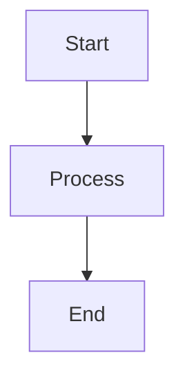
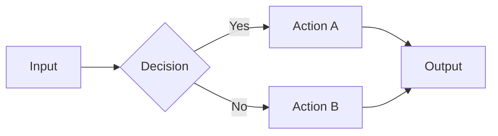

# Lecture {{lecture_number}}: {{title}}

> [!note]  Lecture Info
> **Subject:** {{subject}} (`{{subject_code}}`)
> **Date:** {{date}} | **Unit:** {{unit_number}} | **Lecture #:** {{lecture_number}}
> **Professor:** {{professor}} | **Venue:** {{venue}} | **Duration:** {{duration}}

---

##  Learning Objectives

By the end of this lecture, you should be able to:

1. 
2. 
3. 
4. 
5. 

---

##  Key Concepts

> [!important] Core Ideas
> List the most critical concepts introduced in this lecture.

- ==**Concept 1:**== 
- ==**Concept 2:**== 
- ==**Concept 3:**== 
- ==**Concept 4:**== 
- ==**Concept 5:**== 

---

##  Definitions

| Term | Definition |
|---|---|
|  |  |
|  |  |
|  |  |
|  |  |
|  |  |

---

##  Main Content

### Topic 1: 

<!-- Write detailed notes here. Use diagrams, examples, bullet points -->

### Topic 2: 

<!-- Use Mermaid diagrams where applicable -->

### Topic 3: 

---

##  Examples

### Example 1: 

**Problem:**

**Solution:**

**Explanation:**

---

### Example 2: 

**Problem:**

**Solution:**

**Explanation:**

---

## ️ Diagrams / Flowcharts

<!-- Insert images, hand-drawn notes, or Mermaid diagrams here -->

---

##  Summary

> [!tip]  Lecture Summary
> **In this lecture, we covered:**
> 1. 
> 2. 
> 3. 
>
> **Key Takeaway:** 

---

##  Questions & Doubts

> [!warning]  Questions to Clarify
> Note any doubts from this lecture for follow-up.

- [ ] 
- [ ] 
- [ ] 

---

##  Practice Questions

1. 
2. 
3. 
4. 
5. 

---

##  Navigation

| | Link |
|---|---|
| ⬅️ Previous Lecture | [[Lecture {{lecture_number - 1}}]] |
| ️ Next Lecture | [[Lecture {{lecture_number + 1}}]] |
|  Unit Overview | [[Unit {{unit_number}} Overview]] |
|  Subject Overview | [[{{subject}} Overview]] |
|  Dashboard | [[00-Dashboard/Home]] |

---

##  References

- **Textbook:** 
- **Chapter/Page:** 
- **Reference Book:** 
- **Online Resource:** 
- **Slides:** 

---

*Notes taken on: {{date}} | Last reviewed: {{date}}*
