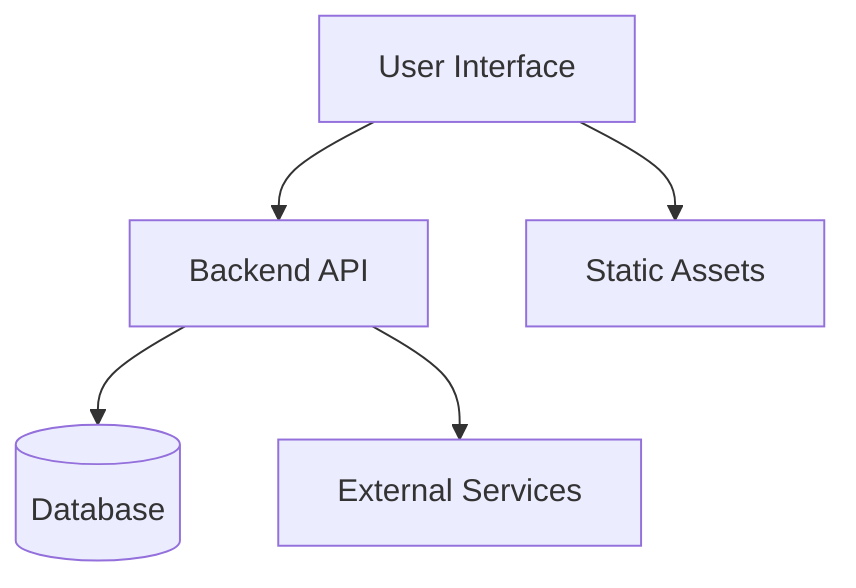

# ️ Project: {{project_name}}

> [!note]  Project Info
> **Type:** {{project_type}} | **Semester:** {{semester}} | **Subject:** {{subject_code}}
> **Status:** `planning` | **Guide:** {{guide_name}}
> **Duration:** {{start_date}} → {{end_date}} | **Team:** {{member_1}}, {{member_2}}, {{member_3}}
> **Repository:** [{{project_name}}]({{repo_url}})

---

##  Project Overview

> Write a brief 3–5 sentence overview of what this project is about, its purpose, and its significance.


---

##  Problem Statement

> [!important] Problem Being Solved
> State the problem clearly. What gap or need does this project address?

**Problem:**

**Current Limitations / Issues:**
- 
- 
- 

**Why This Matters:**

---

##  Objectives

By the end of this project, we aim to:

1. 
2. 
3. 
4. 
5. 

**Success Criteria:**
- [ ] 
- [ ] 
- [ ] 

---

## ️ Technology Stack

| Layer | Technology | Version | Purpose |
|---|---|---|---|
| **Frontend** |  |  |  |
| **Backend** |  |  |  |
| **Database** |  |  |  |
| **Framework** |  |  |  |
| **Tools** |  |  |  |
| **Platform** |  |  |  |

### Architecture Diagram



---

##  Requirements

### Functional Requirements

| # | Requirement | Priority | Status |
|---|---|---|---|
| FR-01 |  |  Must /  Should /  Could | ⬜ |
| FR-02 |  |  | ⬜ |
| FR-03 |  |  | ⬜ |
| FR-04 |  |  | ⬜ |
| FR-05 |  |  | ⬜ |

### Non-Functional Requirements

| # | Requirement | Category |
|---|---|---|
| NFR-01 |  | Performance / Security / Usability |
| NFR-02 |  |  |
| NFR-03 |  |  |

---

## ️ Timeline / Milestones

| Phase | Milestone | Start | End | Status | Deliverable |
|---|---|---|---|---|---|
| Phase 1 | Planning & Requirements | {{start_date}} | | ⬜ Pending | SRS Document |
| Phase 2 | System Design |  | | ⬜ Pending | Design Document |
| Phase 3 | Implementation |  | | ⬜ Pending | Source Code |
| Phase 4 | Testing & Debugging |  | | ⬜ Pending | Test Report |
| Phase 5 | Documentation |  | | ⬜ Pending | User Manual |
| Phase 6 | Final Presentation | | {{end_date}} | ⬜ Pending | Presentation |

### Gantt Chart

```mermaid
gantt
    title Project Timeline
    dateFormat YYYY-MM-DD
    section Planning
        Requirements Analysis   :a1, {{start_date}}, 7d
        System Design           :a2, after a1, 7d
    section Development
        Module 1 Implementation :b1, after a2, 14d
        Module 2 Implementation :b2, after b1, 14d
    section Testing
        Unit Testing            :c1, after b2, 7d
        Integration Testing     :c2, after c1, 5d
    section Delivery
        Documentation           :d1, after c2, 5d
        Final Presentation      :d2, after d1, 2d
```

---

##  Progress Tracker

### Phase 1: Planning & Requirements
- [ ] Define project scope
- [ ] Finalize team roles
- [ ] Prepare SRS document
- [ ] Get guide approval

### Phase 2: System Design
- [ ] Create ER diagram
- [ ] Design database schema
- [ ] Create system architecture
- [ ] Create UI wireframes
- [ ] Review with guide

### Phase 3: Implementation
- [ ] Set up development environment
- [ ] Set up repository (Git)
- [ ] Implement Module 1: 
- [ ] Implement Module 2: 
- [ ] Implement Module 3: 
- [ ] Code review

### Phase 4: Testing
- [ ] Write unit tests
- [ ] Perform integration testing
- [ ] User acceptance testing
- [ ] Fix bugs and issues

### Phase 5: Documentation
- [ ] Write project report
- [ ] Prepare user manual
- [ ] Record demo video
- [ ] Prepare presentation slides

### Phase 6: Submission
- [ ] Final code cleanup
- [ ] Push to repository
- [ ] Submit project report
- [ ] Demo presentation

---

##  Team Members & Roles

| Member | Role | Responsibilities | Contact |
|---|---|---|---|
| {{member_1}} | Project Lead | Overall coordination, Module A |  |
| {{member_2}} | Developer | Module B, Testing |  |
| {{member_3}} | Designer | UI/UX, Documentation |  |

---

##  Meeting Notes

### Meeting 1 - {{start_date}}

**Attendees:**
**Agenda:**
**Decisions Made:**
**Action Items:**
- [ ] (Name): 
- [ ] (Name): 

---

### Meeting 2 - 

**Attendees:**
**Agenda:**
**Decisions Made:**
**Action Items:**
- [ ] 

---

##  Learning Notes

> [!tip] What We Learned Building This Project

### Technical Learnings

1. 
2. 
3. 

### Process Learnings

1. 
2. 

### Challenges & Solutions

| Challenge | Solution | Lesson |
|---|---|---|
|  |  |  |
|  |  |  |
|  |  |  |

---

##  Evaluation

| Component | Max Marks | Marks Obtained | Remarks |
|---|---|---|---|
| Project Report | | | |
| Implementation | | | |
| Presentation | | | |
| Viva | | | |
| **Total** | | | |

**Evaluated by:** {{guide_name}}
**Evaluation Date:** 

---

##  References & Resources

| Resource | Type | Link / Details |
|---|---|---|
|  | Research Paper |  |
|  | Documentation |  |
|  | Tutorial |  |
|  | GitHub Repo |  |
|  | Textbook |  |

---

##  Navigation

- [[05-Projects/Overview| Projects Overview]]
- [[00-Dashboard/Home| Dashboard]]
- Repository: [{{project_name}}]({{repo_url}})

---

*Project started: {{start_date}} | Deadline: {{end_date}} | Guide: {{guide_name}}*
