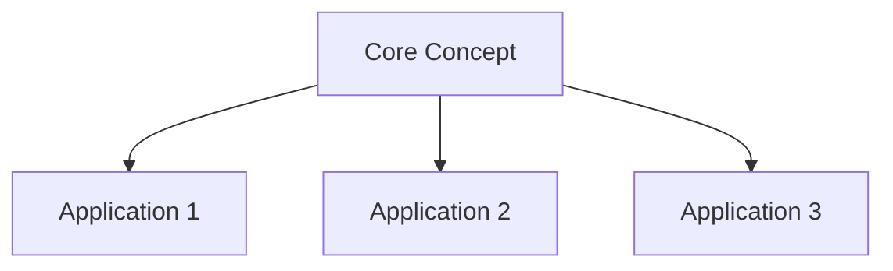

[[00-Dashboard/Home|Home]] | [[09-Templates/Templates-Dashboard|Templates Dashboard]]

# Revision: {{subject}} - {{revision_type}} Review

> [!note]  Revision Session Info
> **Subject:** {{subject}} (`{{subject_code}}`) | **Semester:** {{semester}}
> **Type:** {{revision_type}} | **Date:** {{date}} | **Round:** {{revision_round}}
> **Unit/Scope:** {{unit_or_all}} | **Duration:** {{duration}} mins
> **Confidence Before:** {{score_before}}/10 → **After:** {{score_after}}/10

---

## Quick Review Checklist

> Tick off each item as you revise it. Be honest - don't tick unless you truly understand it.

### Unit 1: 
- [ ] Core concept / definition
- [ ] Key algorithms / methods
- [ ] Example / solved problem
- [ ] Diagram / flowchart

### Unit 2: 
- [ ] Core concept / definition
- [ ] Key algorithms / methods
- [ ] Example / solved problem
- [ ] Diagram / flowchart

### Unit 3: 
- [ ] Core concept / definition
- [ ] Key algorithms / methods
- [ ] Example / solved problem
- [ ] Diagram / flowchart

### Unit 4: 
- [ ] Core concept / definition
- [ ] Key algorithms / methods
- [ ] Example / solved problem
- [ ] Diagram / flowchart

### Unit 5: 
- [ ] Core concept / definition
- [ ] Key algorithms / methods
- [ ] Example / solved problem
- [ ] Diagram / flowchart

---

## Key Formulas

> [!important]  Must-Know Formulas - Verify you can write these from memory!

| Formula | Description | Unit |
|---|---|---|
|  |  |  |
|  |  |  |
|  |  |  |
|  |  |  |
|  |  |  |
|  |  |  |

---

## Important Definitions

> Write these from memory first, then check your notes.

| Term | Definition (Your Own Words) | Verified? |
|---|---|---|
|  |  |  /  |
|  |  |  /  |
|  |  |  /  |
|  |  |  /  |
|  |  |  /  |
|  |  |  /  |
|  |  |  /  |
|  |  |  /  |
|  |  |  /  |
|  |  |  /  |

---

## Common Mistakes to Avoid

> [!warning]  Don't Make These Errors!

| Mistake | Why It's Wrong | What to Do Instead |
|---|---|---|
|  |  |  |
|  |  |  |
|  |  |  |
|  |  |  |
|  |  |  |

### Tricky Concepts / Confusing Areas

-  **Don't confuse:** X vs Y
  - **X is:** 
  - **Y is:** 
  
-  **Common misconception:** 
  - **Reality:** 
  
-  **Exam trap:** 
  - **Correct approach:** 

---

## 5-Minute Summary

> [!tip]  If You Only Have 5 Minutes - Read This!

### {{subject}} at a Glance

**What this subject is about:**

**The 5 Most Important Topics:**
1. 
2. 
3. 
4. 
5. 

**The #1 Thing to Remember:**
> ==**Key Insight:**== 

**Critical Diagram:**

---

## Interview Questions Quick Fire

> [!tip] Answer these out loud or in writing - time yourself!

| # | Question | Time to Answer | Got It? |
|---|---|---|---|
| 1 |  | 30 sec |  /  |
| 2 |  | 30 sec |  /  |
| 3 |  | 30 sec |  /  |
| 4 |  | 60 sec |  /  |
| 5 |  | 60 sec |  /  |
| 6 |  | 60 sec |  /  |
| 7 |  | 30 sec |  /  |
| 8 |  | 30 sec |  /  |
| 9 |  | 90 sec |  /  |
| 10 |  | 90 sec |  /  |

**Quick Fire Score:** ___/10

---

## Self Assessment

> [!note]  How Well Do You Know This Subject?

### Unit-by-Unit Rating

| Unit | Topic | Confidence (1–10) | Action Needed |
|---|---|---|---|
| 1 |  | /10 | Revise / Practice / Ready |
| 2 |  | /10 | Revise / Practice / Ready |
| 3 |  | /10 | Revise / Practice / Ready |
| 4 |  | /10 | Revise / Practice / Ready |
| 5 |  | /10 | Revise / Practice / Ready |

### Overall Assessment

| Metric | Rating |
|---|---|
| **Conceptual Understanding** |  |
| **Formula Recall** |  |
| **Problem Solving** |  |
| **Diagram Drawing** |  |
| **Exam Readiness** |  |

### My Weakest Areas (Focus for Next Revision)

1. 
2. 
3. 

### My Action Plan

- [ ] Re-read: 
- [ ] Practice problems from: 
- [ ] Watch video on: 
- [ ] Ask teacher about: 

---

## Related Notes

- [[{{subject}} Overview]]
- [[{{subject}} Unit 1 Notes]]
- [[{{subject}} Unit 2 Notes]]
- [[01-Semester-V/CS-302-MJ-T-Operating-Systems/Overview|Revision Hub]]
- [[07-Exams/{{subject}}-Exam-Prep|Exam Prep]]
- [[00-Dashboard/Home| Dashboard]]

---

*Revised on: {{date}} | Next revision: {{next_revision_date}} | Round: {{revision_round}}*
