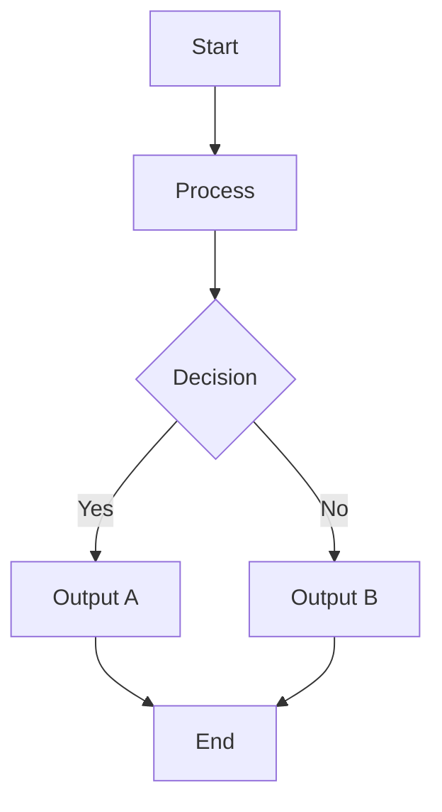
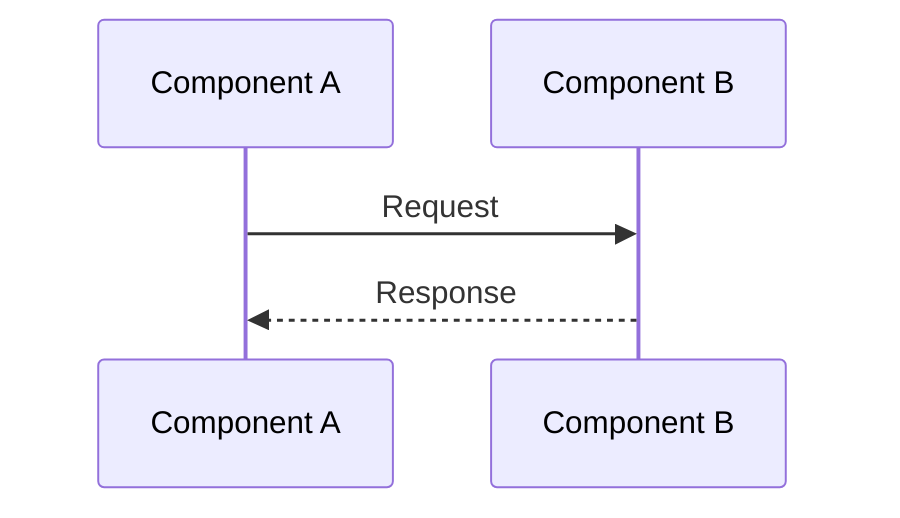

[[00-Dashboard/Home|Home]] | [[09-Templates/Templates-Dashboard|Templates Dashboard]]


# Unit {{unit_number}}: {{title}}

> [!note]  Unit Info
> **Subject:** {{subject}} (`{{subject_code}}`) | **Semester:** {{semester}}
> **Unit:** {{unit_number}} | **Status:** `not-started`
> **Started:** {{date_started}} | **Completed:** - | **Last Revised:** -

---

## Learning Objectives

> From the official syllabus - master all of these!

By the end of this unit, you should be able to:

1. 
2. 
3. 
4. 
5. 
6. 

---

## Topics Covered (Syllabus Checklist)

> Check off each topic as you study it.

- [ ] **Topic 1:** 
  - [ ] Sub-topic 1.1
  - [ ] Sub-topic 1.2
  - [ ] Sub-topic 1.3
- [ ] **Topic 2:** 
  - [ ] Sub-topic 2.1
  - [ ] Sub-topic 2.2
- [ ] **Topic 3:** 
  - [ ] Sub-topic 3.1
  - [ ] Sub-topic 3.2
- [ ] **Topic 4:** 
  - [ ] Sub-topic 4.1
  - [ ] Sub-topic 4.2
- [ ] **Topic 5:** 
  - [ ] Sub-topic 5.1
  - [ ] Sub-topic 5.2

---

## Key Concepts

> [!important] Core Ideas of This Unit
> Master these before moving on.

- ==**Concept 1:**== 
- ==**Concept 2:**== 
- ==**Concept 3:**== 
- ==**Concept 4:**== 
- ==**Concept 5:**== 

### Concept Map

```mermaid
mindmap
  root((Unit {{unit_number}}))
    Topic 1
      Sub-topic 1.1
      Sub-topic 1.2
    Topic 2
      Sub-topic 2.1
      Sub-topic 2.2
    Topic 3
      Sub-topic 3.1
    Topic 4
      Sub-topic 4.1
```

---

## Detailed Notes

### 1. 

> Provide detailed explanation with examples, analogies, and elaboration.

#### 1.1 

#### 1.2 

---

### 2. 

#### 2.1 

#### 2.2 

---

### 3. 

#### 3.1 

#### 3.2 

---

### 4. 

#### 4.1 

---

### 5. 

#### 5.1 

---

## Diagrams / Flowcharts

### Diagram 1: 



### Diagram 2: 



---

## Definitions Table

| Term | Definition | Related Concept |
|---|---|---|
|  |  |  |
|  |  |  |
|  |  |  |
|  |  |  |
|  |  |  |
|  |  |  |

---

## Important Theorems / Properties / Algorithms

| # | Name | Statement / Description |
|---|---|---|
| 1 |  |  |
| 2 |  |  |
| 3 |  |  |

---

## Code Examples

> (If applicable for this unit)

```python
# Example code for Unit {{unit_number}}

```

---

## Interview Questions

> [!tip]  Frequently Asked Interview Questions from this Unit

**Q1:** 
**A1:** 

---

**Q2:** 
**A2:** 

---

**Q3:** 
**A3:** 

---

**Q4:** 
**A4:** 

---

**Q5:** 
**A5:** 

---

## Practice Problems

| # | Problem | Difficulty | Status |
|---|---|---|---|
| 1 |  | Easy / Medium / Hard | ⬜ Not Attempted |
| 2 |  |  | ⬜ Not Attempted |
| 3 |  |  | ⬜ Not Attempted |
| 4 |  |  | ⬜ Not Attempted |
| 5 |  |  | ⬜ Not Attempted |

---

## Revision Summary

> [!tip]  Unit {{unit_number}} - Revision Summary
>
> **Top 5 Things to Remember:**
> 1. 
> 2. 
> 3. 
> 4. 
> 5. 
>
> **One-Line Gist:** 
>
> **Common Exam Questions from This Unit:**
> - 
> - 
> - 

---

## References

| Resource | Type | Details |
|---|---|---|
| **Textbook** | Book | Author: | Ch: |
| **Reference** | Book | Author: | Ch: |
| **Online** | Video/Article | URL: |
| **Slides** | PDF | Location: |

---

## Navigation

| | Link |
|---|---|
| ⬅ Previous Unit | [[Unit {{unit_number - 1}} Overview]] |
|  Next Unit | [[Unit {{unit_number + 1}} Overview]] |
|  Subject Overview | [[{{subject}} Overview]] |
|  Dashboard | [[00-Dashboard/Home]] |

---

*Unit {{unit_number}} started: {{date_started}} | Completed: - | Revised: -*
